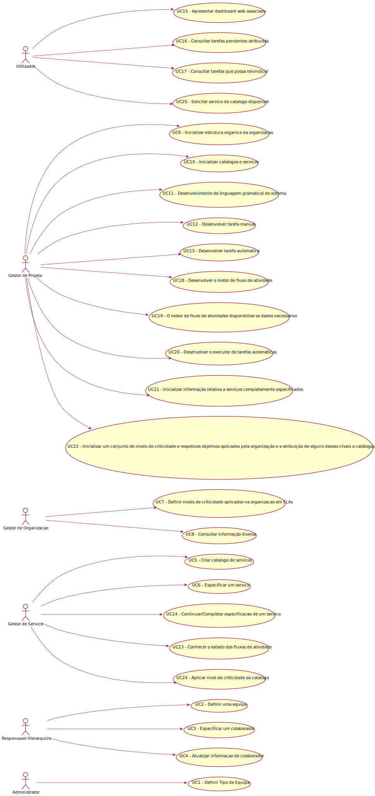

# Projeto Integrador da LEI-ISEP 2020-21 - 4º Semestre

# 1. Constituição do Grupo de Trabalho

O grupo de trabalho é constituído pelo estudantes identificados na tabela seguinte.

| Número do Aluno                           | Nome do Aluno                 |
|-------------------------------------------|-------------------------------|
| [**1190402**](1190402.md)  | **António Fernandes**         |
| [**1190742**](1190742.md)  | **João Pereira**              |
| [**1191045**](1191045.md)  | **Rui Soares**                |
| [**1191072**](1191072.md)  | **Teresa Pereira Leite**      |

# 2. Distribuição de Funcionalidades ###

A distribuição de requisitos/funcionalidades ao longo do período de desenvolvimento do projeto pelos elementos do grupo de trabalho realizou-se conforme descrito nos ficheiros da tabela seguinte.

| Número do Aluno                         |
|-----------------------------------------|
| [**1190402**](1190402.md)|
| [**1190742**](1190742.md)|
| [**1191045**](1191045.md)|
| [**1191072**](1191072.md)|
| [**1200587**](1200587.md)|

# 3. Trello Board

**[Aceder ao Trello](https://trello.com/b/Qwqy3NzL/lei2021s42dk03)**

# 4. Wiki do Projeto

**[Aceder à Wiki](https://bitbucket.org/antoniodbf261201/lei20_21_s4_2dk_03/wiki/Home)**

# 5. Diagrama de Casos de Uso

