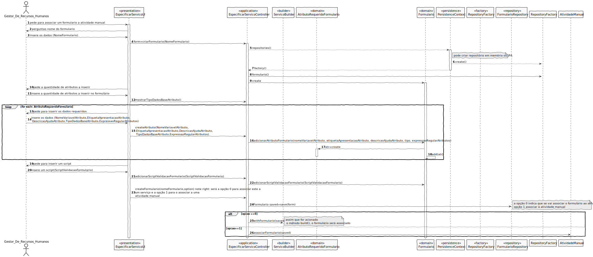

# UC11 - Desenvolvimento de linguagem gramatical do sistema
=======================================

# 1. Requisitos

**Definir uma gramática de suporte ao sistema para permitir a validação de formulários e atividades automáticas**

    - Pode ser uma ou mais linguagens de suporte a todo o sistema.
    - Caso seja mais do que uma, pretende-se que haja coerência/consistência sintática e semântica entre as linguagens.
    - Neste sprint apenas é requerida a validação sintática e semântica das expressões suportadas pela linguagem.

## Informações do cliente:

### Monday, 17 de May de 2021 às 13:00
Boa tarde,

Tanto na especificação de uma estrutura de um Formulário (de solicitação de Serviço ou de atividade manual) como numa atividade automática, surge associado o conceito de Script. É requerido pelo cliente que se desenvolva uma linguagem simples adaptada aos conhecimentos dos Gestores de Serviços.

Gostaria então de esclarecer alguns aspetos:

1 - Os Scripts poderão ter uma de duas funcionalidades: validação de Formulário ou Execução de uma tarefa automática. Como em ambos os casos será o Gestor de Serviços a indicar estes Scripts, o cliente pretende apenas uma linguagem mais abrangente que permita todas estas funcionalidades, ou será preferível duas linguagens diferentes, cada uma adaptada ao seu contexto? Por um lado duas linguagens diferentes evitaria erros de o Gestor tentar usar sintaxes duma funcionalidade noutra, mas por outro lado o Gestor teria de aprender a operar com duas linguagens distintas.

2 - Relacionado com a anterior, que "âmbito" de funcionalidade se pretende nesta(s) linguagem(s) a desenvolver? Dando o exemplo de validação de um formulário:

       - Pretende-se uma linguagem mais geral, que permita ao Gestor especificar condições, estruturas de repetição e outras operações lógicas do género? Ou seja, o Gestor teria a liberdade de indicar algo como: "Se campo 1 tem este valor então campo 3 é obrigatório".

       - Ou pretende-se uma linguagem mais restrita com funcionalidades mais bem definidas. Por exemplo, o Gestor poderia colocar no Script "Restringir campo 3 a campo 1 por valor", e esta operação teria o mesmo efeito que na outra alternativa. No caso desta alternativa, quais seriam as funcionalidades mais essenciais a reconhecer?

Há também a hipótese de a alternativa mais restrita se aplicar melhor aos Scripts de validação de formulários, e a linguagem mais geral aos Scripts de realização automática de tarefas (ou vice-versa), se de facto forem duas linguagens diferentes.

3 - O cliente pretende que o Gestor simplesmente faça upload para a nossa aplicação de um ficheiro de Script (que escreveu com recurso a um qualquer editor de texto), ou pretende-se que o Gestor seja capaz de escrever o conteúdo do Script inteiramente na nossa aplicação. Naturalmente, em ambos os casos a linguagem seria validada pela aplicação, mas a segunda alternativa poderá trazer algumas limitações em termos de introdução de texto devido a se tratar de uma aplicação em consola.

    RESPOSTA: Abaixo seguem respostas/comentários ao que foi dito e questionado (por pontos).

    Ponto 1:
    Certo, os scripts têm essas duas funcionalidades.
    De acordo com os critérios de aceitação da US 1004, essa decisão foi deixada propositadamente em aberto para que a equipa de desenvolvimento tome a decisão que considerar melhor para o projeto alcançar os seus objetivos. Obviamente, a decisão deve ser ponderada e bem fundamentada.
    Para minimizar alguns dos aspetos que referes, já foi dito que se pretende que haja coerência/consistência sintática e semântica entre as linguagens. Portanto, caso exista mais do que uma linguagem, operações semelhantes devem ser feitas da mesma forma.

    Obviamente, que a decisão pode ser tomada tendo em consideração o suporte técnico especializado dado por cada UC.

    Ponto 2:
    Prevê-se que possam existir formulários simples e outros mais complexos. Como tal, parece fazer sentido uma linguagem mais geral onde se possa verificar, por exemplo:
    Se um atributo está preenchido ou não;
    Verificar se o valor de um atributo está em conformidade com uma determinada expressão regular;
    Aplicar operações lógicas sobre os atributos em conformidade com o seu tipo de dados (numéricas vs. texto);
    Definir diferentes fluxos de validação com base nas operações lógicas realizadas sobre os valores dos atributos;
    Combinação de operações lógicas simples para formar operações lógicas mais complexas;
    (outras)
    O resultado do script de validação de formulário de ser OK ou NotOK e no caso de ser NotOK deve incluir uma ou mais mensagens de erro.

    No contexto de validações de formulários, o suporte a estruturas repetitivas aparenta ser desnecessário.

    Exemplo (expresso em português e não na linguagem a ser desenvolvida):

    Se CampoA tem o valor "X" então (i) o CampoB tem que estar preenchido e ter um mínimo de 10 caracteres e (ii) os valores admissíveis do CampoC variam entre 0 e 10 (inteiros). Caso o valor do CampoA seja "Y" o campo B pode não ser preenchido mas os valores admissíveis do CampoC variam entre 0 e 20 desde que sejam pares. Caso o valor do Campo A seja diferente de "X", "Y" e "Z" o valor do campoD tem obrigatoriamente que ser maior do que o valor do CampoE e caso o produto dos campo D e E seja superior a K então o campo K tem que ser preenchido (apenas e só neste cenário).

    Acho que se a linguagem desenvolvida suportar a especificação de cenários destes e a combinação destas cenários terá a flexibilidade necessária à sua função.

    Ponto 3:

    É importante garantir que o script introduzida seja válido.

    A forma de introdução é pouco relevante: como dizes, o gestor pode escrever o script fora do sistema mas depois tem que o escrever/copiar para dentro do sistema e o sistema validar o mesmo.

    Ponto 4 (Script das tarefas automáticas):

    Relativamente aos objetivos da linguagem a desenvolver para as tarefas automáticas, esta deve permitir alcançar os objetivos que constam no caderno de encargos, mais especificamente, os bullets constantes no final da página 4 e inicio da página 5.

    Aqui quanto maior diversidade de operações, melhor.

### Monday, 17 de May de 2021 às 18:47

Boa tarde professor, é dito nos requisitos que especifica um atributo de um formulário tem que introduzir uma expressão regular que valide o mesmo.
A minha questão é se temos que desenvolver uma gramática para essa expressão regular ou se usamos a sintaxe que aprendemos.
Por exemplo para um inteiro a expressão regular ser: [0-9]+

    RESPOSTA:

    - Para isso (expressões regulares) não é necessário uma criar uma gramática. Usam o que já existe.

# 2. Análise

## Regras de Negócio

- Coerência/consistência sintática e semântica entre as linguagens.

- Caso exista mais do que uma linguagem, operações semelhantes devem ser feitas da mesma forma.

- O resultado do script de validação de formulário deve ser OK ou NotOK e no caso de ser NotOK deve incluir uma ou mais mensagens de erro.

- O script introduzido é válido, segundo a gramática.

## Alterações ao Modelo de Domínio

**Não será necessária para já qualquer alteração ao modelo de domínio sendo que este representa bem os conceitos.**

##Testes a Efetuar

- Testar a validação efetuada pela gramática.

# 3. Design

*Nesta secção a equipa deve descrever o design adotado para satisfazer a funcionalidade. Entre outros, a equipa deve apresentar diagrama(s) de realização da funcionalidade, diagrama(s) de classes, identificação de padrões aplicados e quais foram os principais testes especificados para validar a funcionalidade.*

*Para além das secções sugeridas, podem ser incluídas outras.*

## 3.1. Realização da Funcionalidade

*Nesta secção deve apresentar e descrever o fluxo/sequência que permite realizar a funcionalidade.*

Esta funcionalidade é utilizada pelo executor de tarefas automáticas, nomeadamente o script associado a uma tarefa automática,
quando despoletado, recorre à linguagem imbutida no sistema.(US5001)

Também, ao definir um serviço (US2002), quando se associa um formulário, a linguagem do sistema é utilizada para validar o mesmo.

## 3.2. Padrões Aplicados

*Nesta secção deve apresentar e explicar quais e como foram os padrões de design aplicados e as melhores práticas.*

###3.2.1 *Service*
A linguagem do sistema é um serviço que apenas será utilizado para as situações descritas anteriormente, separado de todas as outras camadas do sistema.

### Todos os padrões inerentes às situações anteriores e especificados nas suas User Stories.

## 3.3. Testes 
*Nesta secção deve sistematizar como os testes foram concebidos para permitir uma correta aferição da satisfação dos requisitos.*

**Teste 1:** Verificar que não é possível criar uma instância da classe Exemplo com valores nulos.

	@Test(expected = IllegalArgumentException.class)
		public void ensureNullIsNotAllowed() {
		Exemplo instance = new Exemplo(null, null);
	}

# 4. Implementação

*Nesta secção a equipa deve providenciar, se necessário, algumas evidências de que a implementação está em conformidade com o design efetuado. Para além disso, deve mencionar/descrever a existência de outros ficheiros (e.g. de configuração) relevantes e destacar commits relevantes;*

*Recomenda-se que organize este conteúdo por subsecções.*

# 5. Integração/Demonstração

*Nesta secção a equipa deve descrever os esforços realizados no sentido de integrar a funcionalidade desenvolvida com as restantes funcionalidades do sistema.*

# 6. Observações

*Nesta secção sugere-se que a equipa apresente uma perspetiva critica sobre o trabalho desenvolvido apontando, por exemplo, outras alternativas e ou trabalhos futuros relacionados.*
