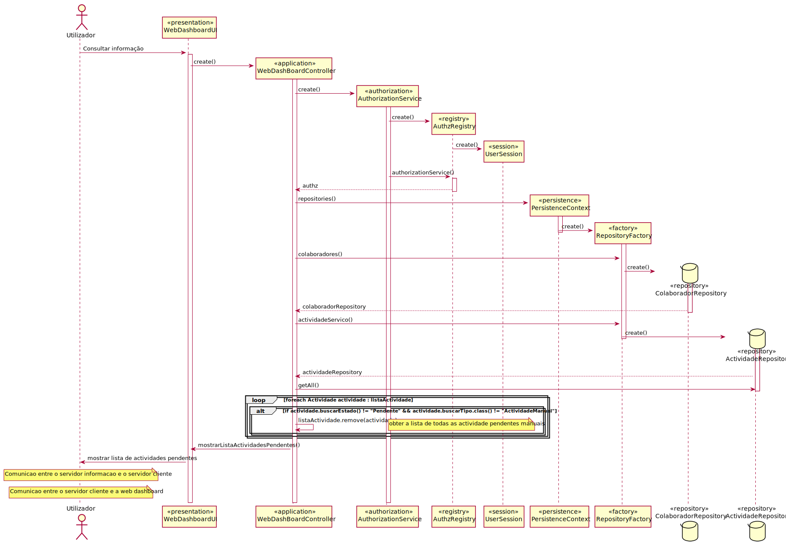

# UC15 - Apresentar dashboard web associado
=======================================

# 1. Requisitos

Para a criação de um dashboard é necessário os dados do utilizador, o número de tarefas pendentes do utilizador, quantas tarefas já terminou 
no prazo limite de resolução, quantas tarefas têm o prazo a terminar em breve, a distribuição dessas tarefas
pelos patamares de urgência e criticidade. Estas informações devem aparecer após a autenticação do utilizador
e devem manter-se sempre atualizadas.

### Informações da parte do cliente:

#### Tuesday, 11 de May de 2021 às 11:59

A User Story:

"Como utilizador, eu pretendo que após me autenticar me seja apresentado o meu dashboard web e que este se mantenha atualizado (automaticamente)."

De forma a evitar dúvidas sobre o que, de facto, se pretende com esta US sistematiza-se o fluxo preconizado.

Sequência de Passos:

1. O utilizador inicia a aplicação consola denominada "Portal".

2. A aplicação solicita a autenticação do respetivo utilizador.

3. O utilizador introduz a sua informação de login.

4. Após sucesso do login, ocorre o seguinte (em paralelo):

4.1. A aplicação consola cria localmente um servidor HTTP, acessível apenas pelo localhost, e abre o URL respetivo onde mostra o dashboard web do utilizador que se autenticou na consola. Este servidor, aceita os refresh da página HTML. A informação disponibilizada é obtida por comunicação entre o servidor HTTP e o Motor de Fluxo (cf. Protocolo de Comunicação).

4.2. A aplicação consola continua a execução "normal" da sua UI para o utilizador aceder/usar as restantes funcionalidades.

5. O utilizador ao fazer logout ou sair da aplicação consola, o servidor HTTP deve terminar.

Espero que esta informação ajude e evite interpretações distintas do pretendido.

No âmbito da US 2011, a sequência pretendida é em tudo semelhante.

Continuação de bom trabalho.

#### Tuesday, 11 de May de 2021 às 22:53

Boa noite professor,
Em relação a esse mesmo US, os dados do login para a autenticação do utilizador devem ser introduzidos na consola ou por meio de uma interface gráfica?
Obrigado

    RESPOSTA: Na aplicação consola conforme indicado.

#### Sunday, 16 de May de 2021 às 01:03

Boa noite,

Relativamente à US 3011, com esta, o cliente pretende que seja apresentado um dashboard com tarefas pendentes, segundo o tópico 8 do ponto 4.2 do Caderno de Encargos ("Exibir dashboard com tarefas pendentes."). Neste devemos então apresentar também uma lista das tarefas pendentes assignadas ao utilizador que se encontra autenticado, tal como na US 3021 (Consultar tarefas pendentes que estão assignadas ao utilizador que se encontra autenticado)?

Além disso, nesse ponto é referido que "Do dashboard deve constar, entre outros dados, o número de tarefas pendentes do utilizador, quantas dessas tarefas já terminou o prazo limite de resolução indicado no pedido e quantas terminam esse prazo em breve (e.g. em menos de 1 hora), a distribuição dessas tarefas pelos patamares de urgência e de criticidade."
Será que a parte "entre outros dados" poderia ser melhor esclarecida para que possamos ter a certeza de que apresentamos tudo o que o cliente deseja no dashboard?

    RESPOSTA:
    1. Na US 3011 não é requerido a apresentação da lista lista de tarefas. Isso apenas é necessário na US3021, sendo que esta já decorre na consola.

    2. De momento esses "outro dados" podem ficar à consideração de cada equipa. Surpreendam positivamente o cliente. Mas devem ser sempre dados orientados/vistos numa perspetiva de dashboard (i.e. informação resumo daquilo que o utilizador tem para fazer). Uma boa possibilidade será disponibilizar a informação já mencionada (e.g. quantidade de tarefas pendentes, etc...) discriminando por tarefas de aprovação e tarefas de realização.

#### Sunday, 16 de May de 2021 às 00:43

Boa noite,

No dashboard web, para além das informações sobre as tarefas do utilizador, que outro tipo de informação quer que a dashboard apresente. De momento, vejo o nome do colaborador e o seu id como boas opções.

    RESPOSTA: Para além do que está definido no caderno de encargos (transcrito abaixo), não é para já necessário mais nada. 
    Se querem incluir o nome: ok!

    "Do dashboard deve constar, entre outras dados, o número de tarefas pendentes do utilizador, quantas dessas tarefas já terminou o prazo limite de resolução indicado no pedido e quantas terminam esse prazo em breve (e.g. em menos de 1 hora), a distribuição dessas tarefas pelos patamares de urgência e de criticidade. Este deve ser exibido imediatamente após autenticação do utilizador e manter-se sempre atualizado (e.g., ao ser-lhe atribuída a realização de uma nova tarefa, o dashboard deve atualizar, sem intervenção do utilizador, a quantidade de tarefas pendentes)."

# 2. Análise

## Regras de Negócio:

-O utilizador tem de estar registado corretamente;

-O utilizador apenas acede à pagina web com as suas informações;

-Quando termina a sessão na consola ou faz logout a ligação ao servidor também deve terminar.

## Alterações ao Modelo de Domínio

**Não será necessária para já qualquer alteração ao modelo de domínio sendo que este representa bem os conceitos.**

## Pré-Condições

-Um colaborador;

-Atividades pendentes do colaborador.

## Pós-Condições

-Mostrar na web dashboard as atividades pendentes do colaborador.

# 3. Design

## 3.1. Realização da Funcionalidade

## 3.2. Padrões Aplicados

*Nesta secção deve apresentar e explicar quais e como foram os padrões de design aplicados e as melhores práticas.*

## 3.3. Testes 
*Nesta secção deve sistematizar como os testes foram concebidos para permitir uma correta aferição da satisfação dos requisitos.*

**Teste 1:** Verificar que não é possível criar uma instância da classe Exemplo com valores nulos.

	@Test(expected = IllegalArgumentException.class)
		public void ensureNullIsNotAllowed() {
		Exemplo instance = new Exemplo(null, null);
	}

# 4. Implementação

*Nesta secção a equipa deve providenciar, se necessário, algumas evidências de que a implementação está em conformidade com o design efetuado. Para além disso, deve mencionar/descrever a existência de outros ficheiros (e.g. de configuração) relevantes e destacar commits relevantes;*

*Recomenda-se que organize este conteúdo por subsecções.*

# 5. Integração/Demonstração

*Nesta secção a equipa deve descrever os esforços realizados no sentido de integrar a funcionalidade desenvolvida com as restantes funcionalidades do sistema.*

# 6. Observações

*Nesta secção sugere-se que a equipa apresente uma perspetiva critica sobre o trabalho desenvolvido apontando, por exemplo, outras alternativas e ou trabalhos futuros relacionados.*

