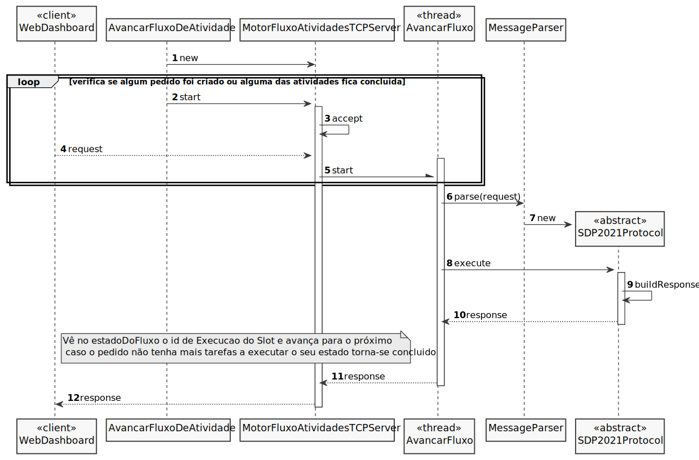
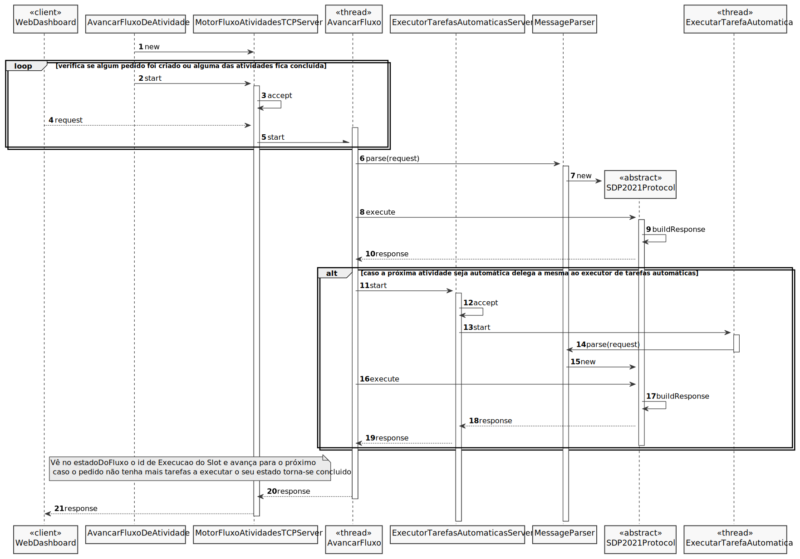

# UC18 - Desenvolver o motor de fluxo de atividade
=======================================

# 1. Requisitos

No caso do Motor de Fluxo de Atividade encontrar uma atividade automática, este deve solicitar e monitorizar a sua
execução no Executor de Tarefas Automáticas. Para tal, deve ser usado o protocolo de aplicação fornecido (SDP2021).

- Deve ser usado o protocolo de aplicação fornecido (SDP2021).

- Deve ser suportado o processamento simultaneo de pedidos.

- Sugere-se que desde já seja considerada a adoção de mecanismos concorrente (e.g. threads) e partilha de estado entre
  esses mecanismos.

- Neste sprint, para efeitos de demonstração, é aceitável que o processamento associado a algumas destas comunicações
  seja apenas simulado (mock).

## Informações obtidas através do cliente:

# Thursday, 20 de May de 2021 às 18:48

Na US4001 é dito o seguinte:
"deve ser desenvolvido no Motor de Fluxo de Atividade o mecanismo de gestão/controlo/avanço do fluxo de atividades de um
dado pedido". Deduzo que a componente de controlo tenha a ver com a apresentação do status das tarefas do pedido e do
próprio pedido; o avanço seja relativo à parte da atualização do status das mesmas; e quanto à gestão? Referem-se à ação
de assignar as tarefas do pedido a colaboradores do sistema? E relativamente às tarefas, neste ponto o ticket apenas
possui no máximo 2 tarefas (no caso de requerer aprovação) ou devem existir um conjunto de tarefas para resolver o
pedido?

    Resposta:
    Um pedido (ticket), como dizes, só tem no máximo duas tarefas (embora futuramente possa ter mais).

    O objetivo desta US é desenvolverem o que for necessário no Motor de Fluxos de Atividades para que:
    1. Após a criação de um Ticket, o mesmo fique num "estado" que permita a realização da primeira tarefa prevista no fluxo de atividades associado;
    2. Após a realização de uma atividade no âmbito de um Ticket, o mesmo fique num "estado" que permita a realização da segunda tarefas;
    3. Após a realização de outra atividade no âmbito de um Ticket, o mesmo fique num "estado" que concluído.

    A informação que criam/alteram para colocar o Ticket no "estado" indicado em cada um dos pontos anteriores, certamente, que irá variar consoante a solução idealizada por cada equipa.

    Parece-me que estarás a pensar bem, mas a complicar por causa da quantidade de verbos que usei para expressar o pretendido.

### No protocolo de comunicação SDP2021 :

Opera como aplicação servidora SDP2021 permitindo às aplicações Aplicação de Serviços e RH e Aplicação Portal dos
Utilizadores obterem os dados necessários. Opera como aplicação cliente SDP2021 para desencadear a execução de tarefas
automáticas em servidores remotos que disponibilizam o serviço Executor de Tarefas Automáticas.

### Pré-requisitos

*Pelo menos um servico e o respetivo fluxo de atividades devem ter sido criados.*
*Pelo menos um pedido deve ter sido efetuado.*
*Pelo menos uma atividade automática deve estar defina na biblioteca de atividades, e associada a um serviço.*

### Pós-Requisitos

*O fluxo de atividades de um dado pedido sofreu avanço/atualização.*
*Uma atividade automática foi delegada ao servidor central para ser executada.*

# 2. Análise

Será necessário usar o protocolo de aplicação fornecido (SDP2021),
c.f. [Protocolo de Comunicação](https://moodle.isep.ipp.pt/pluginfile.php/126996/mod_resource/content/1/LEI-2020-21-Sem4-Projeto_v0-ProtocoloComunicacao.pdf)

Este deve encontrar uma atividade automática, solicitar e monitorizar a sua execução no Executor de Tarefas Automáticas.

## Alterações ao Modelo de Domínio

**Não será necessária para já qualquer alteração ao modelo de domínio sendo que este representa bem os conceitos.**

# 3. Design

## 3.1. Realização da Funcionalidade

## 3.2. Padrões Aplicados

3.3.1 Controller

O padrão Controller foi utilizado para que exista um controlador (neste caso de uso AvancarFluxoDeAtividade) que possa
funcionar como organizador da lógica do caso de uso.

3.3.2 Information Expert

Este padrão atribui às classe a responsabilidade por aquele domínio de negócio que ela representa, como é o caso de
Pedido.

3.3.3 Creator

Geralmente regra 1 e 2, neste caso de uso o creator foi utilizado por ExecutorTarefasAutomaticasServer para instanciar
uma thread ExecutorTarefaAutomatica.

3.3.4 High-Cohesion, Low-Coupling

Padrão utilizado para diminuir o acoplamento entre as classes e ao mesmo tempo só lhes atribuir associações que
realmente sejam coesas com o seu propósito. Em todo este caso de uso tentam-se restringir as responsabilidades próprias
a cada classe e assim minimizar as associações ao necessário apenas. Como se pode observar neste caso de uso:
>
> AvancarFluxo apenas trata de avançar o fluxo de atividades de um dado pedido, e se necessário delega as atividades automáticas
>
> ExecutorTarefasAutomaticasServer instancia a thread responsável por executar a tarefa automática de um dado instante
>
> SDP2021 é o protocolo de aplicação fornecido que apenas trata das comunicações entre as aplicações

3.3.5 Observer

O MotorDeFluxos vai estar constantemente a ver se algum pedido foi criado ou alguma das suas atividades foi concluída
para poder prosseguir o fluxo e alterar o estado do pedido.

# 4. Implementação

A implementação do UC foi de encontro aos SDs realizados.

# 5. Integração/Demonstração

*Nesta secção a equipa deve descrever os esforços realizados no sentido de integrar a funcionalidade desenvolvida com as
restantes funcionalidades do sistema.*

# 6. Observações

- Nenhuma.