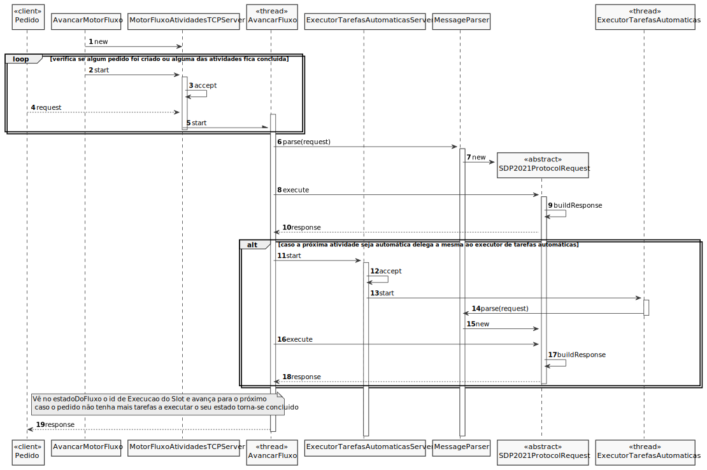

# UC20 - Desenvolver o executor de tarefas automáticas
=======================================

# 1. Requisitos

O gestor de projeto deve desenvolver o executor de tarefas automáticas, utilizado quando encontrada uma atividade automática.

- Deve ser usado o protocolo de aplicação fornecido (SDP2021).
- Deve ser suportado o processamento simultâneo de pedidos para execução de tarefas automáticas.
- Neste sprint, para demonstração, é aceitável que a execução das tarefas automáticas seja apenas simulada (mock).

## Informações da parte do cliente:

---

# 2. Análise

Será necessário usar o protocolo de aplicação fornecido (SDP2021), c.f. [Protocolo de Comunicação](https://moodle.isep.ipp.pt/pluginfile.php/126996/mod_resource/content/1/LEI-2020-21-Sem4-Projeto_v0-ProtocoloComunicacao.pdf)

## Alterações ao Modelo de Domínio

**Não será necessária para já qualquer alteração ao modelo de domínio sendo que este representa bem os conceitos.**

## Pré-Condições

- Existir uma atividade automática.

## Pós-Condições

- Existir o executor de atividades automáticas. 

# 3. Design

## 3.1. Realização da Funcionalidade

## 3.2. Padrões Aplicados

3.3.1 Controller

O padrão Controller foi utilizado para que exista um controlador (neste caso de uso AvancarFluxoDeAtividade) que possa funcionar como organizador da lógica do caso de uso.

3.3.2 Information Expert

Este padrão atribui às classe a responsabilidade por aquele domínio de negócio que ela representa, como é o caso de Pedido.

3.3.3 Creator

Geralmente regra 1 e 2, neste caso de uso o creator foi utilizado por ExecutorTarefasAutomaticasServer para instanciar uma thread ExecutorTarefaAutomatica.

3.3.4 High-Cohesion, Low-Coupling

Padrão utilizado para diminuir o acoplamento entre as classes e, em simultâneo, só lhes atribuir associações que realmente sejam coesas com o seu propósito.
Neste caso de uso tentam-se restringir as responsabilidades próprias a cada classe e assim minimizar as associações ao necessário apenas.
Como se pode observar neste caso de uso:
>
> AvancarFluxo apenas trata de avançar o fluxo de atividades de um dado pedido, e se necessário delega as atividades automáticas
>
> ExecutorTarefasAutomaticasServer instancia a thread responsável por executar a tarefa automática de um dado instante
>
> SDP2021 é o protocolo de aplicação fornecido que apenas trata das comunicações entre as aplicações

3.3.5 Observer

O MotorDeFluxos vai estar constantemente a ver se algum pedido foi criado ou alguma das suas atividades foi concluída para poder prosseguir o fluxo e alterar o estado do pedido.

# 4. Implementação

Esta UC foi implementada tendo em conta o SD realizado.

# 5. Integração/Demonstração

*Nesta secção a equipa deve descrever os esforços realizados no sentido de integrar a funcionalidade desenvolvida com as restantes funcionalidades do sistema.*

# 6. Observações

- Algumas dificuldades com a linguagem.