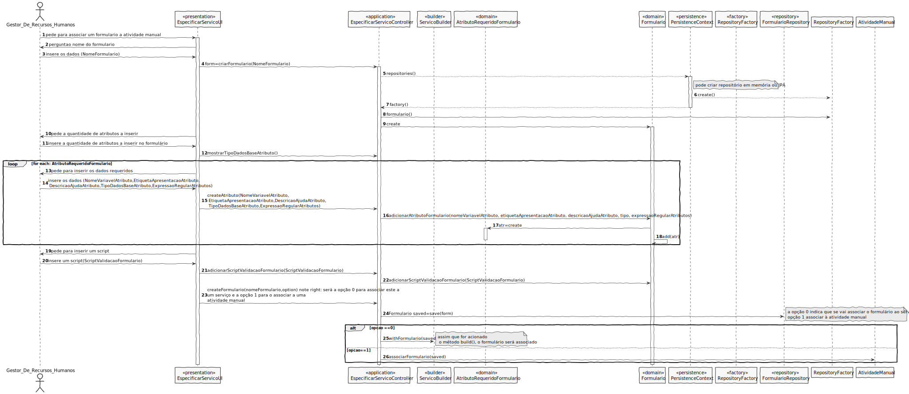

# UC27 - Executar Scripts na lingugem desenvolvida
=======================================

# 1. Requisitos

Executar Scripts com a gramática de suporte ao sistema para permitir a validação de formulários e atividades automáticas.

**Informações apontadas pelo cliente:**

## Tuesday, 15 de June de 2021 às 15:24

Após o utilizador especificar um script para uma atividade automática, podemos assumir que qualquer ficheiro xml/email lá contidos são válidos? Por exemplo, no caso de um ficheiro xml não existir, ou se a sintaxe de um email estiver correta mas o endereço não existir, como deve proceder o executor?

    Resposta: Aquando da especificação do script, sim, podem assumir que o ficheiro e o endereço de email existem.
    Aquando da execução/interpretação do script, devem contemplar a existência de um mecanismo básico de/para tratamento de erros.

## Tuesday, 8 de June de 2021 às 16:53

Relativamente à US1007, ao ser enviado um pedido de execução de uma tarefa automática ao Executor, devem ser incluidos no campo todas as informações necessárias ou existe a possibilidade de o executor aceder à base de dados através de listener's? Por exemplo: no caso do envio de um e-mail, ser necessário aceder ao formulário da solicitação do serviço, este deve estar incluído no campo de dados ou ser adquirido aquando da execução da tarefa, acedendo à base de dados?

    Resposta: Essa comunicação não está prevista na Fig. 1 do caderno de encargos.
    Como tal, privilegia-se soluções que satisfaçam este requisito.
    Contudo, aceitar-se-á outras soluções.

## Tuesday, 1 de June de 2021 às 19:06

No caderno de encargos diz que "A consulta/obtenção de informação constante num determinado ficheiro local partindo de dados existentes no contexto do pedido em causa. Por exemplo, com base no número de cliente indicado no pedido consultar um ficheiro XML com informação sobre clientes para obter o escalão de rapel que lhe está associado. Outro exemplo, com base no identificador de um produto consultar um outro ficheiro para obter o preço base de comercialização desse produto". Estes ficheiros onde se pode consultar informação são ficheiros que contêm os dados da aplicação, ou são ficheiros onde contêm algum tipo de informação à parte dos dados da aplicação?

    Resposta: São ficheiros cuja informação existe noutros sistemas informáticos que a organização usa e é parcialmente exportada para XML de modo a poder ser usada neste contexto e desta forma.
    Por exemplo, a informação de produtos e clientes pode existir num sistema ERP ou num sistema de gestão de stocks e faturação em uso na organização.
    Abaixo deixo link para 2 ficheiros XML com informação sobre produtos que poderiam perfeitamente ser usados para com base no identificador do produto obter o respetivo preço de venda e/ou o preço de retalho:
    http://a.cdn.searchspring.net/help/feeds/searchspring.xml
    https://gist.github.com/kinlane/4abec529e89e4b87a558a6e15986d8a3

# 2. Análise

## Regras de Negócio:

- Aquando da especificação do script o ficheiro e o endereço de email existem.
- Aquando da execução/interpretação do script deve existir um mecanismo básico de tratamento de erros.

## Alterações ao Modelo de Domínio

- Nenhuma alteração ao Modelo de Domínio.

## Pré-Requisitos

Existir a linguagem.

## Pós-Requisitos

Os scripts serem executados com a linguagem desenvolvida.

# 3. Design

## 3.1. Realização da Funcionalidade

Esta funcionalidade é utilizada pelo executor de tarefas automáticas, nomeadamente o script associado a uma tarefa automática,
quando despoletado, recorre à linguagem embutida no sistema.(US5001).

Também, ao definir um serviço (US2002), quando se associa um formulário, a linguagem do sistema é utilizada para validar o mesmo.

## 3.2. Padrões Aplicados
###3.2.1 *Service*
A linguagem do sistema é um serviço que apenas será utilizado para as situações descritas anteriormente, separado de todas as outras camadas do sistema.

### Todos os padrões inerentes às situações anteriores e especificados nas suas User Stories.

## 3.3. Testes
**Testes:** Ficheiros de teste para validar a execução do script.

# 4. Implementação

A implementação desta UC vai de acordo com o SD efetuado no Design desta UC.

# 5. Integração/Demonstração

# 6. Observações

Sem observações.