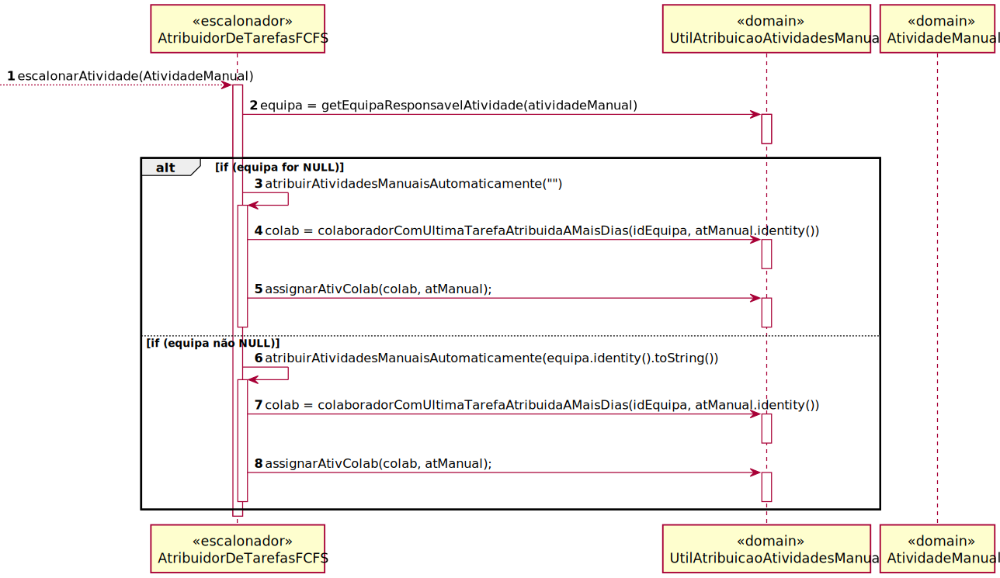
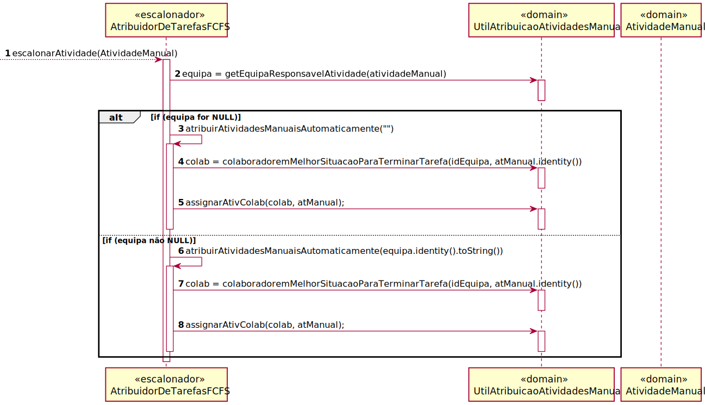

# UC31 - Algoritmo que assigne tarefas automaticamente a colaboradores
=======================================

# 1. Requisitos

O objetivo é criar dois algoritmos que atribuam tarefas automaticamente aos colaboradores, um da forma First Came First
Served e outro da forma considerada melhor pela equipa, tendo em conta round robin e escalonamento por filas.

**Informações apontadas pelo cliente:**

## Friday, 4 de June de 2021 às 02:26

Boa noite,

Tenho algumas dúvidas relativamente à User Story 4072, "Como Gestor de Projeto, eu pretendo que seja desenvolvido e
integrado no Motor de Fluxos de Atividades algoritmos que assignem automáticamente tarefas a colaboradores de forma a
evitar que essas tarefas tenham que ser reivindicadas pelos mesmos.". As minhas dúvidas são as seguintes:

Em relação à altura/ao timing em que é feita a atribuição automática das tarefas:
devemos fazer a atribuição automática assim que o estado passar a "Em Atribuição"? devemos fazer a atribuição automática
de forma periódica (de x em x tempo)? ou devemos fazer a atribuição automática passado x tempo desde a ultima vez em que
foi reinvidicada uma tarefa manualmente? Em relação ao algoritmo baseado em First Come First Served, devemos ordenar a
atribuição de tarefas com base em que Colaboradores estão há mais tempo sem reinvidicar uma tarefa (ou sem terem uma
tarefa atribuida automaticamente)? Se não for este o caso, qual será a abordagem que devemos adotar? Em relação ao
segundo algoritmo, queria confirmar se o objetivo é ordenar a atribuição de tarefas com base nos Colaboradores com menos
carga de trabalho e com um menor tempo médio de execução. Se não for este o caso, qual será a abordagem que devemos
adotar? Desde já agradeço a atenção dispensada.

Melhores cumprimentos.

    RESPOSTA:1. De forma a potenciar ao máximo o cumprimento dos níveis de serviço acordados, a atribuição automática deverá ocorrer imediatamente após o sistema detectar que existe uma tarefa para ser atribuída a alguém.
    2. No primeiro algoritmo, o caminho pode ser esse: o de atribuir a tarefa em mãos ao colaborador que satisfaça as condições requeridas para a tarefa (e.g. pertencer a uma dada equipa) e que esteja à mais tempo sem ter uma tarefa atribuida.
    3. A ideia do segundo algoritmo é estimar a carga de trabalho de cada colaborador que possa satisfazer a tarefa em mãos e atribuir a tarefa aquele que estará em condições de a realizar mais cedo. Exemplo: o colaborador C1 tem 2 tarefas pendentes cujo tempo médio previsto de realização é de 10 minutos e 15 minutos respetivamente, perfazendo um total de 25 minutos enquanto o colaborador C2 tem apenas 1 tarefa pendente,
    mas cujo tempo médio previsto de realização é 35 minutos. Perante este cenário a atribuição de uma nova tarefa realizável por C1 e C2 deverá recair em C1 visto que apesar de ter mais tarefas pendentes conseguirá previsivelmente conclui-las mais cedo do que C2 concluirá a sua tarefa.

# 2. Análise

## Regras de Negócio:

O colaborador tem de ter as competências necessárias para efetuar a tarefa antes desta ser-lhe atribuída. 
Deve existir pelo menos uma tarefa disponível a ser atribuída.

## Alterações ao Modelo de Domínio

--

## Pré-Requisitos

Existirem atividades manuais.

Existir um pedido.

## Pós-Requisitos

A tarefa é assinada automaticamente.

# 3. Design

## 3.1. Realização da Funcionalidade

###First Came First Search

###Atribuidor De Tarefas Inteligentes

# 4. Implementação

Esta UC foi implementada de acordo com os SDs.

# 5. Integração/Demonstração

[Relatório do caso de uso](Relatorio4072.pdf)

# 6. Observações

- Foi gasto muito tempo nas implementações e testes dos algoritmos.