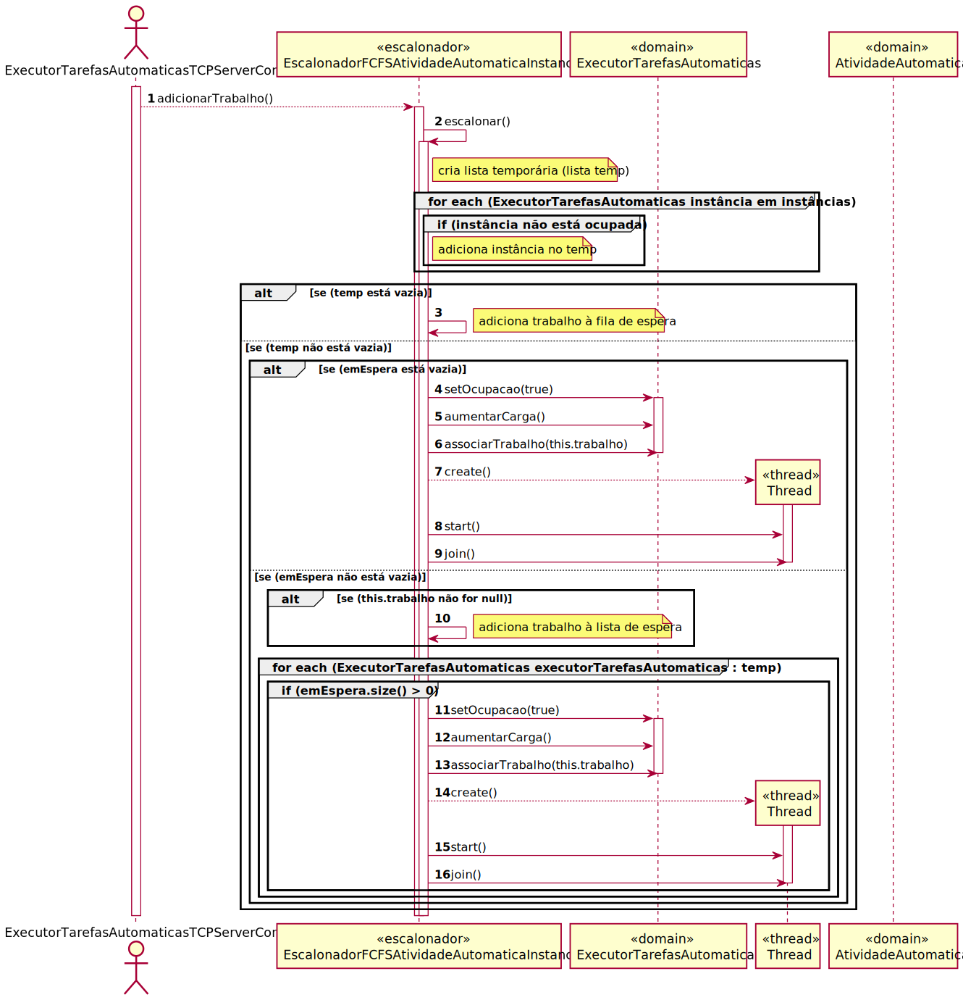
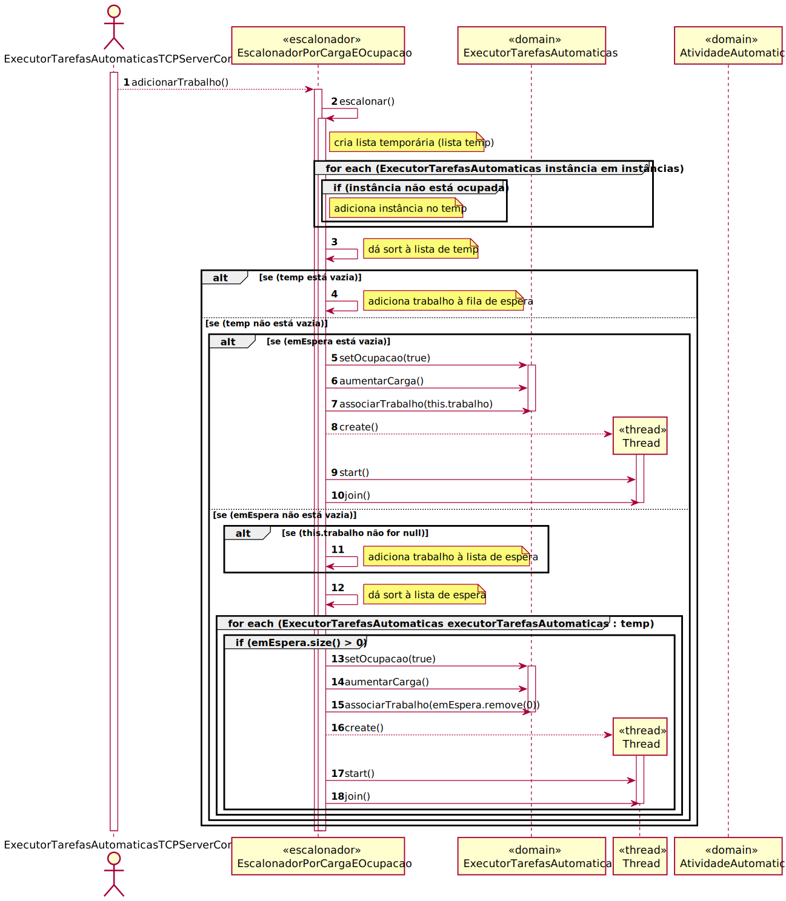

# Algoritmos que distribuam a realização de tarefas automáticas pelas diversas instâncias do Executor de Tarefas Automáticas existentes na infraestrutura instalada.
=======================================

# 1. Requisitos

Serve para distribuir as tarefas automáticas pelo executor de tarefas.

- Deve ser possível configurar no sistema qual o algoritmo que o sistema irá adotar;

- Um dos algoritmos deve atuar de forma First Came First Served

- O segundo algoritmo deve atuar de forma a ter em conta a disponibilidade das respetivas instâncias e a carga atual
  das mesmas.

## Informações apontadas pelo cliente

### Wednesday, 16 de June de 2021 às 23:22

É necessário demonstrar a execução de várias tarefas em simultâneo durante a apresentação ao cliente?
Pergunto isto pois como somos poucos utilizadores (grupo de 4 elementos) e cada tarefa tem um tempo de execução de apenas uns meros segundos, é praticamente impossível demonstrar a execução de várias tarefas no executor sem haver alguma manipulação em termos de código (algo que já foi feito durante cenários de teste pelo grupo de trabalho). 
Podemos simplesmente demonstrar esta situação na documentação/estudo deste caso de uso?

        RESPOSTA:Compreendo e aceito as limitações em o fazerem numa apresentação ao cliente.
        Contudo, saliento que em apresentações de carácter mais técnico tal poderá ser-vos solicitado.
        Cada equipa deve gerir essa questão da forma que considera mais adequada (planeamento da apresentação).

### Tuesday, 15 de June de 2021 às 14:11

Como o cliente já tinha indicado anteriormente, o executor deve conseguir executar várias tarefas automáticas ao mesmo 
tempo. Logo, considera válido comunicarmos ao motor de fluxo de atividades que a tarefa foi bem sucedida no exato 
momento em que o script entra em execução? Se o executor esperasse até ao fim de execução do script e apenas nesse 
instante comunicasse o sucesso da operação, seria impossível termos várias scripts a serem executados simultaneamente.
Outra questão que tinha era sobre o estudo dos algoritmos. Deve ser estudado o tempo que estes demoram a escolher uma 
instância ou também deve ser incluído o tempo de execução de um script?

        RESPOSTA:Reforço a necessidade do "o executor deve conseguir executar várias tarefas automáticas ao mesmo tempo".
        Discordo completamente quando dizes que é "válido comunicarmos ao motor de fluxo de atividades que a tarefa foi 
        bem sucedida no exato momento em que o script entra em execução".
        Pelo contrário, essa notificação apenas deve ser transmitida quando a execução do script estiver terminada.
        Não percebo porquê que dizes que tal seria/é "impossível". Recomendo-te vivamente procurares suporte técnico 
        adequado.Relativamente ao estudo dos algoritmos, nos critérios de aceitação encontras algumas 
        sugestões/exemplos. Outros factores que a tua equipa considere relevantes para o negócio podem também 
        ser analisados. Não me parece que o tempo que se demora a escolher uma instância seja relevante para o negócio.

### Sunday, 13 de June de 2021 às 10:14

Tenho duas dúvidas em relação à User Story 4071. "Como Gestor de Projeto, eu pretendo que seja desenvolvido e integrado 
no MFA algoritmos que distribuam a realização de tarefas automáticas."

Em relação ao primeiro algoritmo, First Came First Served:

- É suposto a quantidade de instâncias do Executor de Tarefas que estão a correr em paralelo sermos nós a definir, por 
  exemplo, 2 ou 3?

- Sempre que um cliente se conecta ao Servidor Executor de Tarefas é criada uma Thread, ou seja, várias tarefas 
  automáticas podem ser realizadas numa só instância do Executor de Tarefas. Daí surgiu-me a seguinte dúvida: qual deve 
  ser o critério que indica que uma determinada instância do Executor de Tarefas se encontra ocupada e, 
  consequentemente, se chegar uma nova tarefa automática terá de ser atribuída a uma outra instância do Executor de 
  Tarefas?
  
        RESPOSTA: Resposta 1: A quantidade de instâncias do Executor de Tarefas pode variar de uma implantação 
        (deployment) para outra. E, portanto, é natural que se o administrador do sistema entender que é necessário colocar 
        mais uma instância do Executor de Tarefas em execução o faça naturalmente sem necessidade de recompilar o sistema. 
        Apenas se torna necessário que haja uma forma do Motor de Fluxos saber/conhecer quais são as instâncias do Executor de Tarefas que se encontram em execução e aonde de forma a poder comunicar com as mesmas. Tal pode ser feito, por exemplo, recorrendo a um ficheiro de configuração. Outras formas também podem ser aceitáveis. Para efeitos de demonstração usar-se 2 ou 3 instâncias parece ser suficiente.
        Resposta 2: O objetivos dos algoritmos a desenvolver visa distribuir a carga de execução das tarefas automáticas pelas instâncias do Executor de Tarefas disponíveis no sistema. Portanto, no limite, a questão não é saber de uma forma binária (sim/não) se uma instância está ocupada mas o quanto cada instância está ocupada e atribuir a tarefa à que estiver menos ocupada.
        Recomendo a leitura do ponto 2.4. do documento descritivo do protocolo de comunicação SDP2021.
        Confirmo que uma instância do Executor de Tarefas pode estar a executar mais do que uma tarefa ao mesmo tempo.

### Sunday, 13 de June de 2021 às 15:01

Após analisar os requisitos da US4071 fiquei com algumas dúvidas.

1) O número de instâncias, que suponho que tenha de ser definido para os algoritmos funcionarem, deve ser um valor definido pelo grupo de trabalho ou deve ser configurável nas "settings" da aplicação?

2) No segundo algoritmo, a "carga" de uma instância refere-se ao número de tarefas que lhe estão atribuídas? Pensei em considerar o tempo de resolução destas mas parece-me impossível obter uma estimativa desse tipo.

3) O "estudo comparativo" que deverá ser feito para ambos os algoritmos implica a persistência de dados? Ou seja, devemos guardar o tempo de execução destes algoritmos sempre que estes forem desencadeados para posteriormente calcular um tempo médio? Não considera mais útil ter um sistema de "benchmark" no qual o utilizador pode escolher, por exemplo, o número de tarefas a executar (tarefas dummy que apenas servem para testes) e o número de instâncias do executor?

--

Para além disto, tenho mais uma questão. Qual deve ser o responsável pela distribuição das tarefas automáticas pelas 
diferentes instâncias do executor? Segundo os requisitos deve ser o motor de fluxos mas não faria mais sentido ser o 
próprio executor a controlar as suas instâncias? Eu digo isto pois parece-me retrógrado o motor de fluxos ter de aceder 
às instâncias do executor quando se tratam de duas aplicações servidoras. Isto implicaria um envio de uma quantidade 
enorme de dados entre os dois servidores, algo que não é desejado.

        RESPOSTA: O responsável é o Motor de Fluxo de Atividades.
        É a única aplicação do sistema que conhece todas as tarefas automáticas que existem para ser executadas.
        A informação trocada entre as duas aplicações deve ser a estritamente necessária à execução da tarefa automática solicitada.
        --

        O ponto 1) está respondido em https://moodle.isep.ipp.pt/mod/forum/discuss.php?d=9203#p12029.

        Sobre o ponto 2), uma forma de medir a carga de cada instância do Executor de Tarefas é através no número de tarefas que o mesmo está a executar no momento. Portanto, podem usar essa informação até porque pelo protocolo SDP2021 essa informação é fácil de obter (cf. 2.4 do documento descritivo do protocolo).

        Sobre o ponto 3), não vejo necessidade de "persistência de dados". Podes elaborar um conjunto de cenários e primeiramente executar esses cenários usando um algoritmo e depois executas os mesmos cenários usando outro algoritmo e comparas os resultados (e.g. tempo total decorrido, diferenças na distribuição das tarefas, etc...) entre as duas execuções.

### Tuesday, 15 de June de 2021 às 14:11

Como o cliente já tinha indicado anteriormente, o executor deve conseguir executar várias tarefas automáticas ao mesmo tempo.
Logo, considera válido comunicarmos ao motor de fluxo de atividades que a tarefa foi bem sucedida no exato momento em que o script 
entra em execução? Se o executor esperasse até ao fim de execução do script e apenas nesse instante comunicasse o sucesso da operação, 
seria impossível termos várias scripts a serem executados simultaneamente.
Outra questão que tinha era sobre o estudo dos algoritmos. 
Deve ser estudado o tempo que estes demoram a escolher uma instância ou também deve ser incluído o tempo de execução de um script?

        RESPOSTA: Reforço a necessidade do "o executor deve conseguir executar várias tarefas automáticas ao mesmo tempo".
        Discordo completamente quando dizes que é "válido comunicarmos ao motor de fluxo de atividades que a tarefa foi bem sucedida no exato momento em que o script entra em execução".
        Pelo contrário, essa notificação apenas deve ser transmitida quando a execução do script estiver terminada.
        Não percebo porquê que dizes que tal seria/é "impossível". Recomendo-te vivamente procurares suporte técnico adequado.
        Relativamente ao estudo dos algoritmos, nos critérios de aceitação encontras algumas sugestões/exemplos. Outros factores que a tua equipa considere relevantes para o negócio podem também ser analisados.
        Não me parece que o tempo que se demora a escolher uma instância seja relevante para o negócio.

### Sunday, 13 de June de 2021 às 17:35

No algoritmo First Come First Serve, podemos assumir que uma instância do executor está "ocupada" quando esta se encontra a realizar uma tarefa? Como neste algoritmo não existe o conceito de "carga" de tarefas, podemos também assumir que apenas é realizada uma tarefa de cada vez (algo que não acontece no algoritmo alternativo)?

Relativamente à ordem deste First Come First Serve, esta deve ser constante ou deve depender de quais instâncias estão disponíveis/ocupadas?

        RESPOSTA: Cada instância do Executor de Tarefas pode estar a executar mais do que uma tarefa automática em simultaneo.

        Exemplo 1 (Algoritmo 1):
        Admita-se que existem 2 instância do Executor de Tarefas (ET1 e ET2).
        Quando surge uma tarefa automática (T1) esta pode ser imediatamente atribuída a ET1. A tarefa seguinte (T2) será atribuída a ET2. E outra tarefa (T3) será atribuída a ET1 novamente. Note-se que aqui não houve a preocupação de saber se as tarefas já tinham sido concluídas ou não.

        Exemplo 2 (Algoritmo 2):
        Admita-se que existem 2 instância do Executor de Tarefas (ET1 e ET2).
        Quando surge uma tarefa automática (T1) esta pode ser imediatamente atribuída a ET1.
        A tarefa seguinte (T2) será atribuída a ET2 visto que ET1 ainda está ocupado com a execução de T1.
        Quando surge outra tarefa (T3), ET1 e ET2 ainda está ocupados a realizar T1 e T2. Assim, T3 é atribuida a ET1.
        Entretanto ET1 termina a execução de T1 e T3 e surge uma nova tarefa (T4).
        T4 é atríbuida a ET1 visto que ET2 ainda está ocupado com T2.
        Entretanto ET2 termina a execução de T2.
        Surge outra tarefa (T5) e esta á atribuida a ET2 visto que ET1 esta a executar T4 e ET2 não se encontra a executar nenhuma tarefa.

        Neste exemplo está-se a controlar a carga de cada Executor pela quantidade de tarefas em execução.

# 2. Análise

## Regras de Negócio:

- Deve existir pelo menos uma Atividade Automática disponível a ser executada por um executor de atividades automáticas;

- Deve ser possível configurar no sistema qual o algoritmo que o sistema irá adotar;

- Um dos algoritmos deve atuar de forma First Came First Served;

- O segundo algoritmo deve atuar de forma a ter em conta a disponibilidade das respetivas instâncias e a carga atual das mesmas.
  
## Alterações ao Modelo de Domínio

--

## Pré-Requisitos

Existir o executor de tarefas automáticas.

## Pós-Requisitos

As tarefas estarem escalonadas devidamente pelas diversas instâncias do executor.

# 3. Design

## 3.1. Realização da Funcionalidade

###First Came First Search

###Carga e Disponibilidade em Conta

# 4. Implementação

Esta UC foi implementada de acordo com os SDs.

# 5. Integração/Demonstração

[Relatório do caso de uso](Relatorio4071.pdf)

# 6. Observações

- Foi gasto muito tempo nas implementações e testes dos algoritmos.