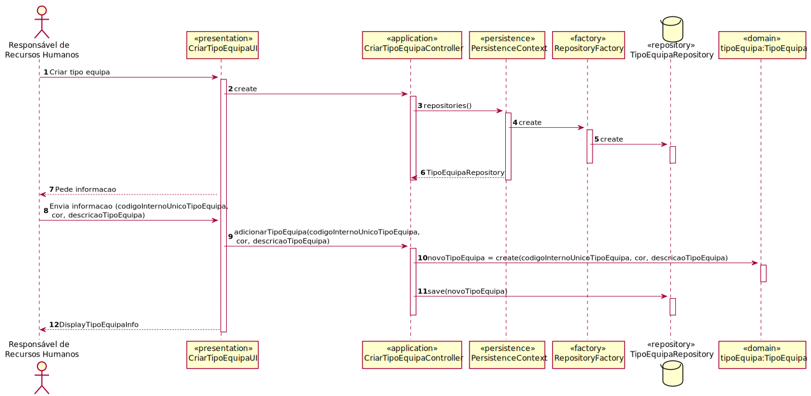
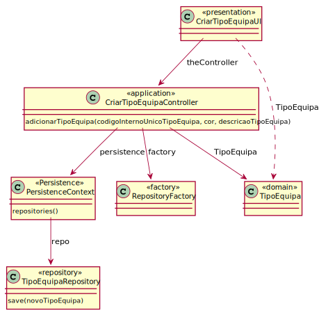

# UC1 - Definir um Tipo de Equipa
=======================================

# 1. Requisitos

**Definir um Tipo de Equipa**

Informações da parte do cliente:

## Thursday, 22 de April de 2021 às 09:45

O código interno único do tipo de equipa, da equipa e do serviço são gerados automaticamente?
        
        RESPOSTA: Não são geradas automaticamente.

## Friday, 16 de April de 2021 às 20:54

 O código da Equipa e do Tipo de Equipa é formato numérico ou alfa-numérico?

        RESPOSTA: São códigos alfanuméricos com um máximo de 15 caracteres. As possíveis regras aplicáveis variam de organizam para organização e, portanto, de momento não se pretende despender esforço em possíveis validações mais complexas.

## Thursday, 1 de April de 2021 às 18:46

Uma equipa caracteriza-se por uma cor, basta uma identificação pelo nome da cor ou o cliente deseja algo mais?

    RESPOSTA: 1) A cor de cada equipa deve ser capturada de forma apropriada a permitir que o sistema seja capaz de usar/aplicar essa cor posteriormente, por exemplo, na UI. 
                1.1) Considerando que existem várias formas de representação de cores, a equipa de desenvolvimento pode adotar a que considerar mais apropriada.

## Thursday, 29 de April de 2021 às 21:51

Uma cor pode ser partilhada por vários tipos de equipas?

    RESPOSTA: Normalmente, atribuem-se cores distintas.
            Comentário Geral:
            Como cliente começo a ficar preocupado com tantas perguntas sobre cores.
            Não entendo o motivo para tal: apenas é necessário atribuir uma cor - qualquer cor.
            Será que uma cor é algo assim tão complexo de usar num sistema?
            Como não entendo nada de cores, fiz uma breve pesquisa e imediatamente percebi que uma cor é representada através de um sistema de cores como o RGB , o CMYK, etc... Adotem um.
            Não devo ser eu a fazer o vosso trabalho...
            Isto também se aplica a outras pequenas coisas que não são o "core" do sistema.
            Foquem-se nas questões/aspetos cruciais do sistema.

# 2. Análise

O tipo de equipa caracteriza várias equipas, é reconhecido por uma cor, identificado por um código interno único e descrito por uma descrição.

## Regras de Negócio:

- o código único é definido manualmente e alfanumérico tendo no máximo 15 caracteres;
- a cor vai ser representada em RGB (escolha feita em equipa);

## Alterações ao Modelo de Domínio

**Não será necessária para já qualquer alteração ao modelo de domínio sendo que este representa bem os conceitos.**

# 3. Design

*Nesta secção a equipa deve descrever o ‘design’ adotado para satisfazer a funcionalidade. Entre outros, a equipa deve apresentar diagrama(s) de realização da funcionalidade, diagrama(s) de classes, identificação de padrões aplicados e quais foram os principais testes especificados para validar a funcionalidade.*

*Para além das secções sugeridas, podem ser incluídas outras.*

## 3.1. Realização da Funcionalidade

*Nesta secção deve apresentar e descrever o fluxo/sequência que permite realizar a funcionalidade.*

## 3.2. Diagrama de Classes

*Nesta secção deve apresentar e descrever as principais classes envolvidas na realização da funcionalidade.*

## 3.3. Padrões Aplicados

*Nesta secção deve apresentar e explicar quais e como foram os padrões de ‘design’ aplicados e as melhores práticas.*

3.3.1 User Interface

O padrão User Interface é usado de modo a providenciar uma ‘interface’ de uso simples ao Gestor de Serviço (neste caso de uso CriarTipoEquipaUI), para que haja separação das restantes partes do sistema.

3.3.2 Controller

O padrão Controller foi utilizado para que exista um controlador (neste caso de uso CriarTipoEquipaController) que possa funcionar como organizador da lógica do caso de uso.

3.3.3 Information Expert

Este padrão atribui às classes a responsabilidade por aquele domínio de negócio que ela representa, como é o caso de TipoEquipa.

3.3.4 Creator

Geralmente regra 1 e 2, neste caso de uso o creator foi utilizado por TipoEquipa para instanciar um objeto TipoEquipa.

3.3.5 High-Cohesion, Low-Coupling

Padrão utilizado para diminuir o acoplamento entre as classes e, em simultâneo, só lhes atribuir associações que realmente sejam coesas com o seu propósito.
Neste caso de uso tentam-se restringir as responsabilidades próprias a cada classe e assim minimizar as associações ao necessário apenas.
Por exemplo, neste caso de uso:
> TipoEquipaRepository, que é apenas um repositório de TipoEquipa, que vai buscar tipo de equipa(s) e guardar o(s) tipos de equipa(s) neste caso de uso;
>
> TipoEquipa instância o objeto que será o TipoEquipa;
>
> PersistenceContext é uma ‘interface’ que trata de chamar o repositório de fábricas;
>
> RepositoryFactory é uma fábrica de repositórios que chama o repositório tipoEquipa;
>
> TipoEquipaController trata de toda a lógica de criar um tipo de equipa, delegando passos intermédios às outras classes.

3.3.6 Repository e Factory

O padrão Repository e o Factory ajudam na persistência, armazenamento e acesso aos dados. É utilizado na camada da Persistence, de modo a garantir a instanciação de TipoEquipaRepository, onde se guarda e se pode aceder às Equipas.
Porém, antes dessa instanciação é utilizada a ‘interface’ PersistenceContext para se poder aceder à fábrica de repositórios RepositoryFactory e nela ir buscar os repositórios ditos anteriormente, entrando em harmonia com a estrutura do projeto.

## 3.4. Testes
*Nesta secção deve sistematizar como os testes foram concebidos para permitir uma correta aferição da satisfação dos requisitos.*

**Teste 1:** Verificar que não é possível criar uma instância da classe TipoEquipa com valores nulos.

	@Test(expected = IllegalArgumentException.class)
		public void ensureNullIsNotAllowed() {
		TipoEquipa instance = new TipoEquipa(null, null, null);
	}

**Teste 2:** Verificar que não é possível criar uma instância da classe TipoEquipa com código único com mais de 15 números.

	@Test(expected = IllegalArgumentException.class)
		public void ensureReferenceMeetsAC2() {
		TipoEquipa instance = new TipoEquipa("1234567890123456", "123456", "Descricao");
	}

**Teste 3:** Verificar que não é possível criar uma instância da classe TipoEquipa com cor com menos ou mais de 6 chars.

	@Test(expected = IllegalArgumentException.class)
		public void ensureReferenceMeetsAC2() {
		TipoEquipa instance = new TipoEquipa("123456789012345", "12345", "Descricao");
	}

    @Test(expected = IllegalArgumentException.class)
		public void ensureReferenceMeetsAC2() {
		TipoEquipa instance = new TipoEquipa("123456789012345", "1234567", "Descricao");
	}

# 4. Implementação

*Nesta secção a equipa deve providenciar, se necessário, algumas evidências de que a implementação está em conformidade com o design efetuado. Para além disso, deve mencionar/descrever a existência de outros ficheiros (e.g. de configuração) relevantes e destacar commits relevantes;*

*Recomenda-se que organize este conteúdo por subsecções.*

# 5. Integração/Demonstração

*Nesta secção a equipa deve descrever os esforços realizados no sentido de integrar a funcionalidade desenvolvida com as restantes funcionalidades do sistema.*

# 6. Observações

*Nesta secção sugere-se que a equipa apresente uma perspetiva critica sobre o trabalho desenvolvido apontando, por exemplo, outras alternativas e ou trabalhos futuros relacionados.*

