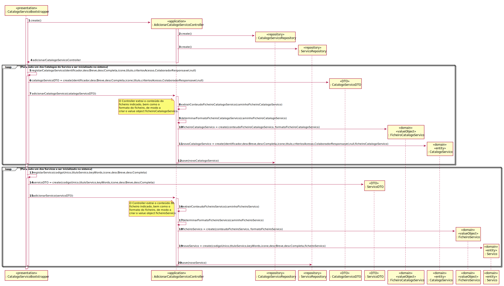
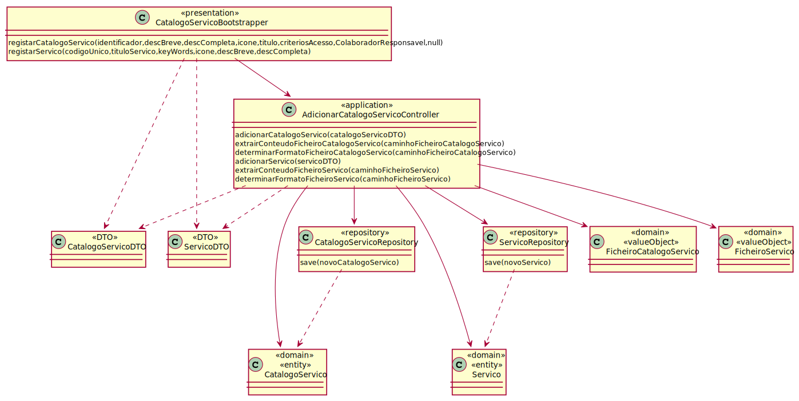

# UC10 - Inicializar catálogos e serviços
=======================================

# 1. Requisitos

**Inicializar catálogos e serviços**

Informações da parte do cliente:

Não existem para já informações adicionais sobre a UC.

# 2. Análise

Para inicializar os catálogos e serviços será necessária todos os dados relativos aos catálogos de serviço e de serviço.

## Regras de Negócio:

Se não tiver todos os dados relativos aos serviços ou ao catálogo não pode inicializar os mesmos.

## Alterações ao Modelo de Domínio

**Não será necessária para já qualquer alteração ao modelo de domínio sendo que este representa bem os conceitos.**

# 3. Design

*Nesta secção a equipa deve descrever o design adotado para satisfazer a funcionalidade. Entre outros, a equipa deve apresentar diagrama(s) de realização da funcionalidade, diagrama(s) de classes, identificação de padrões aplicados e quais foram os principais testes especificados para validar a funcionalidade.*

*Para além das secções sugeridas, podem ser incluídas outras.*

## 3.1. Realização da Funcionalidade

*Nesta secção deve apresentar e descrever o fluxo/sequência que permite realizar a funcionalidade.*

## 3.2. Diagrama de Classes

*Nesta secção deve apresentar e descrever as principais classes envolvidas na realização da funcionalidade.*

## 3.3. Padrões Aplicados

*Nesta secção deve apresentar e explicar quais e como foram os padrões de design aplicados e as melhores práticas.*

3.3.1 Controller

O padrão Controller foi utilizado para que exista um controlador (neste caso de uso AdicionarCatalogoServicoController) que possa funcionar como organizador da lógica do caso de uso.

3.3.2 Information Expert

Este padrão atribui às classes a responsabilidade por aquele domínio de negócio que ela representa, como é o caso de CatalogoServico e de Servico.

3.3.3 Creator

Geralmente regra 1 e 2, neste caso de uso o creator foi utilizado por CatalogoServico para instanciar um objeto CatalogoServico e Servico para instanciar um objeto Servico.

3.3.4 High-Cohesion, Low-Coupling

Padrão utilizado para diminuir o acoplamento entre as classes e ao mesmo tempo só lhes atribuir associações que realmente sejam coesas com o seu propósito.
Em todo este caso de uso tentam-se restringir as responsabilidades próprias a cada classe e assim minimizar as associações ao necessário apenas.
Por exemplo, neste caso de uso:
> CatalogoServicoRepository, que é apenas um repositório de CatalogoServico, que vai guardar o(s) CatalogoServico(s) neste caso de uso;
>
> ServicoRepository, que é apenas um repositório de Servico, que vai guardar o(s) Servico(s) neste caso de uso;
> 
> CatalogoServicoDTO guarda os dados inseridos num objeto intermediário para posteriormente se ir buscar um CatalogoServico específico;
>
> ServicoDTO guarda os dados inseridos num objeto intermediário para posteriormente se ir buscar um Servico específico;
>
> CatalogoServico instancia o objeto que será a CatalogoServico;
>
> Servico instancia o objeto que será a Servico;

3.3.5 DTO

O padrão DTO fornece um objeto intermediário para transferência de dados, diminuindo o acoplamento entre as camadas de domínio e da aplicação, permitindo um rápido carregamento da aplicação.
Neste caso de uso temos a sua implementação nas classes CatalogoServicoDTO e ServicoDTO.

3.3.6 Repository

O padrão Repository ajuda na persistência, armazenamento e acessa os dados. É utilizado na camada da Persistence, de modo a garantir a instanciação de CatalogoServico e Servico, onde se guarda e se pode aceder aos CatalogoServico e Servico.

## 3.4. Testes
*Nesta secção deve sistematizar como os testes foram concebidos para permitir uma correta aferição da satisfação dos requisitos.*

*Não tem testes.*

# 4. Implementação

*Nesta secção a equipa deve providenciar, se necessário, algumas evidências de que a implementação está em conformidade com o design efetuado. Para além disso, deve mencionar/descrever a existência de outros ficheiros (e.g. de configuração) relevantes e destacar commits relevantes;*

*Recomenda-se que organize este conteúdo por subsecções.*

# 5. Integração/Demonstração

*Nesta secção a equipa deve descrever os esforços realizados no sentido de integrar a funcionalidade desenvolvida com as restantes funcionalidades do sistema.*

# 6. Observações

*Nesta secção sugere-se que a equipa apresente uma perspetiva critica sobre o trabalho desenvolvido apontando, por exemplo, outras alternativas e ou trabalhos futuros relacionados.*

