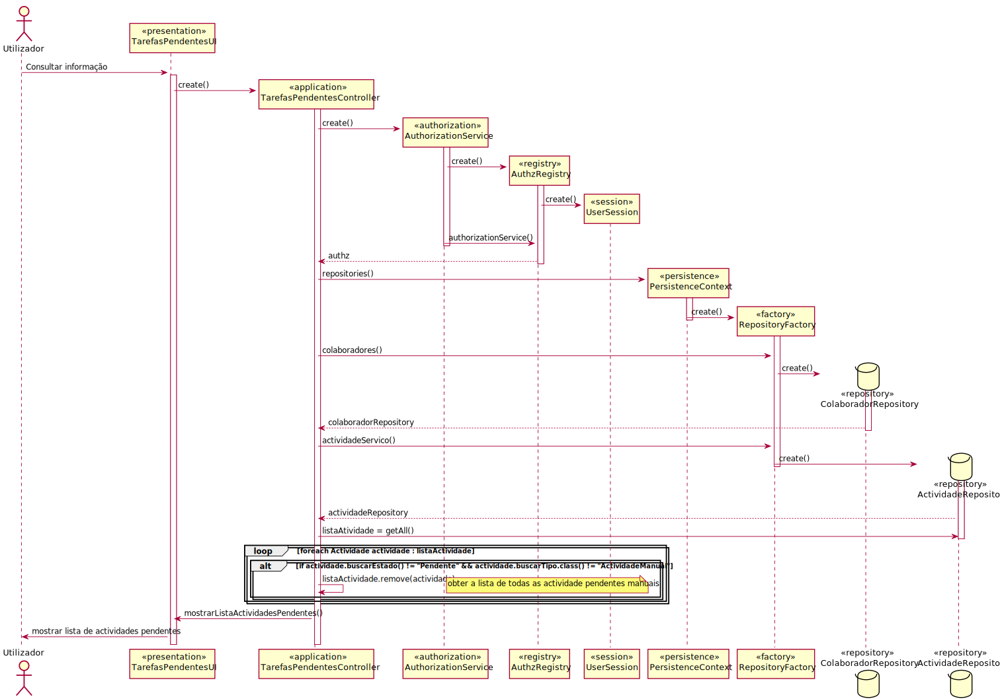

# UC16 - Consultar tarefas pendentes atribuidas
=======================================

# 1. Requisitos

O utilizador deve conseguir ver as tarefas a si atribuidas, com informaçoes relativas a prioridade, criticidade e datas limite.
Deve poder pesquisar apenas pelas que sao suas, pelas que lhes podem ser assignadas e em ambos casos filtrar a informaçao e ordenar por diferentes campos.

##Informações da parte do cliente:

#### Saturday, 15 de May de 2021 às 16:48

Boa tarde,

Para a consulta de tarefas pendentes que estão assignadas ao utilizador, para que este possa filtrar através de data limite de conclusão de tarefa, o cliente prefere que:

1. O utilizador possa inserir uma data e lhe sejam apresentadas todas as tarefas com data limite até essa mesma.

2. O utilizador possa escolher tarefas com data limite até 3 dias, 1 semana ou 2 semanas, por exemplo.

    RESPOSTA: No que concerne a filtrar informação disponível, quanto mais/maior flexibilidade de atuação for dada ao utilizador tanto melhor.
    Portanto, a especificação de uma data pelo utilizador garante essa maior flexibilidade que seria interessante de ser combinada com outros critérios.

# 2. Análise

## Regras de Negócio:

-Deve poder pesquisar por diferentes parametros (quantas mais opçoes existirem melhor).

-Deve ver as suas tarefas ou as que pode reivindicar.

## Alterações ao Modelo de Domínio

**Não será necessária para já qualquer alteração ao modelo de domínio sendo que este representa bem os conceitos.**

## Pré-Condições

-Existirem atividades alocadas ao colaborador.

## Pós-Condições

-Mostrar as atividades do colaborador.

# 3. Design

## 3.1. Realização da Funcionalidade

## 3.2. Padrões Aplicados

*Nesta secção deve apresentar e explicar quais e como foram os padrões de design aplicados e as melhores práticas.*

###3.2.1 User Interface

O padrão User Interface é usado de modo a providenciar uma ‘interface’ de uso simples ao utilizador (neste caso de uso TarefasPendentesUI), para que haja separação das restantes partes do sistema.

###3.2.2 Controller

O padrão Controller foi utilizado para que exista um controlador (neste caso de uso TarefasPendentesController) que possa funcionar como organizador da lógica do caso de uso.

###3.2.3 Repository e Factory

O padrão Repository e o Factory ajudam na persistência, armazenamento e acesso aos dados. É utilizado na camada da Persistence, de modo a garantir a instanciação de AtividadeRepository e ColaboradorRepository, onde se pode aceder as Atividades e aos Colaboradores.

## 3.3. Testes 
*Nesta secção deve sistematizar como os testes foram concebidos para permitir uma correta aferição da satisfação dos requisitos.*

**Teste 1:** Verificar que não é possível criar uma instância da classe Exemplo com valores nulos.

	@Test(expected = IllegalArgumentException.class)
		public void ensureNullIsNotAllowed() {
		Exemplo instance = new Exemplo(null, null);
	}

# 4. Implementação

*Nesta secção a equipa deve providenciar, se necessário, algumas evidências de que a implementação está em conformidade com o design efetuado. Para além disso, deve mencionar/descrever a existência de outros ficheiros (e.g. de configuração) relevantes e destacar commits relevantes;*

*Recomenda-se que organize este conteúdo por subsecções.*

# 5. Integração/Demonstração

*Nesta secção a equipa deve descrever os esforços realizados no sentido de integrar a funcionalidade desenvolvida com as restantes funcionalidades do sistema.*

# 6. Observações

*Nesta secção sugere-se que a equipa apresente uma perspetiva critica sobre o trabalho desenvolvido apontando, por exemplo, outras alternativas e ou trabalhos futuros relacionados.*

