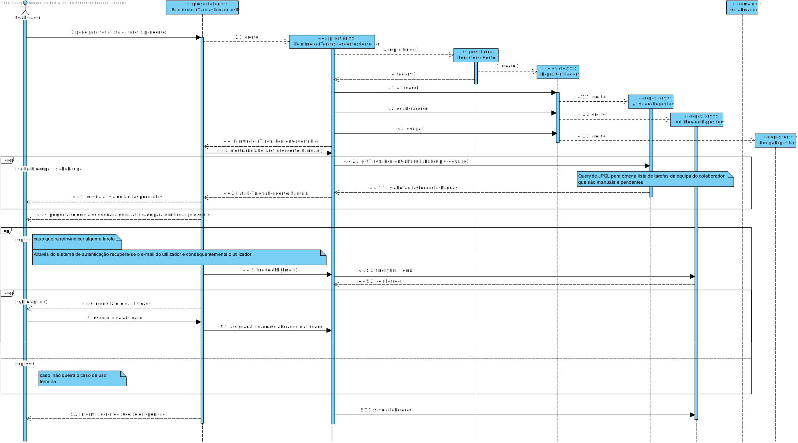
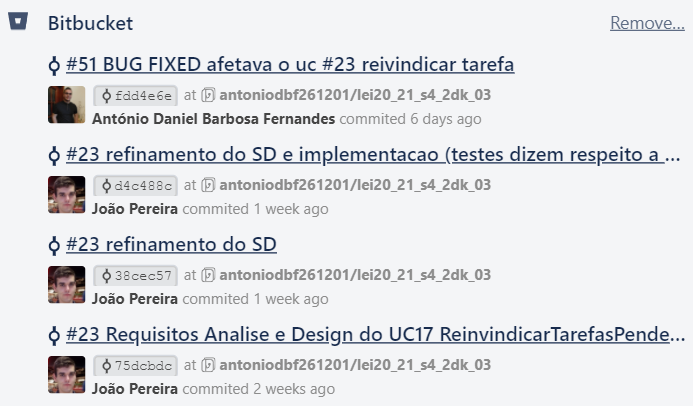
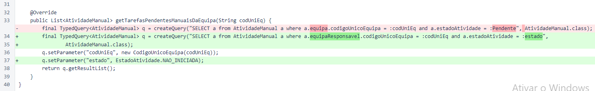
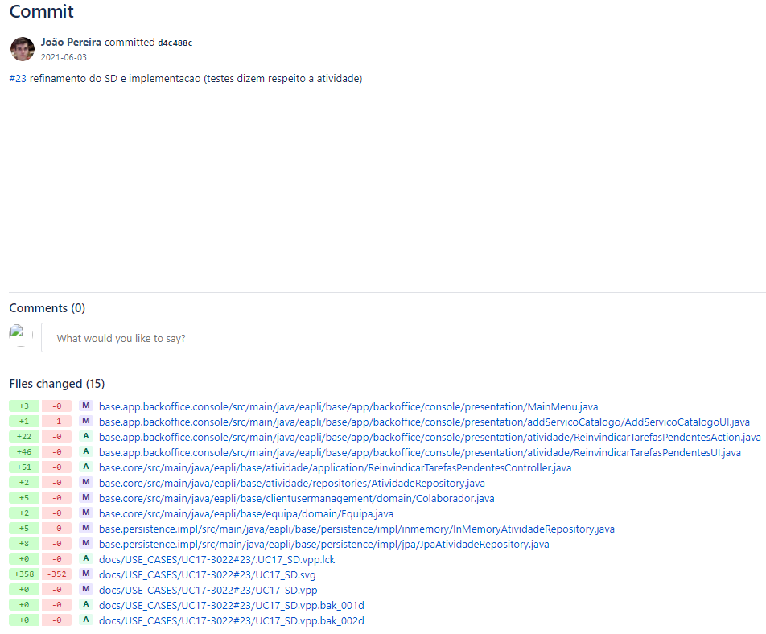
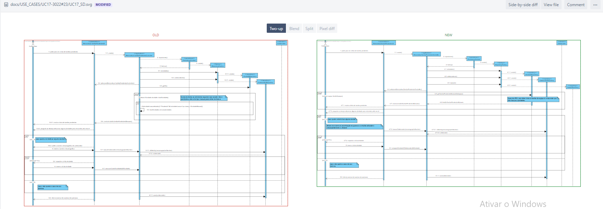
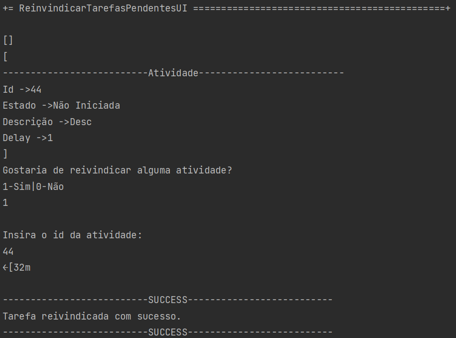
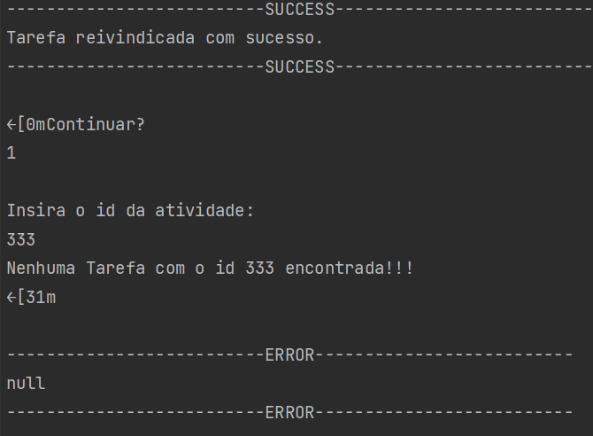

# UC17 - VerTarefasPendentesEReinvindicar
=======================================

# 1. Requisitos

*Nesta secção a equipa deve indicar a funcionalidade desenvolvida bem como descrever a sua interpretação sobre a mesma e sua correlação e/ou dependência de/com outros requisitos.*

#### Pré-requisitos
*É necessário o utilizador estar previamente registado como colaborador*

#### Pós-requisitos
*O utilizador visualizou as suas tarefas pendentes.*
*O utilizador pôde reinvindicar tarefas pendentes a si.*

# Informações da parte do cliente:

## Friday, 14 de May de 2021 às 11:40

Após a leitura do caderno de encargos fiquei com certas dúvidas acerta da US-3022. O Enunciado diz que: " De modo a minimizar o esforço associado à reivindicação de tarefas e a melhorar o desempenho global das equipas, perspetiva-se a existência de um mecanismo automático e inteligente de assignar tarefas a colaboradores." . Sendo que a aplicação terá um sistema automático de atribuição de tarefas o caso de poder reivindicar tarefas como utilizador seria impossível pois o processo sendo automático não existiriam tarefas pendentes. Gostaria de saber se poderia esclarecer a assignação automática das tarefas em paralelo com a reivindicação de tarefas pelo utilizador.

        RESPOSTA: Normalmente, as duas coisas não irão co-existir em simultâneo.
                  A US3022 será usada enquanto o sistema não possuir um algoritmo adequado para realizar automaticamente a atribuição de tarefas.
                  Para além disso, podem existir organizações que não pretendam que o processo seja automático (e.g. porque o algoritmo não é suficientemente bom).

                  Portanto, deves ver esta US e a existência de um algoritmo para o mesmo efeito como algo que enriquece o sistema e as alternativas que são disponibilizadas às organizações que adquirirem o sistema. Não há qualquer conflito entre estas duas coisas.

# 2. Análise

*Neste secção a equipa deve relatar o estudo/análise/comparação que fez com o intuito de tomar as melhores opções de design para a funcionalidade bem como aplicar diagramas/artefactos de análise adequados.*

- Um colaborador possui uma lista de atividades(tarefas).
- Cada atividade é identificada pelo IdAtividade, é de um tipo (TipoAtividade)
e posssui um estado (EstadoAtividade).
- Existem atividades de caráter manual que possam não estar atribuídas.

## Regras de Negócio:

- Cada atividade está devidamente formulada;
- Apenas atividades do tipo manual podem ser assignadas a um dado colaborador;
- Somente atividades no estado pendente devem ser mostradas ao colaborador;

## Alterações ao Modelo de Domínio

**Não será necessária para já qualquer alteração ao modelo de domínio sendo que este representa bem os conceitos.**

# 3. Design

*Nesta secção a equipa deve descrever o design adotado para satisfazer a funcionalidade. Entre outros, a equipa deve apresentar diagrama(s) de realização da funcionalidade, diagrama(s) de classes, identificação de padrões aplicados e quais foram os principais testes especificados para validar a funcionalidade.*

*Para além das secções sugeridas, podem ser incluídas outras.*

## 3.1. Realização da Funcionalidade

*Nesta secção deve apresentar e descrever o fluxo/sequência que permite realizar a funcionalidade.*

### Diagrama de sequência

## 3.2. Padrões Aplicados

*Nesta secção deve apresentar e explicar quais e como foram os padrões de design aplicados e as melhores práticas.*

3.3.1 User Interface

O padrão User Interface é usado a fim de providenciar uma interface de uso simples ao Utilizador (neste caso de uso VerTarefasPendentesEReinvindicarUI), para que haja separação das restantes partes do sistema.

3.3.2 Controller

O padrão Controller foi utilizado para que exista um controlador (neste caso de uso VerTarefasPendentesEReinvindicarController) que possa funcionar como organizador da lógica do caso de uso.

3.3.3 Information Expert

Este padrão atribui às classe a responsabilidade por aquele domínio de negócio que ela representa, como é o caso de Atividade.

3.3.4 Creator

Geralmente regra 1 e 2, neste caso de uso o creator foi utilizado por Colaborador para instanciar um colaborador.

3.3.5 High-Cohesion, Low-Coupling

Padrão utilizado para diminuir o acoplamento entre as classes e ao mesmo tempo só lhes atribuir associações que realmente sejam coesas com o seu propósito.
Em todo este caso de uso tentam-se restringir as responsabilidades próprias a cada classe e assim minimizar as associações ao necessário apenas.
Como se pode observar neste caso de uso:
>  AtividadeRepository, que é apenas um repositório de atividades, só vai buscar as atividades pendentes;
>
> Colaborador, que apenas instancia um colaborador;
> 
>  ColaboradorRepository serve para aceder a um determinado Colaborador pelo seu número mecanográfico;
>
>  PersistenceContext é uma interface que trata de chamar o repositório de fábricas;
>
>  RepositoryFactory é uma fábrica de repositórios que chama os repositórios de colaborador e de atividades;
>
>  ReinvindicarTarefasPendentesController trata de toda a lógica de buscar as atividades pendentes e dar a opção de as reinvindicar, delegando passos intermédios às outras classes.

3.3.6 Repository e Factory

O padrão Repository e o Factory ajudam na persistência, armazenamento e acesso aos dados. É utilizado na camada da Persistence, de modo a garantir a instanciação de AtividadeRepository, onde se guarda e se pode aceder às atividades, e ColaboradorRepository, onde se guarda e se pode aceder aos Colaboradores da organização.
Porém, antes dessa instanciação é utilizada a interface PersistenceContext para se poder aceder à fábrica de repositórios RepositoryFactory e nela ir buscar os repositórios ditos anteriormente, entrando em harmonia com a estrutura do projeto. Abstrai os detalhes de métodos que modificam o estado deste objeto.

## 3.4. Testes
*Nesta secção deve sistematizar como os testes foram concebidos para permitir uma correta aferição da satisfação dos requisitos.*

**Teste 1:** Recusar delay da atividade menor que zero (um delay é sempre positivo).

	@Test(expected = IllegalArgumentException.class)
    public void recusarDelayMenorQueZero() {
        Atividade at = new Atividade("desc", -2);
    }

**Teste 2:** Recusar delay da atividade igual a zero (um delay é sempre positivo).

    @Test(expected = IllegalArgumentException.class)
    public void recusarDelayIgualAZero() {
        Atividade at = new Atividade("desc", 0);
    }

**Teste 3:** Aceitar delay positivo.

	@Test
    public void aceitarDelayMaiorQueZero() {
        Atividade at = new Atividade("desc", 2);
    }

**Teste 4:** Não aceitar instâncias de DescricaoAtividade que sejam nulas.

    @Test(expected = IllegalArgumentException.class)
    public void naoAceitarDescricaoNull() {
        DescricaoAtividade desc = new DescricaoAtividade(null);
    }

**Teste 5:** Não aceitar instâncias de DescricaoAtividade que contenham mais de 500 caracteres.

	@Test(expected = IllegalArgumentException.class)
    public void naoAceitarDescricaoComMaisDe500Caracteres() {
        DescricaoAtividade desc = new DescricaoAtividade("tmeppmnorbgowrbgowujgbwrogbrwugbrwogbrugbrgefefe" +
                "rgorwugborwgubrgobrgourwgborugbrowugborworwbrwobrugbrogrbgourbgwffffffffffffffffffffffffffffffffffffffff" +
                "rwgrowgbwrogrwogrwfffffffffffffffffffffffffffffffffffffffffffffffffffffffffffffffffffffffffffff33333f3f3" +
                "gorweeeeeeeeeeeeeeeeeeeeeeeeeeeeeeeeeeeeeeeeeeeeeeeeeeeeeiehoeihboubfoubfoççbobouqbofbqoeqbqbfoqfboqebfo" +
                "gorwfffffffffffffffffffffffffffffffeeeeeeeeeeeeeeeeeeeeeeeelfqlfqneqlfkqlfeqnlfeqnflkqeflqfnqelnfeqkfq" +
                "ogrwgbrowugbrwogbrwogbrwogbrwogubrgbrogbrubrwogbrwofipeqfpenvjq ojegpqejgqgeqgqegeqg");
    }

**Teste 6:** Não aceitar instâncias de DescricaoAtividade que sejam vazias.

	@Test(expected = IllegalArgumentException.class)
    public void naoAceitarDescricaoVazia() {
        DescricaoAtividade desc = new DescricaoAtividade("");

    }

**Teste 7:** Aceitar instâncias de DescricaoAtividade que estejam dentro dos requisitos.

    @Test
    public void aceitarDescricaoValida() {
        DescricaoAtividade desc = new DescricaoAtividade("Programar");
    }

# 4. Implementação

*Nesta secção a equipa deve providenciar, se necessário, algumas evidências de que a implementação está em conformidade com o design efetuado. Para além disso, deve mencionar/descrever a existência de outros ficheiros (e.g. de configuração) relevantes e destacar commits relevantes;*

##4.1) Commits relevantes

*Aqui temos a lista de commits efetuados e relevantes à US 3022 e mostragem de alterações relevantes (do mais novo ao mais antigo)*

*Commit em que se mostrou essencial alterar a query de JPA utilizada para mostrar as tarefas manuais pendentes para se obter o resultado pretendido*

*Commit em que se refinou o diagrama de sequência e de seguida se implementou o código*

*Commit em que se refinou o diagrama de sequência pois entendeu-se por bem o uso de uma query personalizada utilizando JPA em vez de manipulação de dados inMemory*

# 5. Integração/Demonstração

*Nesta secção a equipa deve descrever os esforços realizados no sentido de integrar a funcionalidade desenvolvida com as restantes funcionalidades do sistema.*

*Resultado demonstrado num cenário de sucesso em que se reinvindica uma tarefa pendente*

*Resultado demonstrado num cenário de insucesso em que ocorre erro na introdução de um dos parâmetros necessários*

# 6. Observações

*Nesta secção sugere-se que a equipa apresente uma perspetiva critica sobre o trabalho desenvolvido apontando, por exemplo, outras alternativas e ou trabalhos futuros relacionados.*

A equipa fez o design adequado ao necessitado, tendo feito o levantamento de requisitos com o cliente, bem como a análise e regras de negócio.
Posteriormente, à medida que se foi discutindo em grupo apercebeu-se de que uma query de JPA personalizada seria melhor para cumprir os padrões acima supracitados,
e houve uma revisão nesta US até que fosse efetivamente cumprida.
No futuro o uso de repositórios e fábricas prova-se crucial no desenvolvido de aplicações e uma prática a manter.

Alternativamente, o uso de um dto intermediário para separar as camadas de domínio das restantes e providenciar mais flexibilidade de manutenção e segurança não se descarta.