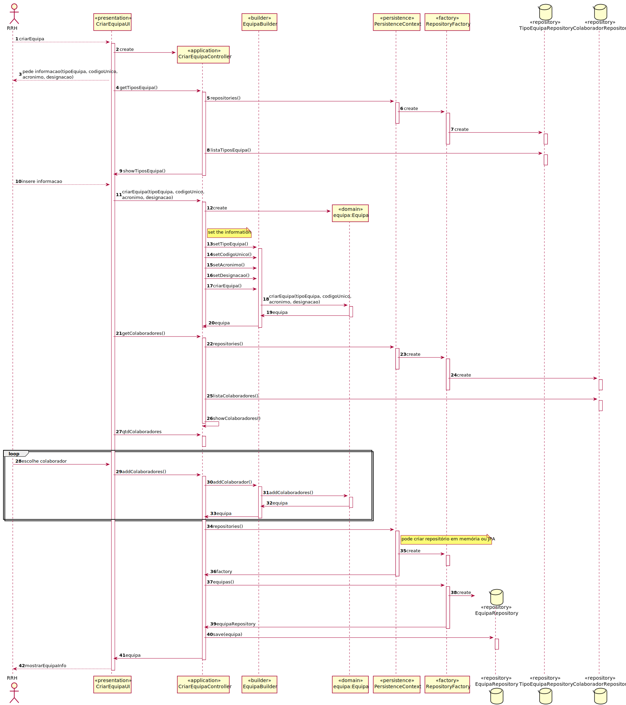
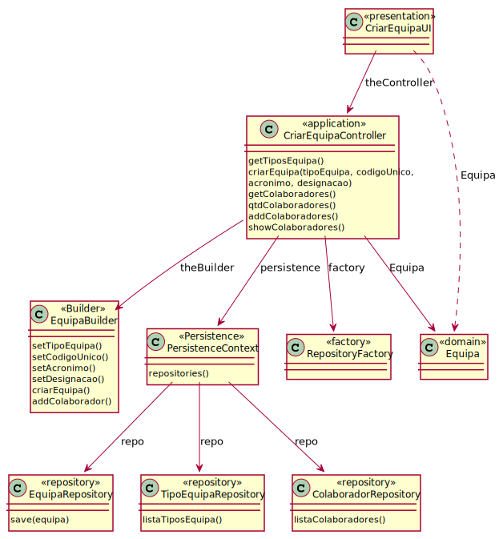

# UC2- Definir uma Equipa
=======================================

# 1. Requisitos

**Definir uma Equipa**

Informações da parte do cliente:

## Friday, 23 de April de 2021 às 18:05

Em relação ao acrónimo da equipa qual é o número de caracteres máximo que pode ter?

        RESPOSTA: São 10 caracteres.

## Thursday, 22 de April de 2021 às 09:45

O código interno único do tipo de equipa, da equipa e do serviço são gerados automaticamente?
        
        RESPOSTA: Não são geradas automaticamente.

## Friday, 16 de April de 2021 às 20:54

 O código da Equipa e do Tipo de Equipa é formato númerico ou alfa-numérico?

        RESPOSTA: São códigos alfanuméricos com um máximo de 15 caracteres. As possíveis regras aplicáveis variam de organizam para organização e, portanto, de momento não se pretende despender esforço em possíveis validações mais complexas.

# 2. Análise

A equipa pertence a um determinado tipo de equipa, possui um código e um acrónimo sendo ambos únicos, deve ter ainda
uma designação e pode ter um ou mais colaboradores responsáveis, define objetivos distintos e resolve atividades.

## Regras de Negócio:

-o codigo unico é definido manualmente e alfanumerico tendo no máximo 15 caracteres;

-o acronimo tem no maximo 10 caracteres;

## Alterações ao Modelo de Domínio

**Não será necessária para já qualquer alteração ao modelo de domínio sendo que este representa bem os conceitos.**

# 3. Design

## 3.1. Realização da Funcionalidade

## 3.2. Diagrama de Classes

## 3.3. Padrões Aplicados

*Nesta secção deve apresentar e explicar quais e como foram os padrões de ‘design’ aplicados e as melhores práticas.*

3.3.1 User Interface

O padrão User Interface é usado de modo a providenciar uma ‘interface’ de uso simples ao RRH (neste caso de uso CriarEquipaUI), para que haja separação das restantes partes do sistema.

3.3.2 Controller

O padrão Controller foi utilizado para que exista um controlador (neste caso de uso CriarEquipaController) que possa funcionar como organizador da lógica do caso de uso.

3.3.3 Information Expert

Este padrão atribui às classes a responsabilidade por aquele domínio de negócio que ela representa, como é o caso de Equipa.

3.3.4 Creator

Geralmente regra 1 e 2, neste caso de uso o creator foi utilizado por Equipa para instanciar um objeto Equipa.

3.3.5 High-Cohesion, Low-Coupling

Padrão utilizado para diminuir o acoplamento entre as classes e, em simultâneo, só lhes atribuir associações que realmente sejam coesas com o seu propósito.
Neste caso de uso tentam-se restringir as responsabilidades próprias a cada classe e assim minimizar as associações ao necessário apenas.

3.3.6 Repository e Factory

O padrão Repository e o Factory ajudam na persistência, armazenamento e acesso aos dados. É utilizado na camada da Persistence, de modo a garantir a instanciação de EquipaRepository, onde se guarda e se pode aceder às Equipas.
Porém, antes dessa instanciação é utilizada a ‘interface’ PersistenceContext para se poder aceder à fábrica de repositórios RepositoryFactory e nela ir buscar os repositórios ditos anteriormente, entrando em harmonia com a estrutura do projeto.

## 3.4. Testes
*Nesta secção deve sistematizar como os testes foram concebidos para permitir uma correta aferição da satisfação dos requisitos.*

**Teste 1:** Verificar que não é possível criar uma instância da classe Exemplo com valores nulos.

	@Test(expected = IllegalArgumentException.class)
		public void ensureNullIsNotAllowed() {
		Exemplo instance = new Exemplo(null, null);
	}

# 4. Implementação

*Nesta secção a equipa deve providenciar, se necessário, algumas evidências de que a implementação está em conformidade com o design efetuado. Para além disso, deve mencionar/descrever a existência de outros ficheiros (e.g. de configuração) relevantes e destacar commits relevantes;*

*Recomenda-se que organize este conteúdo por subsecções.*

# 5. Integração/Demonstração

*Nesta secção a equipa deve descrever os esforços realizados no sentido de integrar a funcionalidade desenvolvida com as restantes funcionalidades do sistema.*

# 6. Observações

*Nesta secção sugere-se que a equipa apresente uma perspetiva critica sobre o trabalho desenvolvido apontando, por exemplo, outras alternativas e ou trabalhos futuros relacionados.*

