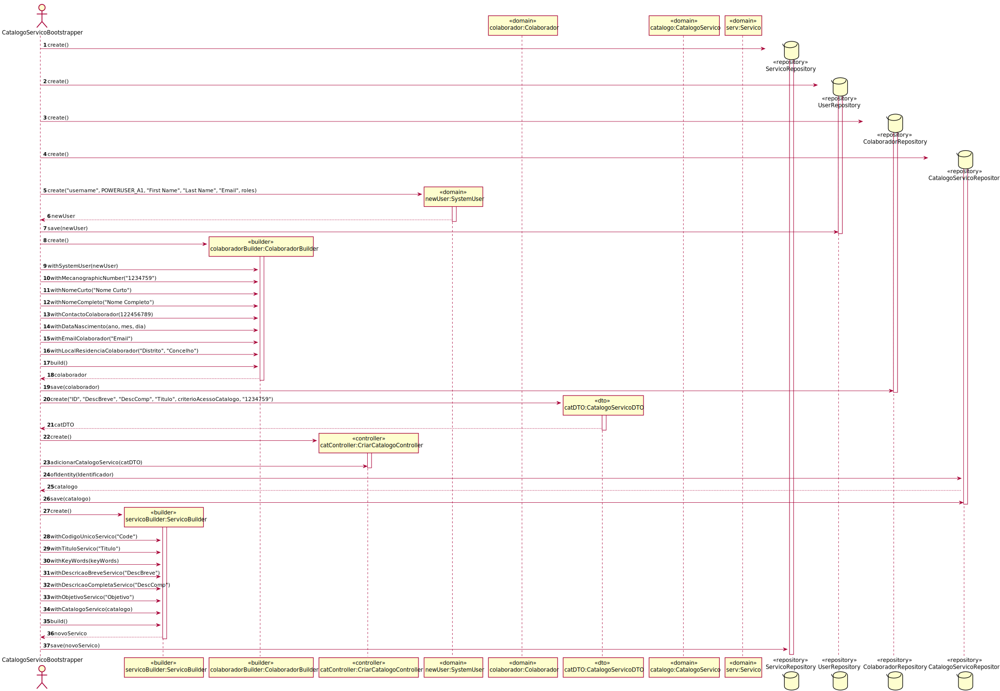

# UC21 - Inicializar informação relativa a serviços completamente especificados
=======================================

# 1. Requisitos

Criar servicos completamente especificados.

# 2. Análise

Para inicializar um conjunto de servicos é necessario ter todas as informacoes relativas aos servicos.

## Regras de Negócio:

-Se nao contiver informacao suficiente nao pode ser inicializado.

## Alterações ao Modelo de Domínio

**Não será necessária para já qualquer alteração ao modelo de domínio sendo que este representa bem os conceitos.**

## Pré-Condições

--

## Pós-Condições

-Servicos totalmente especificados criados.

# 3. Implementação

# 4. Integração/Demonstração

*Nesta secção a equipa deve descrever os esforços realizados no sentido de integrar a funcionalidade desenvolvida com as restantes funcionalidades do sistema.*

# 5. Observações

*Nesta secção sugere-se que a equipa apresente uma perspetiva critica sobre o trabalho desenvolvido apontando, por exemplo, outras alternativas e ou trabalhos futuros relacionados.*

