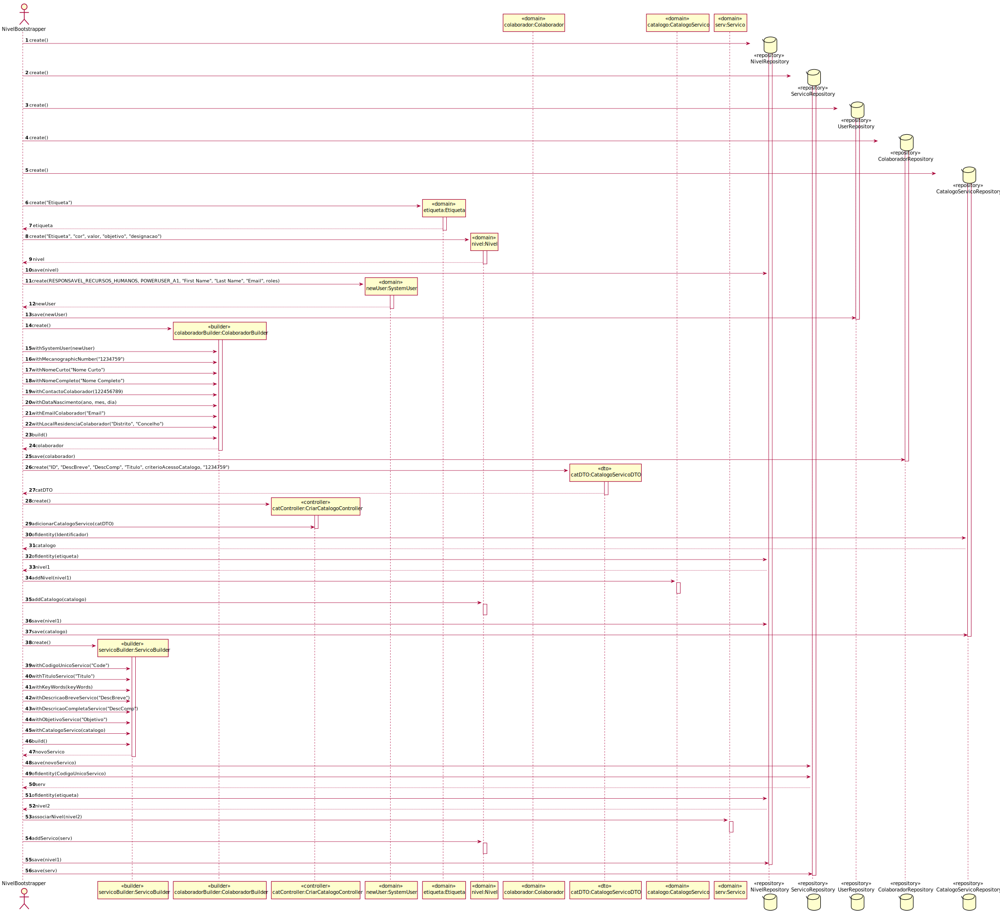

# UC22 - Inicializar um conjunto de níveis de criticidade e respetivos objetivos aplicados pela organização e a atribuição de alguns desses níveis a catálogos de serviços
=======================================

# 1. Requisitos

Criar niveis de criticidade e aplica-los a catalogos.

# 2. Análise

Para inicializar um conjunto de niveis de criticidade é necessario ter todas as informacoes relativas aos niveis, catalogos e as relacoes entre eles.

## Regras de Negócio:

-Se nao contiver informacao suficiente nao pode ser inicializado.

## Alterações ao Modelo de Domínio

**Não será necessária para já qualquer alteração ao modelo de domínio sendo que este representa bem os conceitos.**

## Pré-Condições

--

## Pós-Condições

-Niveis criados e aplicados a catalogos.

# 3. Design

# 4. Implementação

*Nesta secção a equipa deve providenciar, se necessário, algumas evidências de que a implementação está em conformidade com o design efetuado. Para além disso, deve mencionar/descrever a existência de outros ficheiros (e.g. de configuração) relevantes e destacar commits relevantes;*

*Recomenda-se que organize este conteúdo por subsecções.*

# 5. Integração/Demonstração

*Nesta secção a equipa deve descrever os esforços realizados no sentido de integrar a funcionalidade desenvolvida com as restantes funcionalidades do sistema.*

# 6. Observações

*Nesta secção sugere-se que a equipa apresente uma perspetiva critica sobre o trabalho desenvolvido apontando, por exemplo, outras alternativas e ou trabalhos futuros relacionados.*

