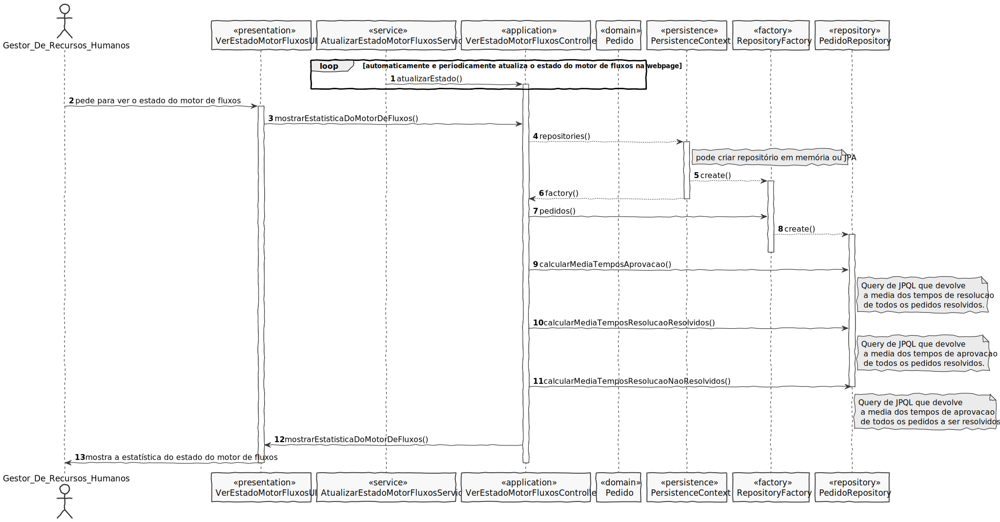

# UC23 - Conhecer o estado dos fluxos de atividade
=======================================

# 1. Requisitos

*Nesta secção a equipa deve indicar a funcionalidade desenvolvida bem como descrever a sua interpretação sobre a mesma e sua correlação e/ou dependência de/com outros requisitos.*

##Informações do Cliente

#Tuesday, 11 de May de 2021 às 11:59
A User Story:

"Como utilizador, eu pretendo que após me autenticar me seja apresentado o meu dashboard web e que este se mantenha atualizado (automaticamente)."

De forma a evitar dúvidas sobre o que, de facto, se pretende com esta US sistematiza-se o fluxo preconizado.

Sequência de Passos:

1. O utilizador inicia a aplicação consola denominada "Portal".

2. A aplicação solicita a autenticação do respetivo utilizador.

3. O utilizador introduz a sua informação de login.

4. Após sucesso do login, ocorre o seguinte (em paralelo):

4.1. A aplicação consola cria localmente um servidor HTTP, acessível apenas pelo localhost, e abre o URL respetivo onde mostra o dashboard web do utilizador que se autenticou na consola. Este servidor, aceita os refresh da página HTML. A informação disponibilizada é obtida por comunicação entre o servidor HTTP e o Motor de Fluxo (cf. Protocolo de Comunicação).

4.2. A aplicação consola continua a execução "normal" da sua UI para o utilizador aceder/usar as restantes funcionalidades.

5. O utilizador ao fazer logout ou sair da aplicação consola, o servidor HTTP deve terminar.

Espero que esta informação ajude e evite interpretações distintas do pretendido.

No âmbito da US 2011, a sequência pretendida é em tudo semelhante.

#Wednesday, 14 de April de 2021 às 19:36
Consegue clarificar melhor o conceito de tempo médio de resolução/aprovação entre catálogos de serviços e de serviços? Que tipo de média utiliza?

    Resposta:
    Usa-se uma média aritmética simples.

###Pré-Requisitos
*Um ou mais serviços devem ter sido previamente definido, juntamente com o seu respetivo fluxo de atividades*
*Um ou mais pedidos devem ter sido previamente efetuados*

###Pós-Requisitos
*É mostrado o estado de todos os fluxos de atividades estatisticamente*

# 2. Análise

*Neste secção a equipa deve relatar o estudo/análise/comparação que fez com o intuito de tomar as melhores opções de design para a funcionalidade bem como aplicar diagramas/artefactos de análise adequados.*

*Recomenda-se que organize este conteúdo por subsecções.*

**Um pedido:**
- é avaliado por um Feedback;
- finaliza com um ResultadoPedido;
- pode ter FicheiroAnexadoPedido;
- por estar num EstadoPedido;
- possui uma DataLimiteResolucaoPedido;
- encontra-se num EstagioPedido;
- pode ter uma UrgenciaPedido;
- possui uma DataSolicitacaoPedido;
- é caracterizado por um IdentificadorAutomaticoPedido;

###Regras de negócio
- O tempo de resolução dos pedidos efetuados é uma média aritmética simples;
- O tempo de aprovação dos pedidos efetuados/aprovados é uma média aritmética simples;

# 3. Design

*Nesta secção a equipa deve descrever o design adotado para satisfazer a funcionalidade. Entre outros, a equipa deve apresentar diagrama(s) de realização da funcionalidade, diagrama(s) de classes, identificação de padrões aplicados e quais foram os principais testes especificados para validar a funcionalidade.*

*Para além das secções sugeridas, podem ser incluídas outras.*

## 3.1. Realização da Funcionalidade

*Nesta secção deve apresentar e descrever o fluxo/sequência que permite realizar a funcionalidade.*

**Nota: antes do diagrama apresentado, o utilizador realiza o login na aplicação Portal.
A aplicação consola cria localmente um servidor HTTP, acessível apenas pelo localhost, e abre o URL respetivo onde mostra o dashboard web do utilizador que se autenticou na consola.
Este servidor, aceita os refresh da página HTML.
A informação disponibilizada é obtida por comunicação entre o servidor HTTP e o Motor de Fluxo (cf. Protocolo de Comunicação).
A aplicação consola continua a execução "normal" da sua UI para o utilizador aceder/usar as restantes funcionalidades.
O utilizador ao fazer logout ou sair da aplicação consola, o servidor HTTP deve terminar.**

## 3.2. Padrões Aplicados

*Nesta secção deve apresentar e explicar quais e como foram os padrões de design aplicados e as melhores práticas.*

3.3.1 User Interface

O padrão User Interface é usado para providenciar uma interface de uso simples ao Gestor de Serviços e Recursos Humanos (neste caso de uso VerEstadoMotorFluxosUI), para que haja separação das restantes partes do sistema.

3.3.2 Controller

O padrão Controller foi utilizado para que exista um controlador (neste caso de uso VerEstadoMotorFluxosController) que possa funcionar como organizador da lógica do caso de uso.

3.3.3 Information Expert

Este padrão atribui às classes a responsabilidade por aquele domínio de negócio que ela representa, como é o caso de Pedido.

3.3.5 High-Cohesion, Low-Coupling

Padrão utilizado para diminuir o acoplamento entre as classes e ao mesmo tempo só lhes atribuir associações que realmente sejam coesas com o seu propósito.
Em todo este caso de uso tentam-se restringir as responsabilidades próprias a cada classe e assim minimizar as associações ao necessário apenas.
Como se pode observar neste caso de uso:
> PedidoRepository, que é apenas um repositório de pedidos, só acede a pedidos e médias de tempos de resolução e/ou aprovação neste caso de uso;
>
> PersistenceContext é uma interface que trata de chamar o repositório de fábricas;
>
> RepositoryFactory é uma fábrica de repositórios que chama os repositórios de colaborador e de catálogo de serviços;
>
> VerEstadoMotorFluxosController trata de toda a lógica de criar um catálogo de serviços, delegando passos intermédios às outras classes.

3.3.6 Repository e Factory

O padrão Repository e o Factory ajudam na persistência, armazenamento e acesso aos dados. É utilizado na camada da Persistence, de modo a garantir a instanciação de PedidoRepository, onde se guarda e se pode aceder aos pedidos.
Porém, antes dessa instanciação é utilizada a interface PersistenceContext para se poder aceder à fábrica de repositórios RepositoryFactory e nela ir buscar o repositório ditos anteriormente, entrando em harmonia com a estrutura do projeto.
Abstrai os detalhes de métodos que modificam o estado deste objeto.

3.3.7 Service (Observer)
Existe um serviço responsável por atualizar periodicamente o estado do motor de fluxos, para que caso o ator queria ver os dados estes sejam em tempo real atualizados.
Neste padrão há um observador que averigua mudanças no motor de fluxos e mostra essas atualizações.

## 3.3. Testes 
*Nesta secção deve sistematizar como os testes foram concebidos para permitir uma correta aferição da satisfação dos requisitos.*

**Teste 1:** Verificar que não é possível criar uma instância da classe Exemplo com valores nulos.

	@Test(expected = IllegalArgumentException.class)
		public void ensureNullIsNotAllowed() {
		Exemplo instance = new Exemplo(null, null);
	}

# 4. Implementação

*Nesta secção a equipa deve providenciar, se necessário, algumas evidências de que a implementação está em conformidade com o design efetuado. Para além disso, deve mencionar/descrever a existência de outros ficheiros (e.g. de configuração) relevantes e destacar commits relevantes;*

*Recomenda-se que organize este conteúdo por subsecções.*

# 5. Integração/Demonstração

*Nesta secção a equipa deve descrever os esforços realizados no sentido de integrar a funcionalidade desenvolvida com as restantes funcionalidades do sistema.*

# 6. Observações

*Nesta secção sugere-se que a equipa apresente uma perspetiva critica sobre o trabalho desenvolvido apontando, por exemplo, outras alternativas e ou trabalhos futuros relacionados.*

