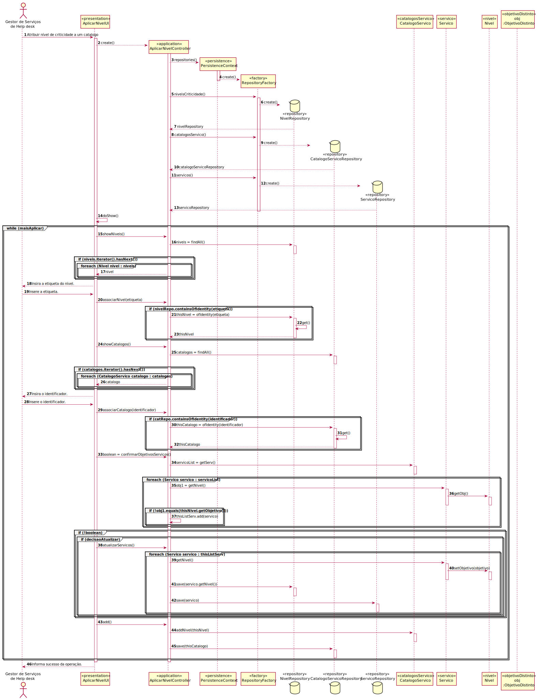

# UC24 - Aplicar nível de criticidade ao catalogo
=======================================

# 1. Requisitos

**Como GSH pretendo atribuir o nível de criticidade aplicado a um catálogo de serviços, assim como contemplar os casos em que é necessário configurar objetivos distintos dos definidos globalmente pela organização.**

Informações da parte do cliente:

## Thursday, 15 de April de 2021 às 11:31

Quando associamos um nível de criticidade de maneira customizada a uma catálogo e necessário redefinir logo os objetivos dos serviços do mesmo?

        RESPOSTA: Não! Por omissão os serviços têm o nível de criticidade e objetivos do catálogo.

## Thursday, 15 de April de 2021 às 11:31

Se declararmos um serviço novo não deviámos também requerir que seja introduzido o objetivo de SLA nesse caso?

        RESPOSTA: Não! Por omissão pode assume o nível de criticidade e objetivos do catálogo.

# 2. Análise

O catálogo vai ser caracterizado por 1 nível de criticidade.
Os serviços do catálogo vão ter níveis de criticidade.

## Regras de Negócio:

- é necessário configurar objetivos distintos dos serviços com os definidos globalmente pela organização.

## Alterações ao Modelo de Domínio

**Não será necessária para já qualquer alteração ao modelo de domínio sendo que este representa bem os conceitos.**

# 3. Design

## 3.1. Realização da Funcionalidade

## 3.2. Padrões Aplicados

###3.2.1 User Interface

O padrão User Interface é usado de modo a providenciar uma ‘interface’ de uso simples ao Gestor de Serviços de Help desk (neste caso de uso AplicarNivelUI), para que haja separação das restantes partes do sistema.

###3.2.2 Controller

O padrão Controller foi utilizado para que exista um controlador (neste caso de uso AplicarNivelController) que possa funcionar como organizador da lógica do caso de uso.

###3.2.3 Repository e Factory

O padrão Repository e o Factory ajudam na persistência, armazenamento e acesso aos dados. É utilizado na camada da Persistence, de modo a garantir a instanciação de CatalogoServicoRepository e NivelCriticidadeRepository, onde se pode aceder às CatalogoServico e NivelCriticidade.

## 3.3. Testes

*Não vão ser implementados testes nesta UC.*

# 4. Implementação

*Nesta secção a equipa deve providenciar, se necessário, algumas evidências de que a implementação está em conformidade com o design efetuado. Para além disso, deve mencionar/descrever a existência de outros ficheiros (e.g. de configuração) relevantes e destacar commits relevantes;*

*Recomenda-se que organize este conteúdo por subsecções.*

# 5. Integração/Demonstração

*Nesta secção a equipa deve descrever os esforços realizados no sentido de integrar a funcionalidade desenvolvida com as restantes funcionalidades do sistema.*

# 6. Observações

*Nesta secção sugere-se que a equipa apresente uma perspetiva critica sobre o trabalho desenvolvido apontando, por exemplo, outras alternativas e ou trabalhos futuros relacionados.*

