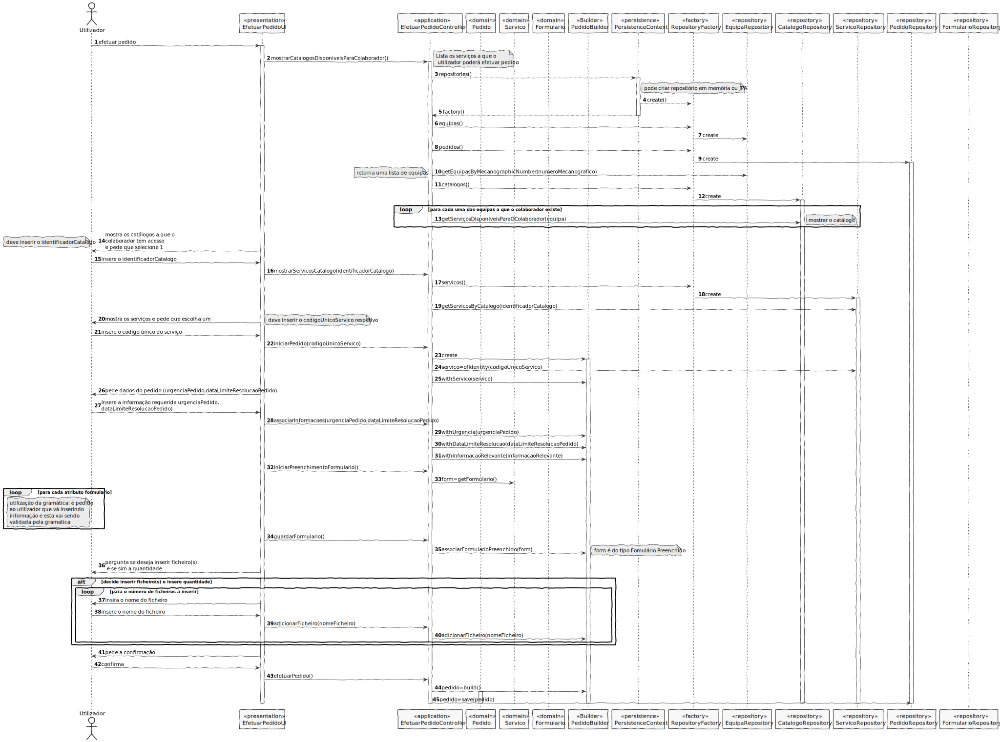

# UC25- Efetuar Pedido
=======================================

# 1. Requisitos

Como {utilizador}, eu pretendo solicitar um serviço do catálogo de serviços que me é disponibilizado.

**->** Nesta funcionalidade o utilizador será capaz de efetuar um **_Pedido_**.

**->** De acordo com a equipa a que este pertence terá acesso a certos catálogos de serviço e consequentemente **_
Serviços_**.

**->** O utilizador poderá indicar a urgência do pedido que será definida como (reduzida, moderada, urgente) e incluir
ficheiros anexados ao pedido, sendo que este deve preencher o formulário relativo ao **_Serviço_**.

**->** Devem ser recolhidos dados referentes à aferição do cumprimento dos objetivos de SLA.

## Requisitos apontados pelo cliente:

### Friday, 21 de May de 2021 às 20:45

Boa noite cliente,

Surgiu-me uma dúvida relativamente aos ficheiros anexados ao solicitar um serviço. No caderno de encargos diz o
seguinte:
"A solicitação de um serviço resulta num pedido que de base é caracterizado por um identificador automático único e
sequencial por ano (e.g. “2021/00037”), por quem e quando foi solicitado, pelo (tipo de) serviço pretendido e respetiva
criticidade (cf. SLA do serviço), a urgência do pedido (reduzida, moderada, urgente), data limite de resolução
pretendida e por um conjunto de ficheiros anexados ao mesmo".

Neste conjunto de ficheiros é obrigatório colocar pelo menos um ficheiro anexado, ou pode não ter nenhum ficheiro
anexado?

Agradeço desde já a sua atenção Cumprimentos

    RESPOSTA: Não é obrigatório anexar ficheiros. Portanto, pode não ter nenhum como pode ter vários.

### Tuesday, 1 de June de 2021 às 17:15

Boa tarde professor, Relativamente à US3003, o que é que pretende por "refinar a US3002 do sprint anterior"? Está
relacionado com o facto de o pedido poder ficar em modo "draft" ou será outra coisa que me esteja a escapar?
Cumprimentos.

    RESPOSTA: Não está relacionado com a questão "draft". Isso não vos foi solicitado em nenhum Sprint.

    O objetivo é (se necessário) rever/melhorar o que foi feito durante o Sprint C e completar a US 3002 no que diz respeito à interligação com a linguagem/gramática desenvolvida para validação de formulários

### Wednesday, 19 de May de 2021 às 15:18

Pretende que seja avaliada de "Baixa" a "Alta", através de uma escala numérica (ex. 1 a 5), ou de alguma outra forma?

    RESPOSTA: No âmbito de um pedido de serviço, a prioridade de uma atividade advém de 3 fatores:
                - nivel de criticidade (definido ao nível do serviço);
                - urgência do pedido (reduzida, moderada, urgente) indicada aquando da realização do pedido;
                - data limite de resolução indicada aquando do pedido.
    Assim, por exemplo, numa listagem de atividades por realizar torna-se essencial mostrar estas 3 informações ao 
    utilizador bem como permitir que este facilmente ordene/filtre as atividade por estas 3 dimensões.
    Deste modo, permite-se que o utilizador gira mais facilmente e melhor a ordem pela qual deve/pretende executar as 
    suas tarefas de forma a não falhar objetivos e satisfazer os anseios dos utilizadores que realizaram os pedidos.

## Pré-condições

O utilizador tem que cumprir os critérios de acesso ao catálogo para ter acesso a estes e consequentemente ao serviço.

## Pós-condições

O Utilizador deve conseguir solicitar um serviço (efetuar um pedido).

# 2. Análise

## Regras de Negócio:

**->** Identificador automático: único e sequencial por ano (e.g. “2021/00037”)

**->** A urgência do pedido pode ser: reduzida, moderada, urgente

**->** Estados do pedido. (i) submetido, (ii) em aprovação, (iii) aprovado ou rejeitado, (iv) em resolução, (v)
concluído/resolvido

**->** As expressões da linguagem/gramática desenvolvida devem ser executadas/interpretadas.

## Alterações ao Modelo de Domínio

Adição do value object InformacaoRelevante (descrição completa)

## Testes a efetuar

**->** A data limite de resolução não pode ser anterior ou igual à data de hoje;

**->** A data de solicitação tem que ser a data do dia em que o pedido é efetuado.

# 3. Design

## 3.1. Realização da Funcionalidade

### Diagrama de Sequência

## 3.2. Diagrama de Classes

*Nesta secção deve apresentar e descrever as principais classes envolvidas na realização da funcionalidade.*

## 3.3. Padrões Aplicados

### User Interface

->Permite a criação de uma interface de uso simplificado para interagir com o utilizador (EfetuarPedidoUI).

#### Controller

-> Entidade que faz a ligação entre a interface do utilizador e a camada de domínio do sistema (application), controla a
execução/fluxo do caso de uso (EfetuarPedidoController).

### Information Expert

->O padrão information expert indica quem tem acesso a informações ou quem "conhece" como é o caso do Pedido que terá
código único... neste caso como é a root Entity do agregado o Pedido conhece a data em que foi efetuado Pedido.

### Creator

->Geralmente regra 1 e 2, neste caso de uso o creator foi, por exemplo, utilizado para criar a Data.

### High-Cohesion & Low-Coupling

->Devemos reduzir sempre o acoplamento e aumentar a coesão entre classes, neste caso há a utilização de interfaces e
cada classe tem funcionalidades específicas e não realiza funcionalidades de outras. Por exemplo, quem pode persistir ou
recuperar objetos do nosso repositório (memória ou base de dados) é por exemplo no caso do Serviço o ServicoRepository.
quem o cria é um builder especializado já que é um objeto complexo.

### Builder

-> O padrão builder serve para criar o Pedido permitindo assim já que este é um objeto complexo a construção de
diferentes representações, e futuramente permitir também que este seja, numa adaptação futura, efetuado de forma
iterativa.

### Factory

->Usado por exemplo na criação do meio de persitência que se deseja (memória ou em base de dados) e assim encapsular a
implementação;

### Repository

O padrão repository é usado para persistir dados, neste caso optei pelo uso de um RepositoryFactory que pode criar um
repositório tanto em memória como em base de dados, e assim há o encapsulamento.

## 3.4. Testes

**Teste 1:** Não aceitar data limite de resolução nula

    @Test(expected = IllegalArgumentException.class)
    public void naoAceitarDataLimiteResolucaoNula() {
        DataLimiteResolucaoPedido data = new DataLimiteResolucaoPedido(null);
    }

**Teste 2:** Não aceitar data limite de resolução vazia

    @Test(expected = IllegalArgumentException.class)
    public void naoAceitarDataLimiteResolucaoVazia() {
        DataLimiteResolucaoPedido data = new DataLimiteResolucaoPedido("");
    }

**Teste 3:** Não aceitar data limite de resolução com tamanho menor que o legal

    @Test(expected = IllegalArgumentException.class)
    public void naoAceitarDataLimiteResolucaoTamanhoMenorQueLegal() {
        DataLimiteResolucaoPedido data = new DataLimiteResolucaoPedido("26/12/20");
    }

**Teste 4:** Não aceitar data limite de resolução sem barra "/"

    @Test(expected = IllegalArgumentException.class)
    public void naoAceitarDataLimiteResolucaoSemBarra() {
        DataLimiteResolucaoPedido data = new DataLimiteResolucaoPedido("26=12=2001");
    }

**Teste 5:** Não aceitar data limite de resolução menor que a atual

    @Test(expected = IllegalArgumentException.class)
    public void naoAceitarDataLimiteResolucaoMenorAtual() {
        DataLimiteResolucaoPedido data = new DataLimiteResolucaoPedido("26/12/2001");
    }

**Teste 6:** Não aceitar data limite de resolução igual à atual

    @Test(expected = IllegalArgumentException.class)
    public void naoAceitarDataLimiteResolucaoIgualAtual() {
        Calendar c = Calendar.getInstance();
        String data = c.get(Calendar.DAY_OF_MONTH) + "/" + c.get(Calendar.MONTH) + "/" + c.get(Calendar.YEAR);
        DataLimiteResolucaoPedido date = new DataLimiteResolucaoPedido(data);
    }

**Teste 7:** Aceitar data limite de resolução válida

    @Test
    public void aceitarDataLimiteResolucaoValida() {
        DataLimiteResolucaoPedido data = new DataLimiteResolucaoPedido("26/12/2099");
    }

# 4. Implementação

- A implementação desta UC coincide com o SD.

# 5. Integração/Demonstração

*Nesta secção a equipa deve descrever os esforços realizados no sentido de integrar a funcionalidade desenvolvida com as
restantes funcionalidades do sistema.*

# 6. Observações

- Apenas tivemos dificuldade na validação dos formulários.