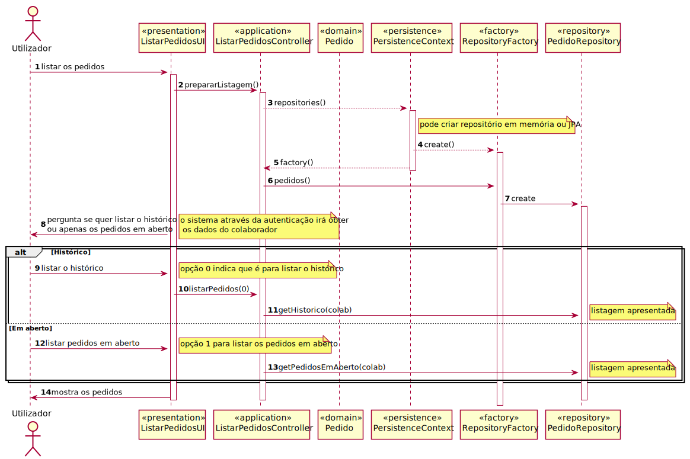

# UC26-Consultar os Pedidos (em curso ou histórico)
=======================================

# 1. Requisitos

Como {utilizador}, eu pretendo consultar os meus pedidos (em curso ou o histórico) e respetivos detalhes/estado.

# 2. Análise

## Regras de Negócio:

**->** Deve ser dada a opção ao utilizador de ver as duas opções separadamente;

**->** Devem estar ordenados dos mais recentes para os mais antigos.

## Alterações ao Modelo de Domínio

- Nenhuma.

## Pré-Requisitos

**->** O colaborador deve estar previamente registado;

**->** O colaborador deve ter efetuado pelo menos um pedido;

## Pós-Requisitos

**->** Mostra os pedidos do utilizador, em curso ou em histórico.

# 3. Design

## 3.1. Realização da Funcionalidade

## 3.2. Padrões Aplicados

3.3.1 User Interface

O padrão User Interface é usado de modo a providenciar uma ‘interface’ de uso simples ao Utilizador (neste caso de uso
ListarPedidosUI), para que haja separação das restantes partes do sistema.

3.3.2 Controller

O padrão Controller foi utilizado para que exista um controlador (neste caso de uso ListarPedidosController) que possa
funcionar como organizador da lógica do caso de uso.

3.3.3 Information Expert

Este padrão atribui às classes a responsabilidade por aquele domínio de negócio que ela representa, como é o caso de
Pedido.

3.3.4 Creator

Geralmente regra 1 e 2, neste caso de uso o creator foi utilizado por Pedido para referenciar qualquer pedido.

3.3.5 High-Cohesion, Low-Coupling

Padrão utilizado para diminuir o acoplamento entre as classes e, em simultâneo, só lhes atribuir associações que
realmente sejam coesas com o seu propósito. Neste caso de uso tentam-se restringir as responsabilidades próprias a cada
classe e assim minimizar as associações ao necessário apenas. Como se pode observar neste caso de uso:
> PedidoRepository, que é apenas um repositório de atividades, só vai buscar as atividades pendentes;
>
> Pedido, que apenas referencia um pedido;
>
>  PersistenceContext é uma ‘interface’ que trata de chamar o repositório de fábricas;
>
>  RepositoryFactory é uma fábrica de repositórios que chama o repositório de pedido;
>
>  ListarPedidosController trata de toda a lógica de buscar as atividades pendentes e dar a opção de as reivindicar, delegando passos intermédios às outras classes.

3.3.6 Repository e Factory

O padrão Repository e o Factory ajudam na persistência, armazenamento e acesso aos dados. É utilizado na camada da
Persistence, de modo a garantir a instanciação de PedidoRepository, onde se guarda e se pode aceder aos pedidos. Porém,
antes dessa instanciação é utilizada a ‘interface’ PersistenceContext para se poder aceder à fábrica de repositórios
RepositoryFactory e nela ir buscar os repositórios ditos anteriormente, entrando em harmonia com a estrutura do projeto.
Abstrai os detalhes de métodos que modificam o estado deste objeto.

# 4. Implementação

- A implementação do UC coincide com o SD.

# 5. Integração/Demonstração

*Nesta secção a equipa deve descrever os esforços realizados no sentido de integrar a funcionalidade desenvolvida com as
restantes funcionalidades do sistema.*

# 6. Observações

- Tivemos umas dúvidas com a query, mas conseguimos resolver.

