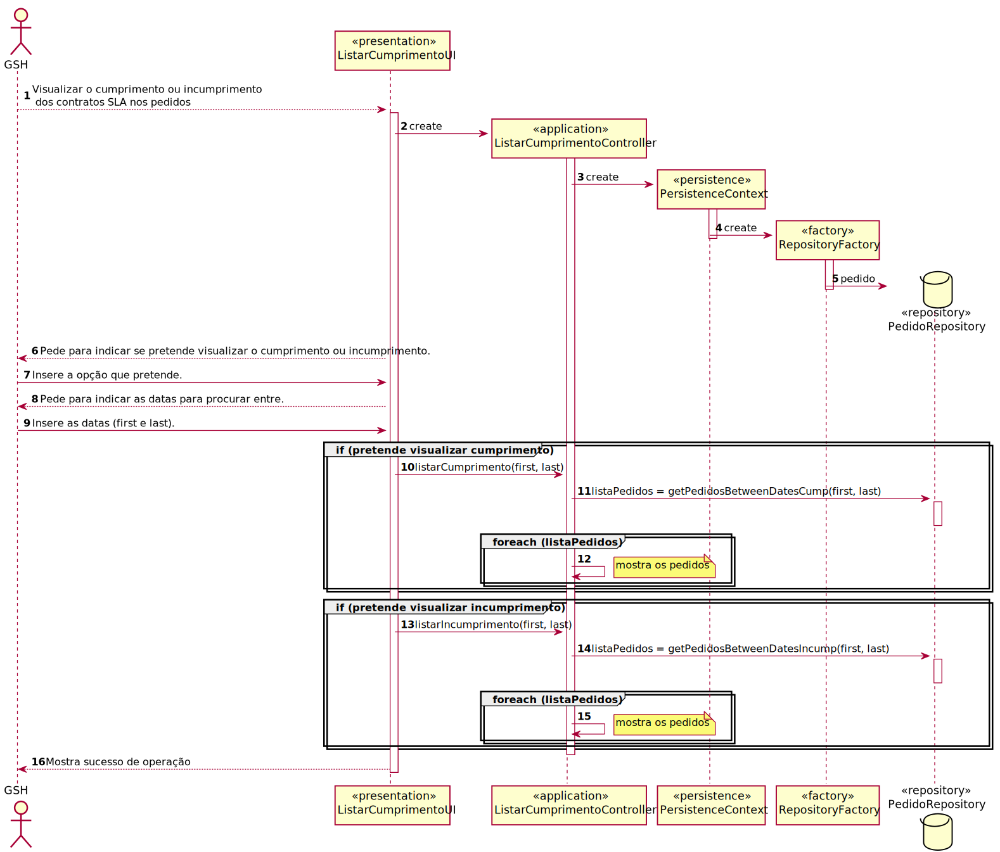

# UC29 - Obter uma listagem sobre o (in)cumprimento do SLA das solicitações recebidas e já concluídas num intervalo de tempo.
=======================================

# 1. Requisitos

Obter uma lista sobre os SLA das solicitações recebidas e das concluídas num certo intervalo.

**Informações apontadas pelo cliente:**

## Tuesday, 15 de June de 2021 às 15:24

Boa tarde professor, relativamente ao US 2013, o titulo diz: "Como GSH, eu pretendo obter uma listagem sobre o (in)cumprimento do SLA das solicitações recebidas e já concluídas num determinado intervalo de tempo." Pelo que eu entendi é suposto pedir ao utilizador para introduzir um intervalo de datas, por exemplo: 15-6-2021 a 20-6-2021. Considera suficiente desta maneira ou também devemos dar a possibilidade do utilizador de introduzir uma hora especifica para cada dia? por exemplo: de 15-6-2021 15:00h a 20-6-2021 16:00h.
Relativamente à listagem, que informação em concreto deve ser apresentada?

    Resposta: Entre datas (dias) é mais do que suficiente.
    Relativamente ao conteúdo da listagem, uma hipótese mais simples será mostrar, para cada pedido ocorrido nesse intervalo, o tempo que demorou a aprovação e a realização do pedido e sinalizar o (in)cumprimento do SLA, mostrando os valores objetivo.
    Uma hipótese mais interessante seria considerar os pedidos ocorridos nesse intervalo de tempo e agrupa-los por serviço de forma a determinar o tempo mínimo/máximo/médio de aprovação e de realização bem como a quantidade e percentagem de pedidos em que o SLA foi ou não cumprido.

# 2. Análise

## Regras de Negócio:

- Obter cumprimento ou incumprimento entre duas datas inseridas pelo GSH.

## Alterações ao Modelo de Domínio

- Nenhuma alteração ao Modelo de Domínio.

## Pré-Requisitos

- Tem de haver contratos SLA no sistema.

## Pós-Requisitos

- Visualizar a lista de SLAs.

# 3. Design

## 3.1. Realização da Funcionalidade

## 3.2. Padrões Aplicados

3.2.1 User Interface

O padrão User Interface é usado de modo a providenciar uma ‘interface’ de uso simples ao Utilizador (neste caso de uso ListarCumprimentoUI) para que haja separação das restantes partes do sistema.

3.2.2 Controller

O padrão Controller foi utilizado para que exista um controlador (neste caso de uso ListarCumprimentoController) que possa funcionar como organizador da lógica do caso de uso.

3.2.3 Information Expert

Este padrão atribui às classes a responsabilidade por aquele domínio de negócio que ela representa, como é o caso de Pedido.

3.2.4 Creator

Geralmente regra 1 e 2, neste caso de uso o creator foi utilizado por Pedido para referenciar qualquer pedido.

3.2.5 High-Cohesion, Low-Coupling

Padrão utilizado para diminuir o acoplamento entre as classes e, em simultâneo, só lhes atribuir associações que realmente sejam coesas com o seu propósito.
Neste caso de uso tentam-se restringir as responsabilidades próprias a cada classe e assim minimizar as associações ao necessário apenas.
Como se pode observar neste caso de uso:
> PedidoRepository, que é apenas um repositório de pedidos, só vai buscar os pedidos concluídos que in/cumpriram os contratos SLA;
>
> Pedido, que apenas referencia um pedido;
>
> PersistenceContext é uma ‘interface’ que trata de chamar o repositório de fábricas;
>
> RepositoryFactory é uma fábrica de repositórios que chama o repositório de pedido;
>
> ListarCumprimentoController trata de toda a lógica de buscar os pedidos concluídos que in/cumpriram os contratos SLA, delegando passos intermédios às outras classes.

3.2.6 Repository e Factory

O padrão Repository e o Factory ajudam na persistência, armazenamento e acesso aos dados. É utilizado na camada da Persistence, de modo a garantir a instanciação de PedidoRepository, onde se guarda e se pode aceder aos pedidos.
Porém, antes dessa instanciação é utilizada a ‘interface’ PersistenceContext para se poder aceder à fábrica de repositórios RepositoryFactory e nela ir buscar os repositórios ditos anteriormente, entrando em harmonia com a estrutura do projeto.
Abstrai os detalhes de métodos que modificam o estado deste objeto.

# 4. Implementação

- A implementação do UC coincide com o SD apresentado em cima.

# 5. Integração/Demonstração

*Nesta secção a equipa deve descrever os esforços realizados no sentido de integrar a funcionalidade desenvolvida com as
restantes funcionalidades do sistema.*

# 6. Observações

- Nenhuma