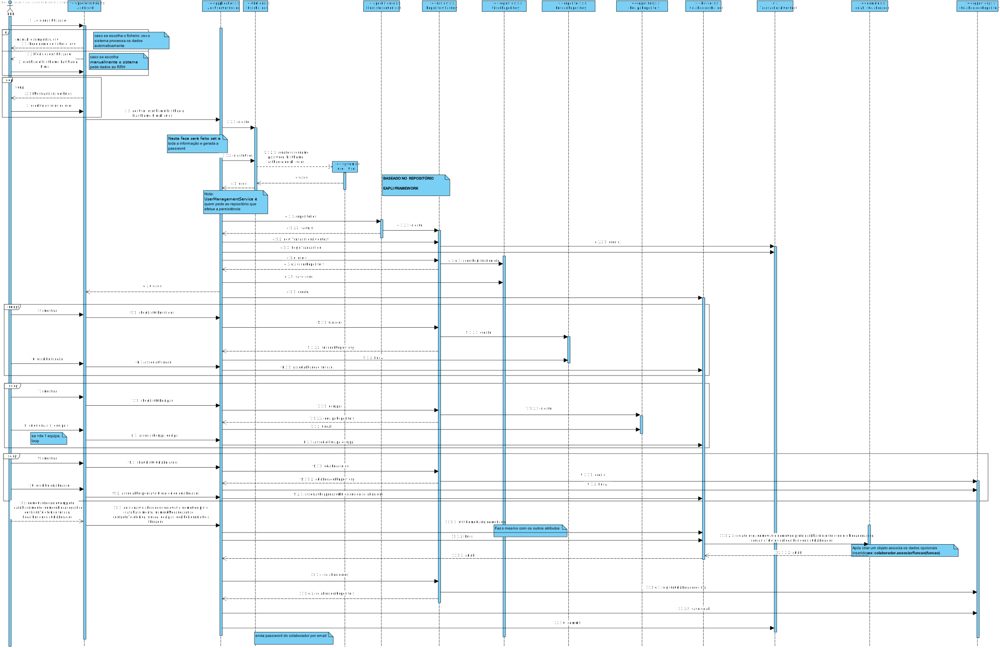
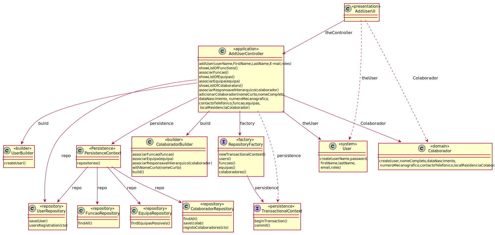

# UC3- Especificar Colaborador
=======================================

# 1. Requisitos

**Especificar Colaborador**

Neste caso de uso o {Responsável de Recursos Humanos (RRH)}, seguindo o nosso MD será um Colaborador e na estrutura da
Organização será o responsável de recursos humanos, deverá ser capaz de especificar um novo colaborador e assim que este
seja adicionado ao sistema deverá puder aceder ao sistema.

**Requisitos apontados pelo cliente:**

## Saturday, 24 de April de 2021 às 22:46

Quando se procede à especificação de um novo Colaborador pretende que seja possível não lhe ser logo atribuída uma
"role", podendo ser esta atualizada mais tarde, ou trata-se de um campo obrigatório?

        RESPOSTA: Deve ser de preenchimento facultativo.

## Thursday, 22 de April de 2021 às 19:32

Há alguma restrição quanto à especificação do número mecanográfico?

        RESPOSTA: Que me esteja a lembrar, não.

## Thursday, 22 de April de 2021 às 09:46

A password do utilizador, depois de definida, deve ser logo mudada por ele?

        RESPOSTA: É uma funcionalidade interessante mas, neste momento, não tem qualquer prioridade.

## Thursday, 22 de April de 2021 às 09:43

Na password de utilizador, há algum tipo de geração automática associada?

        RESPOSTA: Futuramente, certamente que será necessário.

## Wednesday, 21 de April de 2021 às 23:37

Em termos de nome curto e nome completo (colaborador), o que os diferencia será apenas o número de caracteres certo? Se
sim, qual o número de caracteres máximo para cada um?

        RESPOSTA: Nome completo: 80 caracteres; Nome Curto: 30. Tipicamente o nome curto corresponde ao primeiro
                  e último nome do colaborado.

Foi aqui já referido que o código referente à função do Colaborador será alfa-numérico. Relativamente ao número de
caracteres máximo, será o mesmo dos códigos de equipa e tipo de equipa (15 caracteres)?

        RESPOSTA: Também são 15 caracteres.

## Tuesday, 13 de April de 2021 às 22:57

Quando se refere ao local de residência de um colaborador, o que pretende? A morada completa ou apenas a localidade?

        RESPOSTA: No âmbito deste sistema é mais do que suficiente que seja apenas a localidade: Distrito/Concelho.
                  O local de residência deve ser visto como informação não obrigatória.

## Saturday, 24 de April de 2021 às 22:46

Quando se procede à especificação de um novo Colaborador pretende que seja possível não lhe ser logo atribuída uma "
role", podendo ser esta atualizada mais tarde, ou trata-se de um campo obrigatório?

        RESPOSTA: Deve ser de preenchimento facultativo.

**Critérios de Aceitação:**

->Deve contemplar a associação a uma ou mais equipas.

->Devem reutilizar o componente de gestão de utilizadores disponibilizado em EAPLI.

## Pré-condições

n/a

## Pós-condições

Ter um Colaborador registado e que este tenha acesso ao sistema. O programa deve enviar a password para o email deste,
password esta que será gerada automaticamente.

# 2. Análise

Um colaborador é identificado por um número mecanográfico e reconhecido pelo nome curto. é ainda caracterizado pela data
de nascimento, nome completo, o seu local de residência, possui ainda um email e um contacto telefónico.

## Regras de Negócio:

-O nº mecanográfico é único e tem de ser introduzido pelo utilizador.

-O nivel hierárquico (cargo) do novo colaborador pode não ser definido de imediato.

-A password deve ser enviada para o email institucional do colaborador após a conclusão da sua especificação.

-A informação necessária a especificar um colaborador pode ser introduzida manualmente ou através de um ficheiro '.csv'.

-O nome completo deve possuir um máximo de 80 caracteres e o nome curto um máximo de 30, sendo que este último
normalmente corresponde ao primeiro e último nome do colaborador.

-O código referente à função do Colaborador será alfa-numérico com no máximo 15 caracteres

-Relativamente à morada do Colaborador basta identificar -> localidade: Distrito/Concelho.

## Alterações ao Modelo de Domínio

Devido ao facto de o cliente afirmar que a morada é facultativa será necessário efetuar uma alteração no modelo de
domínio, para que a multiplicidade seja do tipo 1 colaborador tem associada 0 ou 1 morada.

Foi ainda necessário adicionar uma função ao colaborador.

## Testes a efetuar

->O colaborador ainda não pode estar registado no sistema. Caso o número mecanográfico exista o sistema deve terminar a
operação e informar que o colaborador já existe.

-O nome completo deve possuir no maximo 80 caracteres

-o nome curto deve possuir no maximo 30 caracteres

-O código referente à função do Colaborador será alfa-numérico com 15 caracteres

-a data de nascimento tem de ser inferior à atual

-O código referente à função do Colaborador será alfa-numérico com 15 caracteres

# 3. Design

*Nesta secção a equipa deve descrever o design adotado para satisfazer a funcionalidade. Entre outros, a equipa deve
apresentar diagrama(s) de realização da funcionalidade, diagrama(s) de classes, identificação de padrões aplicados e
quais foram os principais testes especificados para validar a funcionalidade.*

*Para além das secções sugeridas, podem ser incluídas outras.*

## 3.1. Realização da Funcionalidade

### Diagrama de Sequência

## 3.2. Diagrama de Classes

## 3.3. Padrões Aplicados

### User Interface

->Permite a criação de uma interface de uso simplificado para interagir com o utilizador (AddUserUI).

#### Controller

-> Entidade que faz a ligação entre a interface do utilizador e a camada de domínio do sistema, controla a execução do
caso de uso (AddUserController).

### Information Expert

->O padrão information expert indica quem tem acesso a informações ou quem "conhece". Um bom exemplo disso é o caso do
Colaborador que terá numeroMecanografico... neste caso como é a root Entity do agregado o colaborador conhece / sabe o
seu número mecanográfico.

### Creator

->Geralmente regra 1 e 2, neste caso de uso o creator foi, por exemplo, utilizado para criar o Colaborador.

### High-Cohesion & Low-Coupling

->Devemos reduzir sempre o acoplamento e aumentar a coesão entre classes, neste caso há a utilização de interfaces e
cada classe tem funcionalidades específicas e não realiza funcionalidades de outras. Por exemplo, quem pode persistir ou
recuperar objetos do nosso repositório (memória ou base de dados) é por exemplo no caso do Colaborador o
ColaboradorRepository, como em todos os outros repositórios e no caso do user (sys user)
quem o cria é um builder especializado já que é um objeto complexo.

### Builder

-> O padrão builder serve para criar o objeto User que representa o system user permitindo assim já que este é um objeto
complexo a construção de diferentes representações, foi também usado para construir o Colaborador.

### Factory

->Usado por exemplo na criação do meio de persitência que se deseja (memória ou em base de dados)
e assim encapsular a implementação;

### Repository

O padrão repository é usado para persistir dados, neste caso optei pelo uso de um RepositoryFactory que pode criar um
repositório tanto em memória como em base de dados, e assim há o encapsulamento.

## 3.4. Testes

*Nesta secção deve sistematizar como os testes foram concebidos para permitir uma correta aferição da satisfação dos
requisitos.*

**Teste 1:** Assegurar Que Dois Colaboradores Com Iguais Mecanograficos Nao Sao O Mesmo

        @Test 
        public void assegurarQueDoisColaboradoresComIguaisMecanograficosNaoSaoOMesmo() throws Exception {
        inicializarColaboradoresDeTeste(); final boolean expected = c1.equals(c2); assertTrue(expected); 
        }

**Teste 2:** Assegurar Que Dois Colaboradores Com Diferentes Mecanograficos Nao Sao O Mesmo

        @Test
        public void assegurarQueDoisColaboradoresComDiferentesMecanograficosNaoSaoOMesmo() throws Exception {
        inicializarColaboradoresDeTeste(); 
        final boolean expected = c1.equals(c3); 
        assertFalse(expected); 
        }

**Teste 3:** Assegurar Que Colaborador E O Mesmo Que A Sua Instancia

        @Test 
        public void assegurarQueColaboradorEOMesmoQueASuaInstancia() throws Exception { 
        inicializarColaboradoresDeTeste();
        final boolean expected = c1.sameAs(c1); 
        assertTrue(expected); 
        }

**Teste 4:** Assegurar Que nome Completo Mais 80 Caracteres não é aceite

        @Test(expected = IllegalArgumentException.class)
        public void nomeCompletoMais80Caracteres() { 
        NomeCompletoColaborador n1 = new NomeCompletoColaborador("AAAssssssssbfgthvbfgrdhskcjfhghghghghghghghg
        +"hghghghghghghrgiowivbwbwbçwrborwwbwrbwrbrwbrwbwrbrwbrwbwbrwbrwbrwbrwbrwbrwbrwbrwbwrb"); 
        }

**Teste 5:** Assegurar Que nome Completo menos 80 Caracteres é aceite

        @Test 
        public void nomeCompletoMenos80Caracteres() { 
        NomeCompletoColaborador n1 = new NomeCompletoColaborador("Name1Surname1"); 
        }

**Teste 6:** Assegurar Que nome curto mais 30 Caracteres não é aceite

        @Test(expected = IllegalArgumentException.class)
        public void nomeCurtoMais30Caracteres() { 
        NomeCurtoColaborador n1 = new NomeCurtoColaborador("AAAAAbbtrtththhehfhfehhdedefeqefqerfrrggwgwrwdfdddq"); 
        }

**Teste 7:** Assegurar Que nome curto menos 30 Caracteres é aceite

        @Test 
        public void nomeCurtoMenos30Caracteres() { 
        NomeCurtoColaborador n1 = new NomeCurtoColaborador("Name Surname"); 
        }

**Teste 8:** Assegurar Que a data de hoje não é aceite

        @Test(expected = IllegalArgumentException.class)
        public void naoAceitarDataDeHoje() { 
        Calendar hoje = Calendar.getInstance(); DataNascimentoColaborador d= new
        DataNascimentoColaborador(hoje); 
        }

**Teste 9:** Assegurar Que contacto inválido não é aceite

        @Test(expected=IllegalArgumentException.class)
        public void naoAceitarContactoInvalido() { ContactoColaborador c = new ContactoColaborador(244); 
        }

# 4. Implementação

## Importar colaboradores via .csv

Implementamos um método que carrega toda a informação e assim cria muitos colaboradores de uma única vez. O ficheiro tem
a seguinte organização:

    USERNAME;FIRST_NAME;LAST_NAME;EMAIL;ROLE;MECANOGRAPHIC_NUMBER;NOME_COMPLETO;CONTACTO;ANO;MES;DIA;DISTRITO;CONCELHO
    adbf;Antonio;Fernandes;1190402@isep.ipp.pt;ADMIN;1190402;Antonio Daniel Barbosa Fernandes;967481242;2001;12;26;Viseu;Cinfaes
    tpl;Teresa;Leite;1191072@isep.ipp.pt;CLIENT_USER;1191072;Teresa Pereira Leite;919999999;2001;1;6;Porto;Porto
    jpop;Joao;Pereira;1190742@isep.ipp.pt;RESPONSAVEL_RECURSOS_HUMANOS;1190742;Joao Pedro Pereira;919999999;2001;2;12;Porto;Porto
    rps;Rui;Soares;1191045@isep.ipp.pt;GESTOR_SERVICOS_HELPDESK;1191045;Rui Pedro Mesquita Soares;919999999;2001;3;14;Porto;Porto

O método implementado está preparado para ignorar a primeira linha (cabeçalho) que indica como este deve ser construído

## Geração automática de passwords

Implementamos a funcionalidade de gerar automaticamente a password para os utilizadores.

## Envio de Email

Para enviar a password para o colaborador de forma automática implementamos um método de envio de email

# 5. Integração/Demonstração

## Demonstração da criação automática de colaboradores

## Demonstração do envio de email e geração de password de forma automática

# 6. Observações

*Nesta secção sugere-se que a equipa apresente uma perspetiva critica sobre o trabalho desenvolvido apontando, por
exemplo, outras alternativas e ou trabalhos futuros relacionados.*
