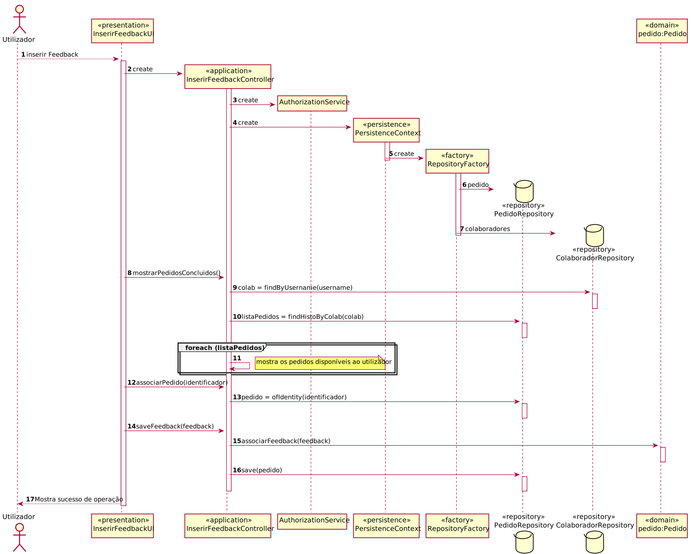

# UC30 — Dar feedback sobre pedido
=======================================

# 1. Requisitos

O utilizador oferece feedback sobre o pedido realizado.

**Informações apontadas pelo cliente:**

- Nenhuma pergunta colocada no fórum.

# 2. Análise

## Regras de Negócio:

- Criar feedback.

## Alterações ao Modelo de Domínio

- Nenhum.

## Pré-Requisitos

Ter sido concluído o pedido feito pelo utilizador.

## Pós-Requisitos

Existir um feedback da parte do utilizador sobre o seu pedido. 

# 3. Design

## 3.1. Realização da Funcionalidade

## 3.2. Padrões Aplicados

3.2.1 User Interface

O padrão User Interface é usado de modo a providenciar uma ‘interface’ de uso simples ao Utilizador (neste caso de uso InserirFeedbackUI) para que haja separação das restantes partes do sistema.

3.2.2 Controller

O padrão Controller foi utilizado para que exista um controlador (neste caso de uso InserirFeedbackController) que possa funcionar como organizador da lógica do caso de uso.

3.2.3 Information Expert

Este padrão atribui às classes a responsabilidade por aquele domínio de negócio que ela representa, como é o caso de Pedido.

3.2.4 Creator

Geralmente regra 1 e 2, neste caso de uso o creator foi utilizado por Pedido para referenciar qualquer pedido.

3.2.5 High-Cohesion, Low-Coupling

Padrão utilizado para diminuir o acoplamento entre as classes e, em simultâneo, só lhes atribuir associações que realmente sejam coesas com o seu propósito.
Neste caso de uso tentam-se restringir as responsabilidades próprias a cada classe e assim minimizar as associações ao necessário apenas.
Como se pode observar neste caso de uso:
> PedidoRepository, que é apenas um repositório de pedidos, só vai buscar os pedidos do Colaborador concluídos;
>
> Pedido, que apenas referencia um pedido;
>
> PersistenceContext é uma ‘interface’ que trata de chamar o repositório de fábricas;
>
> RepositoryFactory é uma fábrica de repositórios que chama o repositório de pedido;
>
> InserirFeedbackController trata de toda a lógica de buscar os pedidos concluídos e dar a opção de inserir um 'feedback', delegando passos intermédios às outras classes.

3.2.6 Repository e Factory

O padrão Repository e o Factory ajudam na persistência, armazenamento e acesso aos dados. É utilizado na camada da Persistence, de modo a garantir a instanciação de PedidoRepository, onde se guarda e se pode aceder aos pedidos.
Porém, antes dessa instanciação é utilizada a ‘interface’ PersistenceContext para se poder aceder à fábrica de repositórios RepositoryFactory e nela ir buscar os repositórios ditos anteriormente, entrando em harmonia com a estrutura do projeto.
Abstrai os detalhes de métodos que modificam o estado deste objeto.

# 4. Implementação

- A implementação do UC coincide com o SD apresentado.

# 5. Integração/Demonstração

*Nesta secção a equipa deve descrever os esforços realizados no sentido de integrar a funcionalidade desenvolvida com as
restantes funcionalidades do sistema.*

# 6. Observações

- Tem de haver pedidos finalizados para poder dar um feedback ao mesmo.