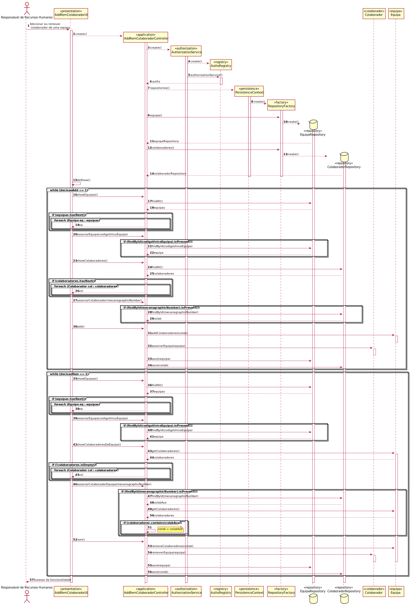

# UC4- Atualizar informacao de colaborador
=======================================

# 1. Requisitos

**Atualizar funções e equipas a que um colaborador pertence**

#Informações da parte do cliente:

## Tuesday, 27 de April de 2021 às 09:29

Como funcionaria esta funcionalidade (remover/adicionar colaborador a equipa) em termos de fluxo de execução?
Por exemplo seria mostrado uma lista de colaboradores inicialmente, o utilizador seleciona um e depois é mostrada a 
lista de equipas a que este pertence e o utilizador escolhia se removia ou adicionava-o a uma equipa,  etc.

	Resposta: Acima de tudo pretendo que seja um fluxo intuitivo, simples, rápido e prático para o utilizador dessa funcionalidade.
				Não tenho nenhum fluxo pré-definido.
				Gostava que a vossa equipa me surpreendesse positivamente a esse respeito.
				Fico a aguardar.

## Friday, 23 de April de 2021 às 10:39

Quando registamos um catálogo no sistema e escolhemos um colaborador que possa ser responsável por este, devemos listar 
colaboradores com uma determinada função na empresa, de uma determinada equipa ou podemos escolher qualquer colaborador.

	Resposta: Podemos escolher qualquer colaborador.
				O sistema deve permitir encontrar o colaborador de uma forma rápida (e.g. através de uma pesquisa).
	

# 2. Análise

Um colaborador é identificado por um número mecanográfico e reconhecido pelo nome curto. É ainda caracterizado pela data
de nascimento, nome completo, o seu local de residência (pode ou não ter), possui ainda um email e um contacto telefónico.
Pertence a uma equipa e exerce uma ou várias funções na sua organização.

## Regras de Negócio:

- O sistema indica o colaborador através duma pesquisa

## Alterações ao Modelo de Domínio

**Não será necessária para já qualquer alteração ao modelo de domínio sendo que este representa bem os conceitos.**

## Testes a efetuar
- Verificar se existe equipa antes de se atribuir outra 
- Verificar se a nova função a atribuir existe no sistema

# 3. Design

*Nesta secção a equipa deve descrever o design adotado para satisfazer a funcionalidade. Entre outros, a equipa deve apresentar diagrama(s) de realização da funcionalidade, diagrama(s) de classes, identificação de padrões aplicados e quais foram os principais testes especificados para validar a funcionalidade.*

*Para além das secções sugeridas, podem ser incluídas outras.*

## 3.1. Realização da Funcionalidade

*Nesta secção deve apresentar e descrever o fluxo/sequência que permite realizar a funcionalidade.*

## 3.2. Padrões Aplicados

*Nesta secção deve apresentar e explicar quais e como foram os padrões de design aplicados e as melhores práticas.*

3.3.1 User Interface

O padrão User Interface é usado a fim de providenciar uma interface de uso simples ao Gestor de Serviço (neste caso de uso AddRemColaboradorUI), para que haja separação das restantes partes do sistema.

3.3.2 Controller

O padrão Controller foi utilizado para que exista um controlador (neste caso de uso AddRemColaboradorController) que possa funcionar como organizador da lógica do caso de uso.

3.3.3 Information Expert

Este padrão atribui às classes a responsabilidade por aquele domínio de negócio que ela representa, como é o caso de Colaborador ou de Equipa.

3.3.4 Creator

Geralmente regra 1 e 2, neste caso de uso o creator foi utilizado por Equipa para instanciar um objeto Equipa.

3.3.5 High-Cohesion, Low-Coupling

Padrão utilizado para diminuir o acoplamento entre as classes e ao mesmo tempo só lhes atribuir associações que realmente sejam coesas com o seu propósito.
Em todo este caso de uso tentam-se restringir as responsabilidades próprias a cada classe e assim minimizar as associações ao necessário apenas.
Por exemplo, neste caso de uso:
>  EquipaRepository, que é apenas um repositório de Equipas, que vai buscar equipa(s) e guardar a(s) equipa(s) neste caso de uso;
>
> Equipa instancia o objeto que será a Equipa e ao qual se adicionará ou removerá o colaborador;
>
> ColaboradorRepository serve para aceder a um determinado Colaborador pelo seu número mecanográfico;
>
> PersistenceContext é uma interface que trata de chamar o repositório de fábricas;
>
> RepositoryFactory é uma fábrica de repositórios que chama os repositórios de colaborador e de equipa;
>
> AddRemColaboradorController trata de toda a lógica de adiconar/remover um colaborador de uma equipa, delegando passos intermédios às outras classes.

3.3.6 Repository e Factory

O padrão Repository e o Factory ajudam na persistência, armazenamento e acesso aos dados. É utilizado na camada da Persistence, de modo a garantir a instanciação de EquipaRepository, onde se guarda e se pode aceder às Equipas, e ColaboradorRepository, onde se guarda e se pode aceder aos Colaboradores da organização.
Porém, antes dessa instanciação é utilizada a interface PersistenceContext para se poder aceder à fábrica de repositórios RepositoryFactory e nela ir buscar os repositórios ditos anteriormente, entrando em harmonia com a estrutura do projeto.

## 3.4. Testes
*Nesta secção deve sistematizar como os testes foram concebidos para permitir uma correta aferição da satisfação dos requisitos.*

**Não se achou necessário a realização de testes tendo em conta os requisitos e os testes realizados para a criação de um colaborador.**

# 4. Implementação

*Nesta secção a equipa deve providenciar, se necessário, algumas evidências de que a implementação está em conformidade com o design efetuado. Para além disso, deve mencionar/descrever a existência de outros ficheiros (e.g. de configuração) relevantes e destacar commits relevantes;*

Na sua implementação nota-se que na classe AddRemColaboradorController há o uso de repositórios de equipa e de colaboradores e delegação de responsabilidades pelas várias classes, seja a realizar findById(mecanographicNumber) por parte do repositório de colaboradores, seja a de 
associarEquipa(equipa) por parte da classe Colaborador (pois o Colaborador sabe a equipa a que pertence), seja a de realizar save(colab) ao repositório de colaboradores.

# 5. Integração/Demonstração

*Nesta secção a equipa deve descrever os esforços realizados no sentido de integrar a funcionalidade desenvolvida com as restantes funcionalidades do sistema.*

Esta funcionalidade foi integrada em conjunto com a User Story [UC3](../UC3-2051%234/ProcessoEngenhariaFuncionalidade.md) "2051-> Como Responsável de Recursos Humanos (RRH), eu pretendo proceder à especificação de um novo colaborador de modo a que este possa, posteriormente, aceder e usar o sistema"
 para que ao criar um colaborador se possa posteriormente alterar os seus dados.

# 6. Observações

*Nesta secção sugere-se que a equipa apresente uma perspetiva critica sobre o trabalho desenvolvido apontando, por exemplo, outras alternativas e ou trabalhos futuros relacionados.*

**Futuramente poder-se-à ter de acrescentar mais opções de mudança em alguns dados do Colaborador.**

