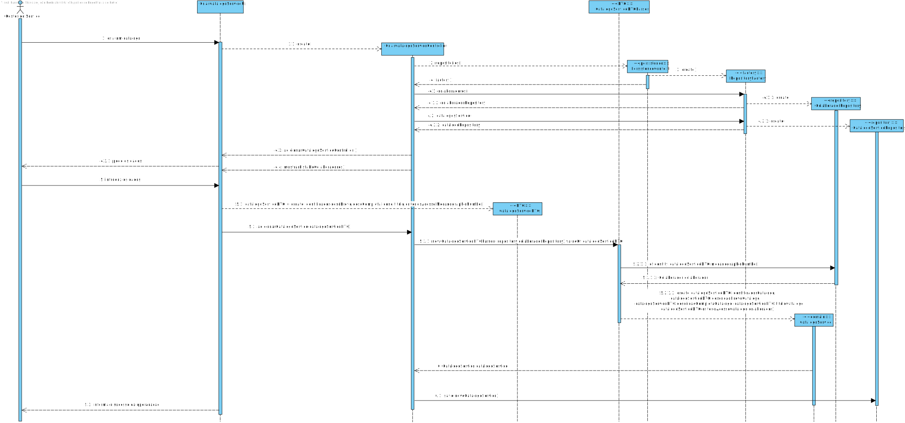

# UC5- Criar catalogo de servicos
=======================================

# 1. Requisitos

**Indicar o colaborador responsável**
**Indicar os colaboradores a quem o serviço fica disponivel: uma ou mais equipas**

#Informações da parte do cliente:

## Friday, 2 de April de 2021 às 21:19

Tendo em conta o Icone que é pedido, que especificidades tem o cliente em mente em relação a ele. Um comprimento, uma largura, uma descrição, um formato (png,jpg, etc)?

        RESPOSTA: Esse ícone tem o intuito de ser usado/aplicado na User Interface. Nesse sentido, apenas é necessário garantir que o sistema consegue usar o ícone indicado e que este possui um mínimo de qualidade que deve ser definido pela vossa equipa.

P.S.: Eu - como cliente - não percebo nada de formatos gráficos (png, gif). Tratem de me sugerir algo interessante e aceitável.

## Friday, 23 de April de 2021 às 16:25

Quais são a regras de negócio presentes no título do catálogo?

    RESPOSTA: Nada de especial: deve suportar os vários exemplos apresentados ao longo do caderno de encargos.

## Tuesday, 27 de April de 2021 às 09:21

Quais são as regras de negócio do icon e do identificador de catálogo?
É necessário escolher logo uma equipa ou várias a que o catálogo fica disponivel?
Um colaborador pode gerir mais que um catálogo certo ?

    Respostas:
    1. Regras de negócios:
        1.1. Sobre o identificador do catálogo já respondi anteriormente (https://moodle.isep.ipp.pt/mod/forum/discuss.php?d=7400). Portanto, não percebo o porquê de perguntares novamente.
        1.2. Sobre o ícone, talvez me esteja a "escapar" algo. De forma bruta, um ícone é um ícone. Não estou certamente a alcançar o que me pedes para decidir. Queres dar exemplos de "coisas" que esteja a considerar na tua pergunta para eu poder decidir.
    2. Sim, pelo menos uma.
    3. Certo.

## Friday, 2 de April de 2021 às 21:22

No contexto do colaborador gerir um catálogo, este pode gerir mais que um, ou para já terá apenas um associado?

    Resposta
    1) Um catálogo tem um colaborador responsável pela sua gestão.
     1.1) Contudo, o mesmo colaborador pode ser responsável por mais do que um catálogo.

## Monday, 5 de April de 2021 às 18:43

No enunciado encontra-se o seguinte: "um catálogo disponibiliza um ou mais serviços e possui pelo menos um colaborador que é responsável pela prestação desses serviços" (2.2.1).
Com base na sua resposta, podemos concluir que um colaborador pode ser responsável por mais do que um catálogo e que um catálogo pode ter vários responsáveis, correto?
Para além disso, um serviço também pode ter mais do que um responsável?

    Resposta 
    1) O cenário mais comum é um catálogo ter um colaborador responsável pela sua gestão.
    1.1) Contudo, de facto, há alguns casos em que um catálogo pode ter mais do que um colaborador como responsável pela sua gestão.

## Monday, 26 de April de 2021 às 00:51

Em relação ao identificador do catálogo é introduzido ou é gerado?

    RESPOSTA: É introduzido.

## Thursday, 15 de April de 2021 às 18:39

Na entidade catálogo de Serviços e serviços, podemos considerar que o título, a descrição e o ícone seguem as mesmas regras de negócio?

    RESPOSTA: De momento, julgo que sim. Caso me lembre de alguma diferença, informarei.

## Wednesday, 14 de April de 2021 às 19:36

Consegue clarificar melhor o conceito de tempo médio de resolução/aprovação entre catálogos de serviços e de serviços? Que tipo de média utiliza?

    RESPOSTA: Usa-se uma média aritmética simples.

## Friday, 16 de April de 2021 às 22:05
Poderá querer activar/desactivar ou apagar algumas das seguintes entidades:Colaborador,Função,Tipo Equipa,Equipa,Catálogo? 

    Resposta:1) A funcionalidade de apagar faz sentido para qualquer uma dessa entidades, até porque os utilizadores podem cometer erros.
             1.1)   Contudo, não é onde se pretende despender esforços.
             1.2)   Relativamente ao desativar/ativar eventualmente pode ser útil na gestão de catálogos.
             1.3)   Nas restantes, não vejo utilidade.

## Friday, 23 de April de 2021 às 10:39

Quando registamos um catálogo no sistema e escolhemos um colaborador que possa ser responsável por este, devemos listar colaboradores com uma determinada função na empresa, de uma determinada equipa ou podemos escolher qualquer colaborador.

    RESPOSTA: Podemos escolher qualquer colaborador. O sistema deve permitir encontrar o colaborador de uma forma rápida (e.g. através de uma pesquisa).

## Friday, 30 de April de 2021 às 13:30

Seguindo o que foi dito acerca dos atributos do serviço, todos os atributos conhecidos do catálogo são obrigatórios ou alguns são opcionais? Se sim, quais destes são opcionais?
    
    RESPOSTA: Diria que são todos obrigatórios.

# 2. Análise

Um catalogo de servicos pode ter outros catalogos de servicos ou disponibilizar servicos. É identificado por um identificador unico, tem uma descricao breve e outra completa,
tem um titulo, um icone e um ou mais criterios de acesso. É afetado pelo nivel de criticidade e especificado pelo colaborador.

## Regras de Negócio:

- Pode-se apagar a entidade Catálogo de Serviços para uma boa gestão de Catálogos.
- Um catálogo pode ou não ter um colaborador responsável, e este pode ser qualquer colaborador.
- O tempo de tempo médio de resolução/aprovação entre catálogos de serviços utiliza uma média aritmética simples.
- O título, a descrição e o ícone seguem as mesmas regras de negócio.
- O identificador do Catálogo é introduzido pelo Gestor de Serviço.
- Os dados do Catálogo são todos obrigatórios.

## Alterações ao Modelo de Domínio

**Não será necessária para já qualquer alteração ao modelo de domínio sendo que este representa bem os conceitos.**

# 3. Design

*Nesta secção a equipa deve descrever o design adotado para satisfazer a funcionalidade. Entre outros, a equipa deve apresentar diagrama(s) de realização da funcionalidade, diagrama(s) de classes, identificação de padrões aplicados e quais foram os principais testes especificados para validar a funcionalidade.*

*Para além das secções sugeridas, podem ser incluídas outras.*

## 3.1. Realização da Funcionalidade

*Nesta secção deve apresentar e descrever o fluxo/sequência que permite realizar a funcionalidade.*

## 3.2. Diagrama de Classes

*Nesta secção deve apresentar e descrever as principais classes envolvidas na realização da funcionalidade.*

## 3.3. Padrões Aplicados

*Nesta secção deve apresentar e explicar quais e como foram os padrões de design aplicados e as melhores práticas.*

3.3.1 User Interface

O padrão User Interface é usado a fim de providenciar uma interface de uso simples ao Gestor de Serviço (neste caso de uso CriarCatalogoServicoUI), para que haja separação das restantes partes do sistema.

3.3.2 Controller

O padrão Controller foi utilizado para que exista um controlador (neste caso de uso CriarCatalogoServicoController) que possa funcionar como organizador da lógica do caso de uso.

3.3.3 Information Expert

Este padrão atribui às classe a responsabilidade por aquele domínio de negócio que ela representa, como é o caso de CatalogoServico.

3.3.4 Creator

Geralmente regra 1 e 2, neste caso de uso o creator foi utilizado por CatalogoServico para instanciar um objeto CatalogoServico.

3.3.5 High-Cohesion, Low-Coupling

Padrão utilizado para diminuir o acoplamento entre as classes e ao mesmo tempo só lhes atribuir associações que realmente sejam coesas com o seu propósito.
Em todo este caso de uso tentam-se restringir as responsabilidades próprias a cada classe e assim minimizar as associações ao necessário apenas. 
Como se pode observar neste caso de uso: 
>  CatalogoServicoRepository, que é apenas um repositório de catálogos de serviços, só guarda o catálogo neste caso de uso;
> 
> CatalogoServicoDTO guarda os dados inseridos num objeto intermediário para posteriormente se criar um catálogo de serviços;
> 
> CatalogoServico instancia o objeto que será o catálogo de serviços;
> 
> ColaboradorRepository serve para aceder a um determinado Colaborador pelo seu número mecanográfico;
> 
> PersistenceContext é uma interface que trata de chamar o repositório de fábricas;
> 
> RepositoryFactory é uma fábrica de repositórios que chama os repositórios de colaborador e de catálogo de serviços;
> 
> CriarCatalogoServicoController trata de toda a lógica de criar um catálogo de serviços, delegando passos intermédios às outras classes.

3.3.6 DTO

O padrão DTO fornece um objeto intermediário para transferência de dados, diminuindo o acoplamento entre as camadas de domínio e da aplicação, permitindo um rápido carregamento da aplicação. 
Neste caso de uso temos a sua implementação na classe CatalogoServicoDTO.

3.3.7 Repository e Factory

O padrão Repository e o Factory ajudam na persistência, armazenamento e acesso aos dados. É utilizado na camada da Persistence, de modo a garantir a instanciação de CatalogoServicoRepository, onde se guarda e se pode aceder aos catálogos de serviços, e ColaboradorRepository, onde se guarda e se pode aceder aos Colaboradores da organização.
Porém, antes dessa instanciação é utilizada a interface PersistenceContext para se poder aceder à fábrica de repositórios RepositoryFactory e nela ir buscar os repositórios ditos anteriormente, entrando em harmonia com a estrutura do projeto. Abstrai os detalhes de métodos que modificam o estado deste objeto.

## 3.4. Testes
*Nesta secção deve sistematizar como os testes foram concebidos para permitir uma correta aferição da satisfação dos requisitos.*

### 3.4.1 testes genéricos a todos os value objects de domínio do agregado catálogo serviço (no teste 3 varia apenas o tamanho aceitável consoante o value object e de acordo com o especificado pelo cliente)
**Teste 1:** Verificar que não é possível instanciar um catálogo de serviços com um identificador vazio.

	@Test(expected = IllegalArgumentException.class)
    public void naoAceitarIdentificadorCatalogoVazio(){
        cs1 = new CatalogoServico("","descricaoBreve","descCompleta","titulo","criterioAcesso",c1);
    }

**Teste 2:** Verificar que não é possível instanciar um catálogo de serviços com um identificador nulo.

    @Test(expected = IllegalArgumentException.class)
    public void naoAceitarIdentificadorCatalogoNull(){
        cs1 = new CatalogoServico(null,"descricaoBreve",
                "descCompleta","titulo","criterioAcesso",c2);
    }

**Teste 3:** Verificar que não é possível instanciar um catálogo de serviços com um identificador com mais de 15 carateres.

    @Test(expected = IllegalArgumentException.class)
    public void naoAceitarIdentificadorCatalogoComMais15Carateres(){
        cs1 = new CatalogoServico("idCat que neste caso sera muito grande zezinho",
                "descricaoBreve","descCompleta",
                "titulo","criterioAcesso",c1);
    }

**Teste 4:** Assegurar que dois catálogos de serviços com o mesmo título não são o mesmo.

    @Test
    public void assegurarQueDoisCatalogosServicoComOMesmoTituloNaoSaoOMesmo() throws Exception{
        final boolean expected = cs1.sameAs(cs2);
        assertTrue(expected);   
    }

# 4. Implementação

*Nesta secção a equipa deve providenciar, se necessário, algumas evidências de que a implementação está em conformidade com o design efetuado. Para além disso, deve mencionar/descrever a existência de outros ficheiros (e.g. de configuração) relevantes e destacar commits relevantes;*

Na sua implementação nota-se que na classe criarCatalogoController há o uso de repositórios de catalogo e de colaboradores e delegação de responsabilidades pelas várias classes, seja a de criar catálogo de serviços
à classe catálogo serviço, seja a de realizar save(catalogo) ao repositório de catálogo de serviços.

# 5. Integração/Demonstração

*Nesta secção a equipa deve descrever os esforços realizados no sentido de integrar a funcionalidade desenvolvida com as restantes funcionalidades do sistema.*

Não foram realizados grandes esforços para integrar esta funcionalidade com as outras, dado que os agregados estão muito bem definidos.
Teve-se em conta a máxima reutilização de código de outros casos de uso, renomeando-se no design alguns métodos.
Em coerência com o caso de uso de pesquisa, abriu-se a possibilidade de se adicionarem mais métodos de pesquisa diferentes nesse repoistório.
Para reunir todos os repositórios e facilitar o projeto para todos, o uso da fábrica de repositórios também está em coerência com este caso de uso.

# 6. Observações

*Nesta secção sugere-se que a equipa apresente uma perspetiva critica sobre o trabalho desenvolvido apontando, por exemplo, outras alternativas e ou trabalhos futuros relacionados.*

O trabalho desenvolvido não foi muito complicado devido à forte base desenvolvida anteriormente, seja um modelo de domínio bem definido,
seja uma boa infraestrutura de repositórios e fábricas.
Futuramente existe possibilidade de o catálogo de serviços ser pesquisado para que se obtenham dele os serviços associados.

