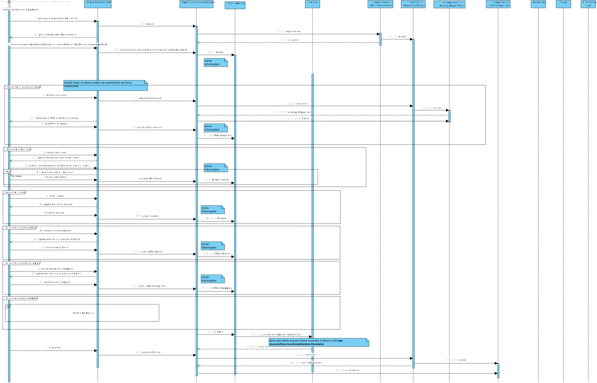

# UC6 - Especificar um Serviço
=======================================

# 1. Requisitos

**Especificar um Serviço**

Neste caso de uso o {Gestor de Serviços Help Desk (GSH)}, seguindo o nosso MD será um Colaborador e na estrutura da
Organização será o Gestor de Serviços Help Desk, deverá ser capaz de especificar um novo serviço para o sistema sendo
que o cliente pretende que seja possível, que a especificação seja concretizada de forma faseada ou de uma só vez.

**Requisitos apontados pelo cliente:**

### Wednesday, 28 de April de 2021 às 10:08

Dados mínimos a especificar no Serviço.

    RESPOSTA:No mínimo deve ser especificado o código e o título do serviço.
    A restante informação pode ser introduzida incrementalmente (i.e. interrompendo o caso de uso e retomando-o à posteriori)

### Tuesday, 27 de April de 2021 às 21:35

A especificação do formulário também pode ficar inacabada.

    RESPOSTA: Diria que sim.

### Tuesday, 27 de April de 2021 às 10:44

Regras de negócio do Título do Serviço.

    RESPOSTA: Todos os códigos/identificadores que são alfa-numéricos devem ser case-insensitive. I.e. o código
    "xpto1234" e "XpTo1234" são considerados iguais.

### Saturday, 24 de April de 2021 às 23:32

Identificador de um formulário.

    RESPOSTA: Pode ser atribuído automaticamente.

**Critérios de Aceitação**

-->O serviço só deve ficar disponível para solicitação quando a sua especificação ficar completa e válida.

-->Apenas informação base do serviço (código, descrição, catálogo onde será disponibilizado, formulários, requer
feedback).

### Friday, 21 de May de 2021 às 16:47

Podemos considerar que existem Tarefas de certos serviços que possam ser aproveitadas por outros serviços e assim damos
a opção do user escolher se quer utilizar alguma tarefa externa ou apenas temos a opção de criar tarefas para o
respetivo serviço?

    RESPOSTA: Liminarmente não! Não há "aproveitamento" de tarefas de um serviço para outro. Isso não faz sentido.

### Monday, 17 de May de 2021 às 21:13

O fluxo de atividades de um serviço pode ficar num estado de incompleto e ter a sua especificação retomada num momento
posterior?

    RESPOSTA: De acordo com o que foi solicitado anteriormente, a especificação de um serviço pode ficar incompleta e 
    portanto o seu fluxo de atividades pode também ficar incompleto.
    Notem, contudo, que neste sprint C o objetivo é conseguirmos especificar completamente um serviço.

## Pré-condições

n/a

## Pós-condições

Ter um serviço registado ou parte dele. Este apenas pode ser requisitado se estiver num estado válido.

# 2. Análise

Um Serviço é identificado por um código único de serviço, tem uma descrição breve e uma mais completa, um ícone e um
conjunto de keyword que o permitiram facilitar a pesquisa e para além disso terá de identificar o catálogo a que
pertence.

## Regras de Negócio:

- O serviço pode ser especificado de forma faseada;

- Apenas deve estar disponível apenas quando estiver num estado válido;

- Todos os códigos/identificadores que são alfa-numéricos devem ser case-insensitive;

- Deve ser associado um Formulário ao serviço;

- Deve ser possível associar o nível de criticidade;

- O serviço deve puder ser encontrado através das keywords que serão associadas a este;

- O código único do serviço deve ser gerado automaticamente.

- Adição de fluxos de atividade e validações dos formulários.

- Deve ser utilizada a linguagem/gramática desenvolvida pela equipa.

## Alterações ao Modelo de Domínio

- Existia um atributo a mais no Serviço (especificação) que foi removido;

- Necessário adicionar uma descrição à atividade de forma a saber qual o seu objetivo;

- Alterações nos agregados de Pedido, de Atividade e de FluxoDeAtividade;

## Testes a efetuar

-->o serviço não pode ser disponibilizado sem ter as informações mínimas requeridas (No mínimo deve ser especificado o
código e o título do serviço);

--> Todos os códigos/identificadores que são alfa-numéricos devem ser case-insensitive

-> O serviço deve puder ser encontrado através das keywords que serão associadas a este

# 3. Design

## 3.1. Realização da Funcionalidade

### Diagrama de Sequência

#### Novo Serviço

#### Retoma especificação Serviço

#### Definir Fluxos de Atividade

#### Associar Formulário a Serviço ou Atividade Manual

## 3.2. Diagrama de Classes

## 3.3. Padrões Aplicados

### User Interface

->Permite a criação de uma interface de uso simplificado para interagir com o utilizador (EspecificarServicoUI).

#### Controller

-> Entidade que faz a ligação entre a interface do utilizador e a camada de domínio do sistema, controla a execução do
caso de uso (EspecificarServicoController).

### Information Expert

->O padrão information expert indica quem tem acesso a informações ou quem "conhece" um bom exemplo disso é o caso do
serviço que terá código único... neste caso como é a root Entity do agregado o serviço conhece / sabe o seu número
código único.

### Creator

->Geralmente regra 1 e 2, neste caso de uso o creator foi, por exemplo, utilizado para criar o Serviço.

### High-Cohesion & Low-Coupling

->Devemos reduzir sempre o acoplamento e aumentar a coesão entre classes, neste caso há a utilização de interfaces e
cada classe tem funcionalidades específicas e não realiza funcionalidades de outras. Por exemplo, quem pode persistir ou
recuperar objetos do nosso repositório (memória ou base de dados) é por exemplo no caso do Serviço o ServicoRepository.
quem o cria é um builder especializado já que é um objeto complexo.

### Builder

-> O padrão builder serve para criar o Serviço permitindo assim já que este é um objeto complexo a construção de
diferentes representações.

### Factory

->Usado por exemplo na criação do meio de persitência que se deseja (memória ou em base de dados) e assim encapsular a
implementação;

### Repository

O padrão repository é usado para persistir dados, neste caso optei pelo uso de um RepositoryFactory que pode criar um
repositório tanto em memória como em base de dados, e assim há o encapsulamento.

## 3.4. Testes

*Nesta secção deve sistematizar como os testes foram concebidos para permitir uma correta aferição da satisfação dos
requisitos.*

**Teste 1:** Não Permitir objetivos de serviço com mais de 50 caracteres

    @Test(expected = IllegalArgumentException.class)
    public void naoAceitarObjetivoServicoComMaisDe50Caracteres() { ObjetivoServico ob = new ObjetivoServico("
    aaaaaaaaaaaaaaaaaaaaaaaaaaaaaaaaaaaaaaaaaaaaaaaaaaaaaaaaaaaaaaaaaaa" +
    "bbbbbbbbbbbbbbbbbbbbbbbbbbbbbbbbbbbbbbbb");
    }

**Teste 2:** Permitir objetivos do serviço com menos de 50 caracteres

    @Test 
    public void aceitarObjetivoServicoComMenosDe50Caracteres() { 
    ObjetivoServico ob = new ObjetivoServico("Objetivo"); 
    }

**Teste 3:** Não aceitar descrição breve com mais de 40 caracteres

    @Test(expected = IllegalArgumentException.class)
    public void naoAceitarDescricaoBreveMais40Caracteres() { 
    DescricaoBreveServico db = new DescricaoBreveServico("aaaaaaaaaaaaaaaaaaaaaaaaaaaaaaaaaaaaaaaaaaaaaaaaaaaaaa" +
    "aaaaaaaaaaabbbbbbbbbbbbbbbbbbbbbbbbbbbbbbbbbbbbbbbb"); 
    }

**Teste 4:** Aceitar descrição breve com menos de 40 caracteres

    @Test 
    public void aceitarDescricaoBreveMenos40Caracteres() { 
    DescricaoBreveServico db = new DescricaoBreveServico("Descricao"); 
    }

**Teste 5:** Não permitir descrições completas com mais de 500 caracteres

    @Test(expected =IllegalArgumentException.class)
    public void naoAceitarDescricaoCompletaMais500Caracteres() { DescricaoCompletaServico dc = new
    DescricaoCompletaServico("O servico consiste na correcao de falhas eletricas"
    + " na organizacao.O servico consiste na correcao de falhas eletricas\"\n" +
    "                + \" na organizacao.O servico consiste na correcao de falhas eletricas\"\n" +
    "                + \" na organizacao.O servico consiste na correcao de falhas eletricas\"\n" +
    "                + \" na organizacao.O servico consiste na correcao de falhas eletricas\"\n" +
    "                + \" na organizacao.O servico consiste na correcao de falhas eletricas\"\n" +
    "                + \" na organizacao.O servico consiste na correcao de falhas eletricas\"\n" +
    "                + \" na organizacao.O servico consiste na correcao de falhas eletricas\"\n" +
    "                + \" na organizacao.");
    }

**Teste 6:** Permitir descrições completas com menos de 500 caracteres

    @Test public void aceitarDescricaoCompletaMenos500Caracteres() { DescricaoCompletaServico dc = new 
    DescricaoCompletaServico("O servico consiste na correcao de falhas eletricas na organizacao."); 
    }

**Teste 7:** Não aceitar título com mais de 50 caracteres

    @Test(expected = IllegalArgumentException.class)
    public void naoAceitarTituloMais50Caracteres() { TituloServico ts = new TituloServico("
    aaaaaaaaaaaaaaaaaaaaaaaaaaaaaaaaaaaaaaaaaaaaaaaaaaaaaa" +
    "aaaaaaaaaaabbbbbbbbbbbbbbbbbbbbbbbbbbbbbbbbbbbbbbbb"); 
    }

**Teste 8:** Aceitar títulos com menos de 50 caracteres

@Test public void aceitarTituloMenos50Caracteres() { TituloServico ts = new TituloServico("Titulo"); }

**Teste 9:** Não permitir códigos de serviço com mais de 15 caracteres

    @Test(expected = IllegalArgumentException.class)
    public void naoAceitarCodigoServicoMais15Caracteres() { 
    CodigoUnicoServico db = new CodigoUnicoServico("aaaaaaaaaaaaaaaaaaaaaaaaaaaaaaaaaaaaaaaaaaaaaaaaaaaaaa" +
                                                    "aaaaaaaaaaabbbbbbbbbbbbbbbbbbbbbbbbbbbbbbbbbbbbbbbb"); 
    }

**Teste 10:** Aceitar códigos de serviço com menos de 15 caracteres

    @Test 
    public void aceitarCodigoServicoMenos15Caracteres() { 
    CodigoUnicoServico db = new CodigoUnicoServico("CodigoUnico"); 
    }

**Teste 11:** Não permitir descrição de ajuda relativamente ao atributo com mais de 50 caracteres

    @Test(expected = IllegalArgumentException.class)
    public void naoPermitirDescricaoAjudaAtributoMais50Caracteres() { DescricaoAjudaAtributo d = new
    DescricaoAjudaAtributo("aaaaaaaaaaaaaaaaaaaaaaavvvvvvvvvvvvvvvvvvvvvvvbbduded" +
                           "eiefbiefefeuf9eyfvbeygfegoirguwrghrçoguwgourçgow4oçowbgçowçogourgwrgo4gwrgwg" +
                           "4gowgbwogo4pwgbwo4ugbwo44ghhhhhhhhhhhhhhhhhhhhhhhhhhhhhh"); }

**Teste 12:** Permitir descrição de ajuda relativamente ao atributo com menos de 50 caracteres

      @Test
      public void permitirDescricaoAjudaAtributoMenos50Caracteres() { 
      DescricaoAjudaAtributo d = new DescricaoAjudaAtributo("
      aaaaaaaaaaaaaa"); }

**Teste 13:** Recusar delay < 0

    @Test(expected = IllegalArgumentException.class)
    public void recusarDelayMenorQueZero() {
        Atividade at = new Atividade("desc", -2);
    }

**Teste 14:** Recusar delay =0

    @Test(expected = IllegalArgumentException.class)
    public void recusarDelayIgualAZero() {
        Atividade at = new Atividade("desc", 0);
    }

**Teste 15:** Aceitar delay >0

    @Test public void aceitarDelayMaiorQueZero() { 
    Atividade at = new Atividade("desc", 2); 
    }

**Teste 16:** Não aceitar descrição Nula

    @Test(expected = IllegalArgumentException.class)
    public void naoAceitarDescricaoNull() { DescricaoAtividade desc = new DescricaoAtividade(null); }

**Teste 17:** Não aceitar descrição com mais de 500 caracteres

    @Test(expected = IllegalArgumentException.class)
    public void naoAceitarDescricaoComMaisDe500Caracteres() {
        DescricaoAtividade desc = new DescricaoAtividade("tmeppmnorbgowrbgowujgbwrogbrwugbrwogbrugbrgefefe" +
                "rgorwugborwgubrgobrgourwgborugbrowugborworwbrwobrugbrogrbgourbgwffffffffffffffffffffffffffffffffffffffff" +
                "rwgrowgbwrogrwogrwfffffffffffffffffffffffffffffffffffffffffffffffffffffffffffffffffffffffffffff33333f3f3" +
                "gorweeeeeeeeeeeeeeeeeeeeeeeeeeeeeeeeeeeeeeeeeeeeeeeeeeeeeiehoeihboubfoubfoççbobouqbofbqoeqbqbfoqfboqebfo" +
                "gorwfffffffffffffffffffffffffffffffeeeeeeeeeeeeeeeeeeeeeeeelfqlfqneqlfkqlfeqnlfeqnflkqeflqfnqelnfeqkfq" +
                "ogrwgbrowugbrwogbrwogbrwogbrwogubrgbrogbrubrwogbrwofipeqfpenvjq ojegpqejgqgeqgqegeqg");
    }

**Teste 18:** Não aceitar descrição vazia

    @Test(expected = IllegalArgumentException.class)
    public void naoAceitarDescricaoVazia() {
        DescricaoAtividade desc = new DescricaoAtividade("");

    }

**Teste 19:** Aceitar descrição válida

    @Test
    public void aceitarDescricaoValida() {
        DescricaoAtividade desc = new DescricaoAtividade("Programar");
    }

**Teste 20:** Recusar ordem de execução menor que zero

    @Test(expected = IllegalArgumentException.class)
    public void recusarOrdemExecucaoIgualAZero() {
        OrdemExecucao order = new OrdemExecucao(0);
    }

**Teste 20:** Recusar ordem de execução igual a zero

    @Test(expected = IllegalArgumentException.class)
    public void recusarOrdemExecucaoMenorQueZero() { OrdemExecucao order = new OrdemExecucao(-1); }

**Teste 20:** Aceitar ordem de execução igual a zero

    @Test
    public void aceitarOrdemExecucaoSuperiorAZero() {
        OrdemExecucao order = new OrdemExecucao(1);
    }

**Teste 21:** Recusar Data de Início Nula

@Test(expected = IllegalArgumentException.class)
public void recusarDataInicioNula() { DiaHoraInicioVigorFluxoAtividade dH = new DiaHoraInicioVigorFluxoAtividade(null, "
20:45:00");

    }

**Teste 22:** Recusar Data de Início Vazia

@Test(expected = IllegalArgumentException.class)
public void recusarDataInicioVazia() { DiaHoraInicioVigorFluxoAtividade dH = new DiaHoraInicioVigorFluxoAtividade("", "
20:45:00"); }

**Teste 23:** Aceitar Data de Início correta

    @Test
    public void aceitarDataInicioCorreta() {
        DiaHoraInicioVigorFluxoAtividade dH = new DiaHoraInicioVigorFluxoAtividade("26/12/2001", "20:45:00");
    }

**Teste 24:** Recusar Hora de início Nula

    @Test(expected = IllegalArgumentException.class)
    public void recusarHoraInicioNula() {
        DiaHoraInicioVigorFluxoAtividade dH = new DiaHoraInicioVigorFluxoAtividade("26/12/2001", null);
    }

**Teste 25:** Recusar Hora de Fim Vazia

    @Test(expected = IllegalArgumentException.class)
    public void recusarHoraInicioVazia() {
        DiaHoraInicioVigorFluxoAtividade dH = new DiaHoraInicioVigorFluxoAtividade("26/12/2001", "");
    }

**Teste 26:** Aceitar Hora de Início Correta

    @Test
    public void aceitarHoraInicioCorreta() {
        DiaHoraInicioVigorFluxoAtividade dH = new DiaHoraInicioVigorFluxoAtividade("26/12/2001", "20:45:00");
    }

**Teste 27:** Recusar Data de Fim nula

    @Test(expected = IllegalArgumentException.class)
    public void recusarDataFimNula() {
        DiaHoraFimVigorFluxoAtividade dH = new DiaHoraFimVigorFluxoAtividade(null, "20:45:00");

    }

**Teste 28:** Recusar Hora de Fim Vazia

    @Test(expected = IllegalArgumentException.class)
    public void recusarDataFimVazia() {
        DiaHoraFimVigorFluxoAtividade dH = new DiaHoraFimVigorFluxoAtividade("", "20:45:00");
    }

**Teste 29:** Aceitar Data de Fim Correta

    @Test
    public void aceitarDataFimCorreta() {
        DiaHoraFimVigorFluxoAtividade dH = new DiaHoraFimVigorFluxoAtividade("26/12/2001", "20:45:00");
    }

**Teste 30:** Recusar Hora de Fim Nula

    @Test(expected = IllegalArgumentException.class)
    public void recusarHoraFimNula() {
        DiaHoraFimVigorFluxoAtividade dH = new DiaHoraFimVigorFluxoAtividade("26/12/2001", null);
    }

**Teste 31:** Recusar Hora de Fim Vazia

    @Test(expected = IllegalArgumentException.class)
    public void recusarHoraFimVazia() {
        DiaHoraFimVigorFluxoAtividade dH = new DiaHoraFimVigorFluxoAtividade("26/12/2001", "");
    }

**Teste 32:** Aceitar Hora de Fim Correta

    @Test
    public void aceitarHoraFimCorreta() {
        DiaHoraFimVigorFluxoAtividade dH = new DiaHoraFimVigorFluxoAtividade("26/12/2001", "20:45:00");
    }

# 4. Implementação

*Nesta secção a equipa deve providenciar, se necessário, algumas evidências de que a implementação está em conformidade
com o design efetuado. Para além disso, deve mencionar/descrever a existência de outros ficheiros (e.g. de configuração)
relevantes e destacar commits relevantes;*

*Recomenda-se que organize este conteúdo por subsecções.*

# 5. Integração/Demonstração

*Nesta secção a equipa deve descrever os esforços realizados no sentido de integrar a funcionalidade desenvolvida com as
restantes funcionalidades do sistema.*

# 6. Observações

*Nesta secção sugere-se que a equipa apresente uma perspetiva critica sobre o trabalho desenvolvido apontando, por
exemplo, outras alternativas e ou trabalhos futuros relacionados.*
