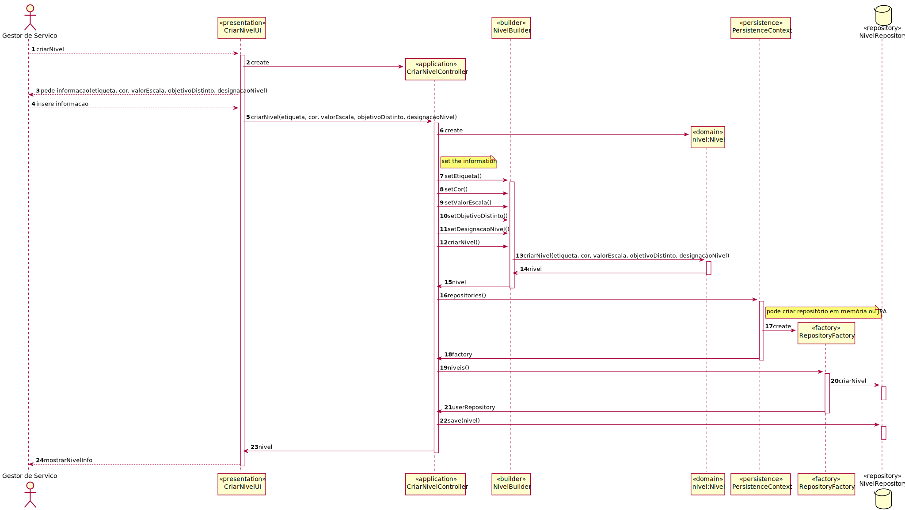
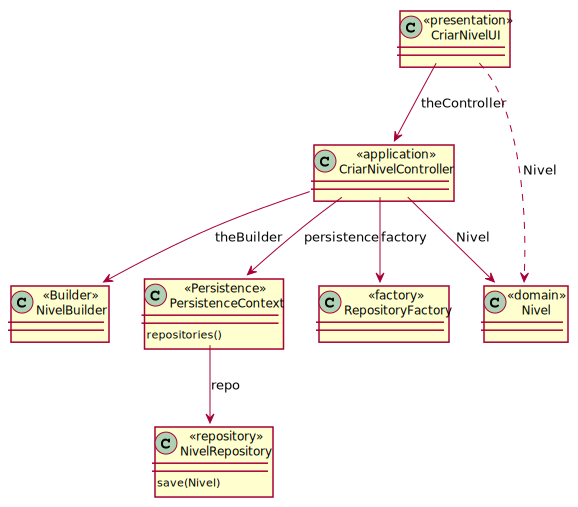

2010-Como GSH, eu pretendo definir os niveis de criticidade e respetivos objetivos aplicados na organização para definição de SLAs.

# UC7 - Definir niveis de criticidade aplicados na organizacao em SLAs
=======================================

# 1. Requisitos

**Definir niveis de criticidade aplicados na organizacao em SLAs**

**Informações apontadas pelo cliente:**

## Sunday, 25 de April de 2021 às 15:12

Ao especificar o nível de criticidade:

--> quais são as regras de negócio associadas aos tempos de resposta e de aprovação?

-->  Tempos indicados em minutos.

    RESPOSTA:   1. Tempos são indicados em minutos.
		2. Normalmente a etiqueta é uma ou duas palavras, portanto, 20/25 caracteres devem ser suficientes.

## Thursday, 22 de April de 2021 às 09:46

Entre que valores está a escala dos níveis de criticidade?

    RESPOSTA: Conforme consta do caderno de encargos, isso varia de organização para organização. A única regra relevante é a seguinte: quanto maior o valor numérico associado, maior é o nível de criticidade associado.

## Thursday, 15 de April de 2021 às 11:31

Quando associamos um nível de criticidade de maneira customizada a uma catálogo e necessário redefinir logo os objetivos dos serviços do mesmo? Se declararmos um serviço novo não deviámos também requerir que seja introduzido o objetivo de SLA nesse caso?

    RESPOSTA:   Não! Por omissão os serviços têm o nível de criticidade e objetivos do catálogo.

 		Não! Por omissão pode assume o nível de criticidade e objetivos do catálogo.

## Wednesday, 14 de April de 2021 às 19:16

A criticidade é relativa ao:

1. catalogo.

2. serviço.

3. catalogo mas dentro dele podemos ter serviços com níveis de criticidade diferentes.

A duração é relativa ao:

1. nível de criticidade.

2. serviço.
   
   
      RESPOSTA: Uma organização tem níveis de criticidade e para cada nível tem objetivos standard definidos (cf. caso de uso 4.1.8).

      Por sua vez, cada catálogo pode estar associado a um nível de criticidade, sendo que os objetivos a cumprir (i) podem ser os objetivos standard desse nível (cf. caso de uso 4.1.9a)
      ou (ii) os objetivos podem ser distintos (cf. caso de uso 4.1.9b).

      Para além disso é dito: "Em geral, todos os serviços regem-se pela criticidade e objetivos do catálogo através do qual são disponibilizados.
      Excecionalmente, um serviço pode ter uma criticidade e objetivos distintos daqueles especificados ao nível do catálogo onde está presente." (cf. fim da pág. 7 e inicio da pág. 8).

      O exemplo da Tabela 1 reflete o exposto acima, onde 2 serviços distintos (SRV_46 e SRV_21) têm o mesmo nível de criticidade mas objetivos distintos.

## Friday, 16 de April de 2021 às 15:20

Quando é referido "Excecionalmente, um serviço pode ter uma criticidade e objetivos distintos daqueles especificados", com "criticidade" distinta refere-se a um nível de criticidade distinto?
Pois como o exemplo da Tabela 1 mostra, como disse, dois serviços distintos com o mesmo nível de criticidade (mas objetivos distintos), ficamos na dúvida se serviços do mesmo catálogo poderão ter níveis distintos.

Se sim, há alguma restrição? Por exemplo, se um catálogo tem nível de criticidade 3, os serviços não podem ter níveis de criticidade abaixo de 3, ou acima de 3, etc.?

	RESPOSTA: 1. Sim, "criticidade" refere-se a nível de criticidade.

		  2. Não há restrição.

# 2. Análise

Os niveis de criticidade sao identificados por uma etiqueta unica, descritos por uma designacao e caracterizados por um valor na escala e uma cor.
Pode ter objetivos distintos e afeta o catalogo de servicos ja que rege o servico.

## Regras de Negócio:

-O nivel de criticidade do catalogo e do serviço sao independentes.
-Tempo indicado em minutos.
-A etiqueta é uma ou duas palavras (20/25 caracteres).
-A organização tem níveis de criticidade e cada nível tem objetivos mínimos definidos.
-Os catalogos tem niveis e os seus objetivos podem ser os standard dos niveis ou especificos do catalogo.
-Os serviços podem ter o mesmo nivel de criticidade e objetivos diferentes.
-A escala dos níveis de criticidade varia de organização para organização. Regra geral: Quanto maior o vala, maior é o nível de criticidade associado.
- a cor vai ser representada em RGV (escolha feita em equipa);

# 3. Design

## 3.1. Realização da Funcionalidade

## 3.2. Diagrama de Sequência

## 3.3. Padrões Aplicados

*Nesta secção deve apresentar e explicar quais e como foram os padrões de ‘design’ aplicados e as melhores práticas.*

3.3.1 User Interface

O padrão User Interface é usado de modo a providenciar uma ‘interface’ de uso simples ao Gestor de Serviço (neste caso de uso CriarNivelUI), para que haja separação das restantes partes do sistema.

3.3.2 Controller

O padrão Controller foi utilizado para que exista um controlador (neste caso de uso CriarNivelController) que possa funcionar como organizador da lógica do caso de uso.

3.3.3 Information Expert

Este padrão atribui às classes a responsabilidade por aquele domínio de negócio que ela representa, como é o caso de Nivel.

3.3.4 Creator

Geralmente regra 1 e 2, neste caso de uso o creator foi utilizado por Nivel para instanciar um objeto Nivel.

3.3.5 High-Cohesion, Low-Coupling

Padrão utilizado para diminuir o acoplamento entre as classes e, em simultâneo, só lhes atribuir associações que realmente sejam coesas com o seu propósito.
Neste caso de uso tentam-se restringir as responsabilidades próprias a cada classe e assim minimizar as associações ao necessário apenas.

3.3.6 Repository e Factory

O padrão Repository e o Factory ajudam na persistência, armazenamento e acesso aos dados. É utilizado na camada da Persistence, de modo a garantir a instanciação de NivelRepository, onde se guarda e se pode aceder aos Niveis.
Porém, antes dessa instanciação é utilizada a ‘interface’ PersistenceContext para se poder aceder à fábrica de repositórios RepositoryFactory e nela ir buscar os repositórios ditos anteriormente, entrando em harmonia com a estrutura do projeto.

## 3.4. Testes
*Nesta secção deve sistematizar como os testes foram concebidos para permitir uma correta aferição da satisfação dos requisitos.*

**Teste 1:** Verificar que não é possível criar uma instância da classe Exemplo com valores nulos.

	@Test(expected = IllegalArgumentException.class)
		public void ensureNullIsNotAllowed() {
		Exemplo instance = new Exemplo(null, null);
	}

# 4. Implementação

*Nesta secção a equipa deve providenciar, se necessário, algumas evidências de que a implementação está em conformidade com o design efetuado. Para além disso, deve mencionar/descrever a existência de outros ficheiros (e.g. de configuração) relevantes e destacar commits relevantes;*

*Recomenda-se que organize este conteúdo por subsecções.*

# 5. Integração/Demonstração

*Nesta secção a equipa deve descrever os esforços realizados no sentido de integrar a funcionalidade desenvolvida com as restantes funcionalidades do sistema.*

# 6. Observações

*Nesta secção sugere-se que a equipa apresente uma perspetiva critica sobre o trabalho desenvolvido apontando, por exemplo, outras alternativas e ou trabalhos futuros relacionados.*
