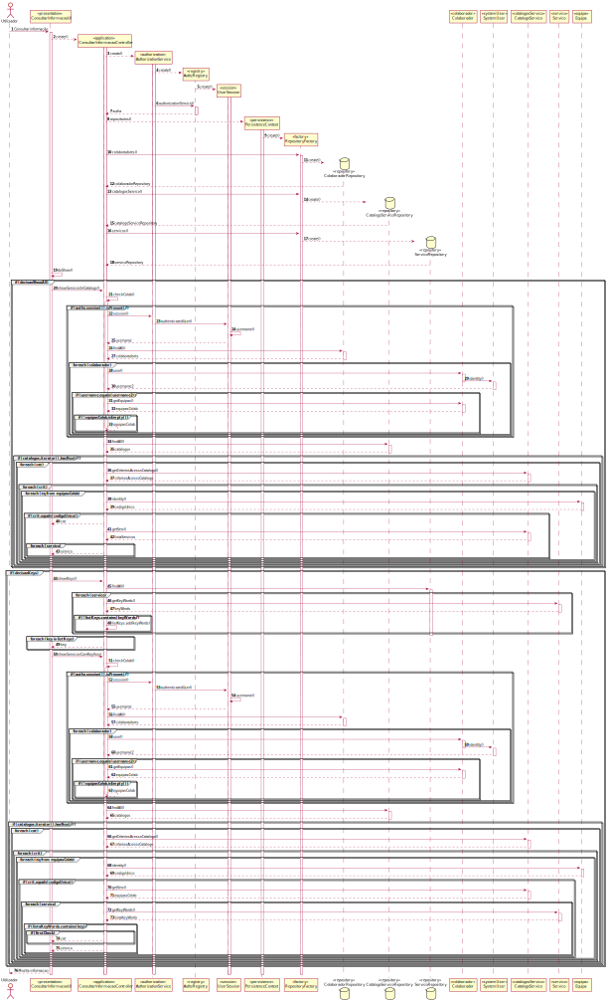

# UC8 — Consultar informação diversa
=======================================

# 1. Requisitos

**Consultar informação diversa**

Informações da parte do cliente:

## Thursday, 15 de April de 2021 às 18:44

De acordo com a alínea, “10. Consultar informação diversa. Alguns exemplos: (…) e. Informação estatística sobre o estado de execução das solicitações em aprovação e/ou resolução”, que tipo de dados estatísticos se refere?

	Resposta: Por exemplo, quantas solicitações estão pendentes. Destas qual é a percentagem de solicitações que estão por aprovar e quais é que estão por executar/realizar. Também é útil poder ver esta informação por equipa e/ou por catálogo que modo a tentar perceber/detectar onde é que existe uma sobrecarga.
            Em termos de análise também é interessante poder comparar as solicitações recebidas num dado período (e.g. dia, semana, mês) com as solicitações tratadas (i.e. aprovadas e resolvidas) nesse mesmo período.

# 2. Análise

O utilizador pode consultar/pesquisar catálogos de serviços e respetivos serviços a que lhe estão associadas.
Ao consultar um catálogo o utilizador pode encontrar o catalogo através do identificador ou do titulo e pode visualizer o nivel de criticidade, a descrição breve e completa e o icone.
Ao consultar um serviço o utilizador pode encontrar o serviço através do titulo, do código único ou pelas keywords associadas ao mesmo e pode visualizar a descrição breve e completa, o icone, o formulário, o nivel de criticidade e o nivel de criticidade.

## Regras de Negócio:

--

## Alterações ao Modelo de Domínio

**Não será necessária para já qualquer alteração ao modelo de domínio sendo que este representa bem os conceitos.**

# 3. Design

*Nesta secção a equipa deve descrever o design adotado para satisfazer a funcionalidade. Entre outros, a equipa deve apresentar diagrama(s) de realização da funcionalidade, diagrama(s) de classes, identificação de padrões aplicados e quais foram os principais testes especificados para validar a funcionalidade.*

*Para além das secções sugeridas, podem ser incluídas outras.*

## 3.1. Realização da Funcionalidade

*Nesta secção deve apresentar e descrever o fluxo/sequência que permite realizar a funcionalidade.*

## 3.2. Padrões Aplicados

*Nesta secção deve apresentar e explicar quais e como foram os padrões de design aplicados e as melhores práticas.*

###3.2.1 User Interface

O padrão User Interface é usado de modo a providenciar uma ‘interface’ de uso simples ao utilizador (neste caso de uso ConsultarInformacaoUI), para que haja separação das restantes partes do sistema.

###3.2.2 Controller

O padrão Controller foi utilizado para que exista um controlador (neste caso de uso ConsultarInformacaoController) que possa funcionar como organizador da lógica do caso de uso.

###3.2.3 Repository e Factory

O padrão Repository e o Factory ajudam na persistência, armazenamento e acesso aos dados. É utilizado na camada da Persistence, de modo a garantir a instanciação de CatalogoServicoRepository e ServicoRepository, onde se pode aceder aos CatalogoServico e aos Servicos.

## 3.3. Testes
*Nesta secção deve sistematizar como os testes foram concebidos para permitir uma correta aferição da satisfação dos requisitos.*

*Não tem testes.*

# 4. Implementação

*Nesta secção a equipa deve providenciar, se necessário, algumas evidências de que a implementação está em conformidade com o design efetuado. Para além disso, deve mencionar/descrever a existência de outros ficheiros (e.g. de configuração) relevantes e destacar commits relevantes;*

*Recomenda-se que organize este conteúdo por subsecções.*

# 5. Integração/Demonstração

*Nesta secção a equipa deve descrever os esforços realizados no sentido de integrar a funcionalidade desenvolvida com as restantes funcionalidades do sistema.*

# 6. Observações

*Nesta secção sugere-se que a equipa apresente uma perspetiva critica sobre o trabalho desenvolvido apontando, por exemplo, outras alternativas e ou trabalhos futuros relacionados.*

