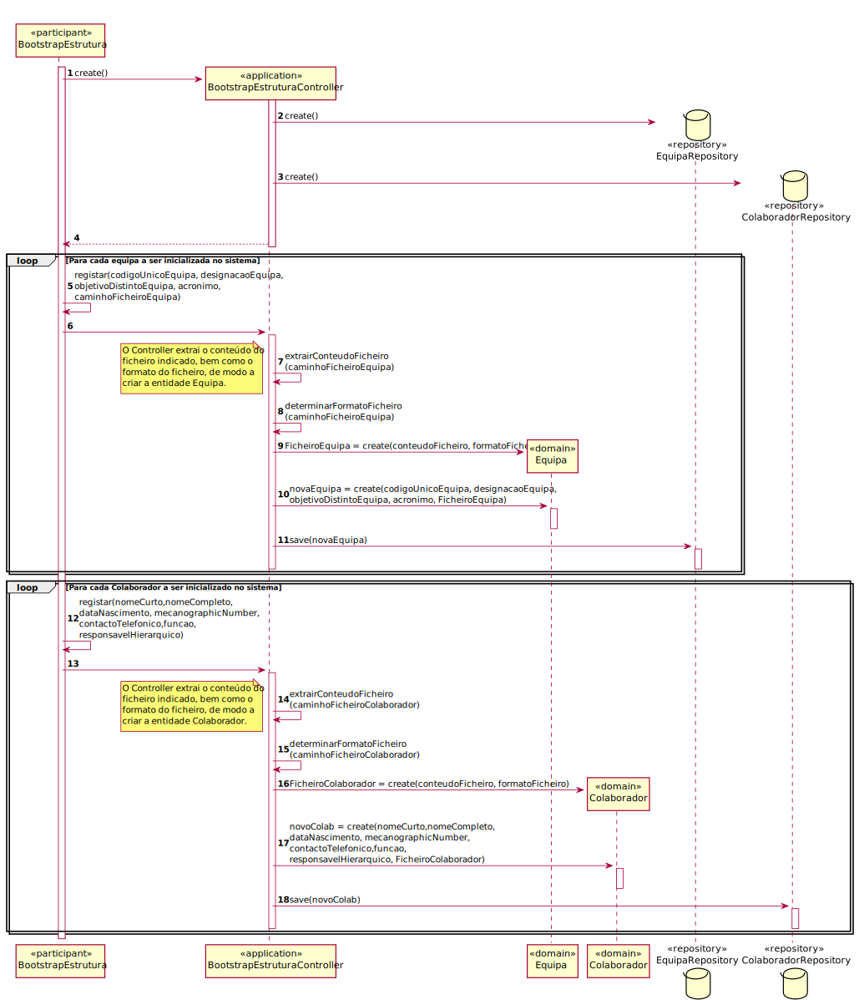
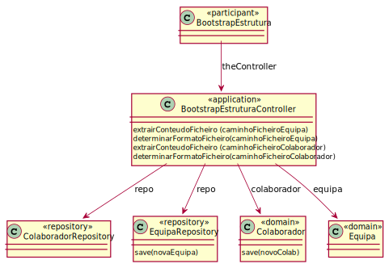

# UC9 - Inicializar estrutura organica da organizacao
=======================================

# 1. Requisitos

**Inicializar estrutura organica da organizacao**

Informações da parte do cliente:

## Monday, 26 de April de 2021 às 11:05

Na inicialização do sistema com dados relativos à estrutura orgânica da organização, tenciono que o cliente se refira à criação do administrador, gestor de serviços helpdesk e responsável de recursos humanos.

Neste caso, na criação destes atores, um email, um username, uma password, um primeiro e um último nome são suficientes?

    RESPOSTA: A estrutura orgânica da organização assenta essencialmente na definição de colaboradores, equipas e relações entre colaboradores e equipas. Obviamente que o que referes (mais relacionado com utilizadores do sistema) também é necessário.

# 2. Análise

Para inicializar a estrutura organica da organizacao é necessario ter todas as informacoes relativas aos colaboradores, equipas e as relacoes entre eles.

## Regras de Negócio:

-Se nao contiver informacao suficiente nao pode ser inicializado.

## Alterações ao Modelo de Domínio

**Não será necessária para já qualquer alteração ao modelo de domínio sendo que este representa bem os conceitos.**

# 3. Design

## 3.1. Realização da Funcionalidade

## 3.2. Diagrama de Classes

## 3.3. Padrões Aplicados

*Nesta secção deve apresentar e explicar quais e como foram os padrões de ‘design’ aplicados e as melhores práticas.*

3.3.1 Controller

O padrão Controller foi utilizado para que exista um controlador (neste caso de uso BootstrapEstruturaController) que possa funcionar como organizador da lógica do caso de uso.

3.3.2 Information Expert

Este padrão atribui às classes a responsabilidade por aquele domínio de negócio que ela representa, como é o caso de Colaborador e de Equipa.

3.3.3 Creator

Geralmente regra 1 e 2, neste caso de uso o creator foi utilizado por Colaborador para instanciar um objeto Colaborador e Equipa para instanciar um objeto Equipa.

3.3.4 High-Cohesion, Low-Coupling

Padrão utilizado para diminuir o acoplamento entre as classes e ao mesmo tempo só lhes atribuir associações que realmente sejam coesas com o seu propósito.
Em todo este caso de uso tentam-se restringir as responsabilidades próprias a cada classe e assim minimizar as associações ao necessário apenas.

3.3.5 Repository

O padrão Repository ajuda na persistência, armazenamento e acessa os dados. É utilizado na camada da Persistence, de modo a garantir a instanciação de Equipa e Colaborador, onde se guarda e se pode aceder as Equipas e Colaboradores.

## 3.4. Testes
*Nesta secção deve sistematizar como os testes foram concebidos para permitir uma correta aferição da satisfação dos requisitos.*

**Teste 1:** Verificar que não é possível criar uma instância da classe Exemplo com valores nulos.

	@Test(expected = IllegalArgumentException.class)
		public void ensureNullIsNotAllowed() {
		Exemplo instance = new Exemplo(null, null);
	}

# 4. Implementação

*Nesta secção a equipa deve providenciar, se necessário, algumas evidências de que a implementação está em conformidade com o design efetuado. Para além disso, deve mencionar/descrever a existência de outros ficheiros (e.g. de configuração) relevantes e destacar commits relevantes;*

*Recomenda-se que organize este conteúdo por subsecções.*

# 5. Integração/Demonstração

*Nesta secção a equipa deve descrever os esforços realizados no sentido de integrar a funcionalidade desenvolvida com as restantes funcionalidades do sistema.*

# 6. Observações

*Nesta secção sugere-se que a equipa apresente uma perspetiva critica sobre o trabalho desenvolvido apontando, por exemplo, outras alternativas e ou trabalhos futuros relacionados.*

