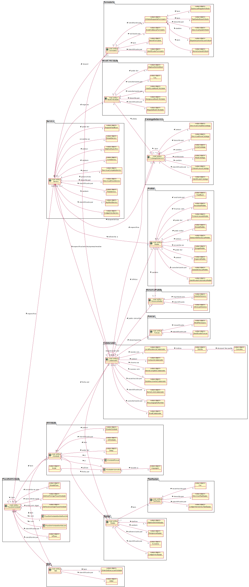

# Decisoes

### Classificacao em Entidades e Value Objects

| **Nome**                          | **Classificacao**                    | **Justificacao**                                                     |
|:----------------------------------|:-------------------------------------|:----------------------------------------------------------------------|
|Colaborador                        |Classe                                |Um colaborador herda caracteristicas de um utilizador.|
|Funcao                             |Value Object                          |Indica a função do colaborador.                                   |
|CatalogoServico                    |Entidade                              |Cada catalogo de servico e unico, tem um identificador proprio e comportamento alteravel.|
|Servico                            |Entidade                              |Cada servico e unico, tem um identificador proprio e comportamento alteravel. |
|CriterioAceitacao                  |Value Object                          |Cada criterio de aceitacao modifica o comportamento de um servico.    |
|Formulario                         |Entidade                              |Cada formulario e unico, pode variar as informacoes e tem um identificador proprio.|
|Especificacao                      |Value Object                          |E uma propriedade do servico, garante-lhe comportamentos diferentes.  |
|Workflow                           |Entidade                              |Cada Workflow (fluxo de atividades) e unico, possui um identificador proprio, para consulta posterior, e comportamento alteravel.|
|Pedido                             |Entidade                              |Cada pedido e unico, possui um identificador proprio e comportamento alteravel.|
|Atividade                          |Entidade                              |Cada atividade e unica, tem um identificador proprio, e referente a um tipo de atividade e tem comportamento alteravel. |
|TipoAtividade                      |Entidade                              |Cada tipo de atividade e unico, tem um identificador proprio e comportamento alteravel. |
|AtividadeManual                    |Entidade                              |Caracteriza o tipo de atividade.                                      |
|AtividadeAutomatica                |Entidade                              |Caracteriza o tipo de atividade.                                      |
|EstadoAtividade                    |Value Object                          |Caracteriza o estado da atividade.                                    |
|Script                             |Value Object                          |Define como se comporta a atividade automatica.                       |
|Equipa                             |Entidade                              |Cada equipa e unica, tem um identificador proprio e comportamento alteravel. |
|Cor                                |Value Object                          |Cada cor caracteriza um tipo de equipa ou nivel de criticidade.                                      |
|Linguagem                          |Value Object                          |As linguagens nao sao unicas e dao comportamento a um script.         |
|Funcao                             |Entity                                |Existe uma função única em cada área, com diferentes níveis hierárquicos e com identificador próprio.|
|TipoEquipa                         |Value Object                          |Caracteriza a equipa.|
|Informacao                         |Value Object                          |Partes fundamentais do formulario.|
|EstagioPedido                      |Value Object                          |Caracteriza o estado do pedido.|
|ResultadoPedido                    |Value Object                          |Determina a conclusao do pedido.|
|HistoricoPedido                    |Entidade                              |O historico de cada pedido e único.| 
|FeedBack                           |Value Object                          |E aplicado aos servicos e demonstra o grau de satisfacao do utilizador. |
|EstadoPedido                       |Value Object                          |Da uma característica ao pedido, nomeadamente o seu estado.|
|NivelCriticidade                   |Entidade                              |Define um grau de criticidade num contrato SLA.|
|DesignacaoNivelCriticidade         |Value Object                          |Especifica o grau de criticidade.|
|CodigoInternoUnicoTipoEquipa       |Value Object                          |Especifica o codigo interno único de um tipo de equipa.|
|DescricaoTipoEquipa                |Value Object                          |Especifica a descricao do tipo de equipa.|
|CodigoUnicoEquipa                  |Value Object                          |Ira identificar a equipa (acaba por a caracterizar) daí ser um value object|
|Acronimo                           |Value Object                          |Simboliza o acronimo atribuido ao tipo de equipa.|
|DesignacaoEquipa                   |Value Object                          |Caracteriza a designação da equipa.|
|MecanographicNumber                |Value Object                          |Sera a forma de identificar o colaborador (Entidade) pelo que o ira caracterizar e portanto e um value object|
|NomeCurtoColaborador               |Value Object                          |Caracteriza o Colaborador, identificando o nome pelo qual sera conhecido, pelo que sera um value object.|
|DataNascimentoColaborador          |Value Object                          |Cada Colaborador deve possuir uma data de nascimento, que o caracteriza.|
|NomeCompletoColaborador            |Value Object                          |Cada Colaborador deve possuir um nome completo, que o caracterize.|
|EmailColaborador                   |Value Object                          |Cada Colaborador deve possuir um endereco de email, que o caracteriza.|
|ContactoColaborador                |Value Object                          |Cada Colaborador deve possuir um contacto telefonico.|
|LocalResidenciaColaborador         |Value Object                          |Cada Colaborador habita num local de residencia|
|IdentificadorCatalogo              |Value Object                          |Identifica o catalogo de forma unica.|
|TituloCatalogo                     |Value Object                          |Um catalogo deve ser caracterizado por um titulo.|
|DescricaoBreveCatalogo             |Value Object                          |Um catalogo deve ser caracterizado por uma descricao breve.|
|DescricaoCompletaCatalogo          |Value Object                          |Um catalogo deve ser caracterizado por uma descricao completa.|
|IconeCatalogo                      |Value Object                          |Um catalogo deve ser caracterizado por um icone.|
|CriterioAcessoCatalogo             |Value Object                          |Um catalogo deve ser caracterizado por um ou mais criterios de acesso.|
|TituloServico                      |Value Object                          |Um servico deve ser caracterizado por um titulo.|
|DescricaoBreveServico              |Value Object                          |Um servico deve ser caracterizado por uma descricao breve.|
|DescricaoCompletaServico           |Value Object                          |Um servico deve ser caracterizado por uma descricao completa.|
|IconeServico                       |Value Object                          |Um servico deve ser caracterizado por um icone.|
|KeyWordServico                     |Value Object                          |Um servico deve ser caracterizado por uma ou mais keywords.|
|IdentificadorFormulario            |Value Object                          |Caracteriza o formulario, identificando-o.|
|NomeFormulario                     |Value Object                          |Atribui um nome caracteristico do formulario.|
|AtributoRequeridoFormulario        |Value Object                          |Um formulario necessita de ter um ou mais atributos requeridos.|
|NomeVariavelAtributo               |Value Object                          |Identifica o atributo requerido do formulario.|
|EtiquetaApresentacaoAtributo       |Value Object                          |Cada atributo tem a sua etiqueta de apresentação.|
|DescricaoAjudaAtributo             |Value Object                          |Um atributo requerido do formulario deve ser caracterizado por uma descricao.|
|TipoDadosBaseAtributo              |Value Object                          |Cada atributo tem um tipo base de dados.|
|ExpressaoRegularAtributo           |Value Object                          |Cada atributo tem uma expressão regular caracteristica|
|EtiquetaNivelCriticidade           |Value Object                          |Identifica o nivel de criticidade (Entidade), caracterizando-o.|
|ValorEscalaNivelCriticidade        |Value Object                          |Caracteriza o nivel de criticidade |
|IdentificadorAutomaticoPedido      |Value Object                          |Caracteriza o pedido.|
|DataSolicitacaoPedido              |Value Object                          |Caracteriza o pedido, identificando a data em que foi efetuado.|
|FicheiroAnexadoPedido              |Value Object                          |Ficheiro que ira ajudar na caracterizacao do pedido.|
|DataLimiteResolucaoPedido          |Value Object                          |Limita a data de resolucao do pedido.|
|UrgenciaPedido                     |Value Object                          |Define a urgencia do pedido.|
|EstadoResolucaoAtividade           |Value Object                          |Define o estado de resolucao da atividade.|
|ObjetivoDistintoEquipa             |Value Object                          |Define o objetivo da equipa.|
|ObjetivoDistintoNivel              |Value Object                          |Define o objetivo do nivel de criticidade.|
|ObjetivoEspecifico                 |Value Object                          |Define o objetivo do serviço.|
|IdentificadorFuncao                |Value Object                          |Identifica a funcao.|
|NivelHierarquico                   |Value Object                          |Uma funcao tem um nível hierárquico.|
|FluxoDeAtividade                   |Entity                                |Cada fluxo de atividades é único e possui comportamento moldável.
|FluxoDeAtividadeSentidoLato        |Classe                                |FluxoDeAtividadeSentidoLato herda características de fluxo de atividade.|  
|FluxoDeAtividadeSentidoRestrito    |Classe                                |FluxoDeAtividadeSentidoRestrito herda características de fluxo de atividade.|
|Concelho                           |Value object                          |Identifica o concelho ao qual o Colaborador tem residência.|
|Distrito                           |Value object                          |Identifica o distrito ao qual o Colaborador tem residência.|
|IdFluxo                            |Value object                          |Identifica o fluxo de atividades.|
|DiaHoraInicioVigorFluxoAtividade   |Value object                          |Indica o dia/hora em que inicia o fluxo de atividade.|
|DiaHoraFimVigorFluxoAtividade      |Value object                          |Indica o dia/hora em que finaliza o fluxo de atividade.|
|EstadoFluxo                        |Value object                          |Caracteriza o estado do fluxo.|
|IdAtividade                        |Value object                          |Identifica a atividade.|
|IdSlot                             |Value object                          |Identifica o slot.|
|ScriptValidacaoFormulario          |Value object                          |Caracteriza o formulario, neste caso, com o script de validacao, que nao e unico.|
|DiaHoraFimVigorAtividade           |Value object                          |Marca o tempo de incio de uma atividade.|
|DiaHoraInicioVigorAtividade        |Value object                          |Marca o tempo de término de uma atividade.|

### Identificacao de Agregados

Um agregado é uma forma para reduzir a complexidade técnica sendo um conjunto de objetos que pode ser tratado como uma
unidade única. Este representa um conceito de domínio.

| **Root**          | **Entidades do Agregado**                                     | **Value Objects do Agregado** |**Classes do Agregado** | **Justificação**|
|:------------------|:--------------------------------------------------------------|:------------------------------|------------------------|-----------------|
|TipoEquipa         |--                                                             |CodigoInternoUnicoTipoEquipa,DescricaoTipoEquipa, Cor|--|Todos os value objects e entidades que fazem parte do agregado TipoEquipa representam um conceito de dominio.|
|Colaborador        |--                                                             |MecanographicNumber, NomeCurtoColaborador, DataNascimentoColaborador, NomeCompletoColaborador, EmailColaborador, ContactoColaborador,Funcao LocalResidenciaColaborador, Concelho, Distrito|Todos os value objects, classes e entidades que fazem parte do agregado Colaborador representam um conceito de dominio. |
|Equipa             |--                                                             |CodigoUnicoEquipa, Acronimo, DesignacaoEquipa,ObjetivoDistintoEquipa|--|Todos os value objects e entidades que fazem parte do agregado Equipa representam um conceito de dominio.|
|CatalogoDeServico  |--                                                             |IdentificadorCatalogo, CriterioAcessoCatalogo, TituloCatalogo, IconeCatalogo, DescricaoBreveCatalogo, DescricaoCompletaCatalogo|--|Todos os value objects e entidades que fazem parte do agregado CatalogoDeServico representam um conceito de dominio.|
|Servico            |--                                                             |CodigoUnicoServico, KeyWordServico, TituloServico, DescricaoBreveServico, DescricaoCompletaServico, IconeServico,ObjetivoEspecifico, EstadoServico|--|Todos os value objects e entidades que fazem parte do agregado Servico representam um conceito de dominio.|
|FluxoDeAtividade   |--                                                             |IdFluxo, DiaHoraInicioVigorFluxoAtividade, DiaHoraFimVigorFluxoAtividade, EstadoFluxo|FluxoDeAtividadeSentidoLato,FluxoDeAtividadeSentidoRestrito|Todos os value objects e entidades que fazem parte do agregado FluxoDeAtividade representam um conceito de dominio.|
|Atividade          |TipoAtividade                                                  |IdAtividade, Script,Linguagem,DiaHoraFimVigorAtividade,EstadoAtividade,DiaHoraInicioVigorAtividade|AtividadeManual,AtividadeAutomatica|Todos os value objects e entidades que fazem parte do agregado Atividade representam um conceito de dominio.|
|Slot               |--                                                             |IdSlot, OrdemDeExecucaoAtividade|--|Todos os value objects e entidades que fazem parte do agregado Slot representam um conceito de dominio.|
|Pedido             |--                                                             |IdentificadorAutomaticoPedido, DataSolicitacaoPedido, UrgenciaPedido, EstagioPedido, DataLimiteResolucaoPedido, EstadoPedido, FicheiroAnexadoPedido, ResultadoPedido, FeedBack|Todos os value objects que fazem parte do agregado Pedido representam um conceito de dominio.|
|HistoricoPedido    |--                                                             |DataDoHistorico, IdVersaoHistorico|--|Todos os value objects e entidades que fazem parte do agregado HistoricoPedido representam um conceito de dominio.|
|Funcao             |--                                                             |IdentificadorFuncao, NivelHierarquico|--|Todos os value objects que fazem parte do agregado Funcao representam um conceito de dominio.|
|NivelCriticidade   |--                                                             |ValorEscalaNivelCriticidade, DesignacaoNivelCriticidade, EtiquetaNivelCriticidade, Cor, ObjetivoDistintoNivel|--|Todos os value objects que fazem parte do agregado NivelCriticidade representam um conceito de dominio.|
|Formulario         |--                                                             |ScriptValidacaoFormulario, AtributoRequeridoFormulario, IdentificadorFormulario, NomeFormulario, NomeVariavelAtributo, EtiquetaApresentacaoAtributo, DescricaoAjudaAtributo, TipoDadosBaseAtributo, ExpressaoRegularAtributo |--|Todos os value objects e entidades que fazem parte do agregado Formulario representam um conceito de dominio.|

